# Computer Vision
## Lecture 1
### Introduction to Computer Vision

---

# What is Computer Vision
- As humans, we perceive the three-dimensional structure of the world around us with apparent ease.
- In computer vision, we try to do the same thing, describe the world that we see in one or more images and to reconstruct its properties, such as shape, illumination, and color distributions
- Computer vision is defined as the mathematical techniques for recovering the three-dimensional shape and appearance of objects in images. In other words, it is the development of methods and techniques that enable computers to understand the content of images and video.
- This field is closely related to how the human visual system works.
---

# The Application of Computer Vision
- **Optical character recognition (OCR)**: reading handwritten postal codes on letters and automatic number plate recognition (ANPR)
- **Machine inspection**: rapid parts inspection for quality assurance using stereo vision with specialized illumination to measure tolerances on aircraft wings or auto body parts or looking for defects in steel castings using X-ray vision
- **Retail**: object recognition for automated checkout lanes
- **3D model building (photogrammetry)**: fully automated construction of 3D models from aerial photographs used in systems such as Bing Maps
- **Medical imaging**: registering pre-operative and intra-operative imagery or performing long-term studies of people’s brain morphology as they age
- **Automotive safety**: detecting unexpected obstacles such as pedestrians on the street, under conditions where active vision techniques such as radar or lidar do not work well
---

# The Application of Computer Vision
- **Match move**: merging computer-generated imagery (CGI) with live action footage by tracking feature points in the source video to estimate the 3D camera motion and shape of the environment
- **Motion capture (mocap)**: using retro-reflective markers viewed from multiple cameras or other vision-based techniques to capture actors for computer animation
- **Surveillance**: monitoring for intruders, analyzing highway traffic, and monitoring pools for drowning victims
- **Fingerprint recognition and biometrics**: for automatic access authentication as well as forensic applications
---

# Image Representation
- In computers, images are represented as multidimensional matrix
- The size of the matrix depends on:
	- The size of the image
	- The color system used
- Image sizes is about width and height
	- The amount of pixels in image
- In computer vision the more the pixels the more the calculation and the longer the time to reach results
- To solve this problem, we reduce the amount of data we need to process, through methods like Segmentation (coming later)
---

# Image Representation
## Color System
- In computers there are various color systems
- Digital images are represented in a computer as a two-dimensional or three-dimensional matrix. The X and Y axes represent pixel locations, while the third dimension represents the color channels (components) of the image.
- A color channel represents the color content of an image. If an image has no color channels, it is called a grayscale image. An image may have multiple channels representing different color components, whose values depend on the color system used.
- Each one is used for different reasons and feature:
	- Some are more suitable to view, others are better for print
	- Some describe colors, others describe various features about colors
---

# Image Representation
## Color System
### Binary Image
- Images can be black and white, meaning values are either 0 (black) or 1 (white).
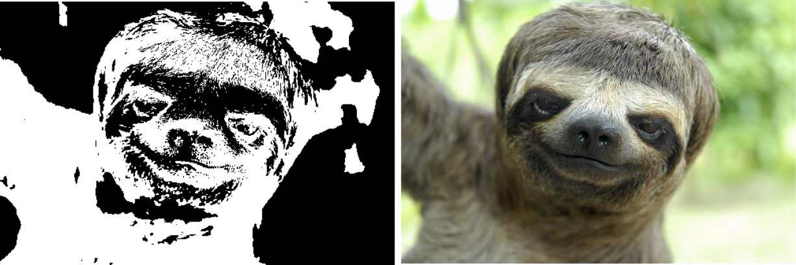
---

# Image Representation
## Color System
### Binary Image
- Images can be grayscale, meaning values range between 0 and 1.

---

# Image Representation
## Color System
- Color systems describe how colors are represented in images. Each color system is defined by:
	- The number of color channels.
	- The number of bits required to represent color levels. The most common is 8 bits (1 byte) per color channel, which gives 256 color levels from 0 to 255.
- From 0 to 255?!?!?! Didn’t you say between 0 and 1?!
	- To simplify storage and compression, color values are stored as integers. Their range is controlled by the number of bits used, such as 8, 10, or 16 bits. This causes complications in processing because each bit depth must be handled separately. To avoid this, we often convert color values from integers—regardless of their bit depth—into real numbers where the minimum value is 0 and the maximum value is 1, with gradients in between.
---

# Image Representation
## Color System
- Some color systems:
	- RGB
	- CMYK
	- HSV
	- YUV
	- LAB
---

# Image Representation
## Color System
### RGB

- RGB is the most commonly used color system. It is an additive system, meaning we use colors to illuminate a black surface (the screen). It consists of three components: red, green, and blue (similar to the human eye). It is used for display on screens.

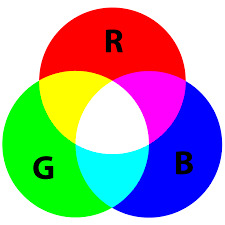

---

# Image Representation
## Color System
### CMYK

- CMYK is a subtractive system, meaning we use colors to darken a white surface. It consists of yellow, cyan, and magenta. It is used in printing and is not very important for computer vision.

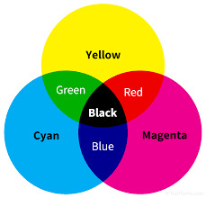

---

# Image Representation
## Color System
### HSV

  

- This system is represented as a cone with three components:
	- Hue: represents the color used, represented by a point on the circumference of the cylinder. The starting point is red at value 0 and increases in degrees up to 360.
	- Saturation: represents the amount of color in the color (as it approaches zero, the color becomes gray). It is represented by the radius.
	- Value: represents the amount of white in the color, represented by height. To avoid becoming completely white, the maximum value represents a vivid color.

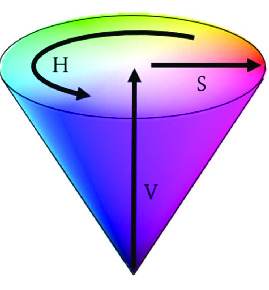

---

# Image Representation
## Color System
### HSV
- To convert from RGB to HSV, we use the following equations.

$$
M = max(R,G,B)
\\
m = min(R,G,B)
\\
V= \frac{M}{Max Value}
$$
$$
S=\begin{cases}
1 - \dfrac{m}{M}, & M > 0 \\
0, & M = 0
\end{cases}
$$

$$
H= cos^{-1}\left[  \dfrac{R-\dfrac{1}{2}G-\dfrac{1}{2}B}{\sqrt{R^2+G^2+B^2-RG-RB-GB}} \right]
\\
if(B>G)
\\
H=360-H
$$

- In 99% of cases Max Value is 255
---

# Image Representation
## Color System
### LAB
- This color system was defined by the International Commission on Illumination. It represents colors using three components:
	- Lightness.
	- A and B: represent the four distinctive colors in the human visual system: red, green, blue, and yellow.
- It is commonly used in digital image processing and computer vision algorithms because it has a wider color representation range than other systems and includes multiple transformation matrices that make it device-independent.
---

# Digital Image Acquisition
- To acquire digital images, we need an imaging device such as a camera or a scanner. For cameras, there are four main parameters to consider:
	- Sensor size.
	- Aperture.
	- ISO.
	- Shutter speed.
---

# Digital Image Acquisition
## Sensor Size
- Cameras are not equal. Have you ever wondered why professional camera images are better than those from mobile devices? The main reason is sensor size. Suppose we have two 50-megapixel sensors, one with an area of 3 cm² and another with 20 cm². Which one gives better results?
- The second one, because larger pixel size allows it to capture more light, which reduces noise and produces better results with fewer subsequent processing steps.
- This is why laptop cameras have acceptable quality compared to external webcams, which have larger sensors at the same resolution.
---

# Digital Image Acquisition
## Aperture

- It is a number that represents the amount of blocking in the lens. The larger the number, the greater the blocking and the smaller the aperture. Aperture is commonly used to emphasize the main subject of an image at the expense of the background.

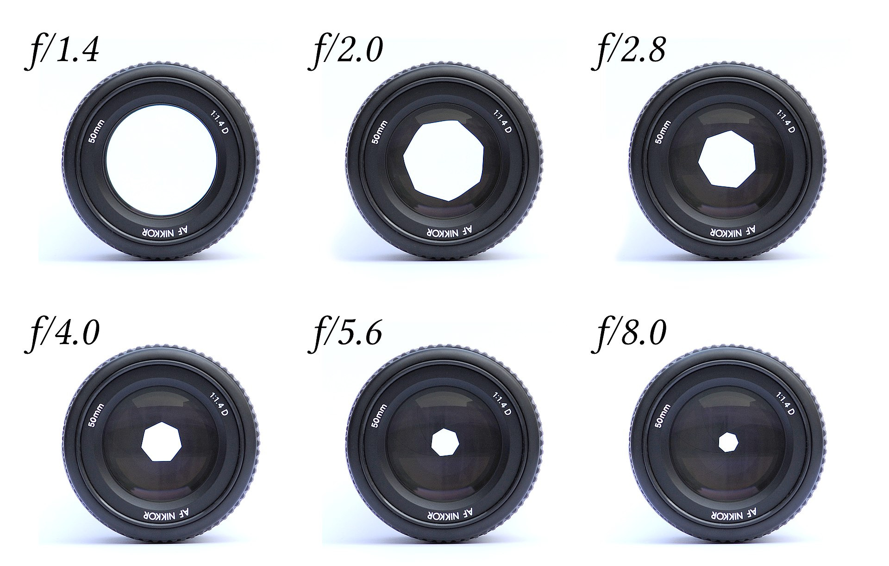

---

# Digital Image Acquisition
## Aperture

- In the right image, the aperture is large and the number is small, which reduces the depth of field and enhances objects close to the camera at the expense of distant ones (background). In the left image, the aperture is smaller and the number is larger, which increases the depth of field and enhances distant objects at the expense of closer ones.

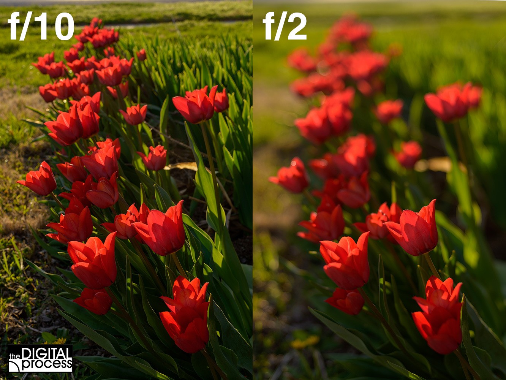

---

# Digital Image Acquisition
## Aperture
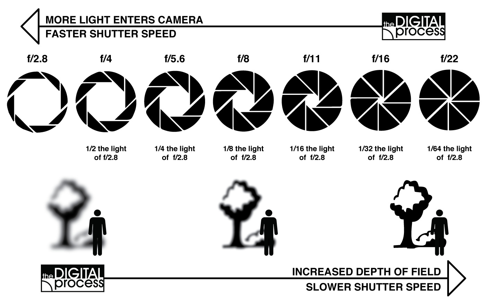
---

# Digital Image Acquisition
## ISO
- This value represents the sensor’s sensitivity to light. The higher the number, the higher the sensitivity. However, high values cause noise to appear in the image.
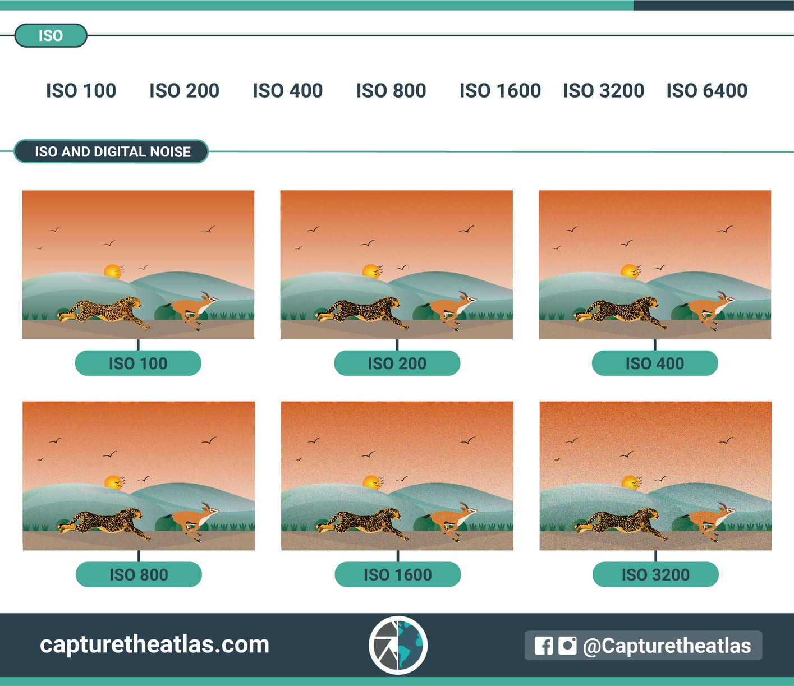
---

# Digital Image Acquisition
## Shutter Speed
- This value represents the time it takes for the shutter in older cameras to close after pressing the capture button.
- In other words, it represents the time the camera takes to capture the image after pressing the button and starting to collect colors from the sensor.
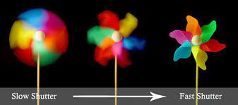
---
 
# Digital Image Acquisition
## Why is it important?
- Simply put, we must balance the four parameters to achieve the best possible image.
- A good image requires minimal preparation and carries a large amount of useful information, which means fewer processing steps are needed.
---

# Basic Image Operations
## Addition

- we can add a value to an image, which often represents increasing brightness, especially if the image is represented using the RGB system.
- If we want to increase brightness in the HSV system, we only increase the V component. In both cases, we must ensure we do not exceed the maximum color value, which is 1.

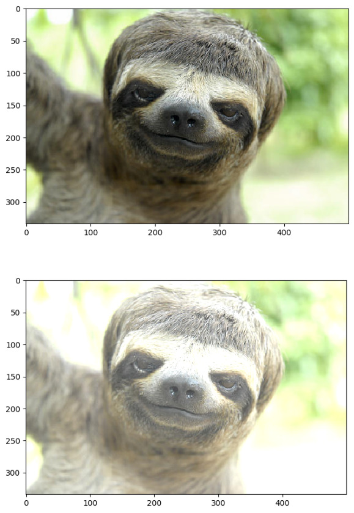

---

# Basic Image Operations
## Addition

- Addition can also be performed on two images, meaning we add two images together to produce a new image. The two images must be the same size and have the same number of color channels.

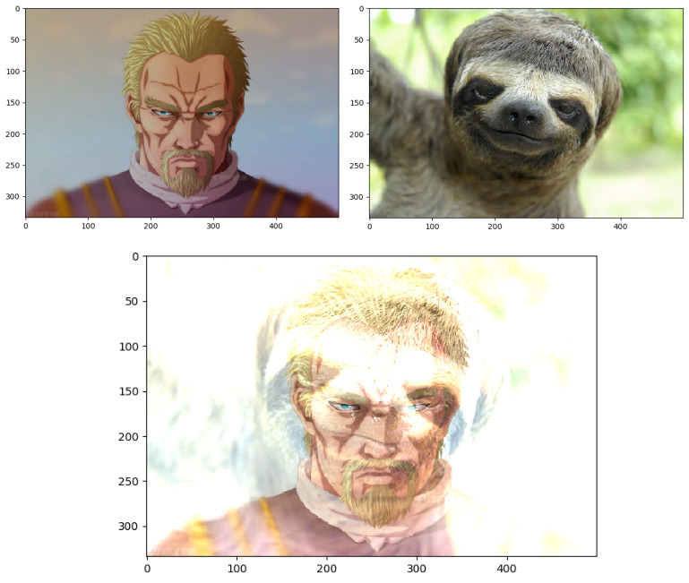

---

# Basic Image Operations
## Multiplication

- Multiplication is similar to addition. We can multiply by a value to change brightness or multiply two images for blending.

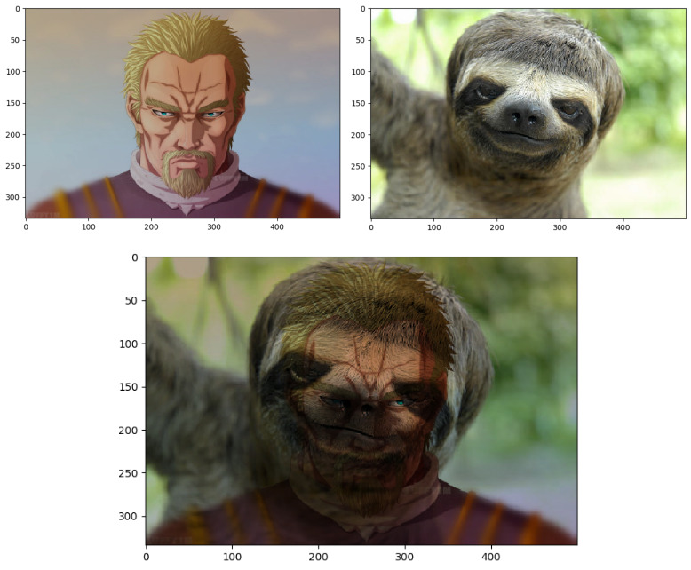

---

# Basic Image Operations
## Contrast
- Contrast is the difference in brightness and/or color that makes an object distinguishable.
- To examine contrast, we use a histogram, which shows the frequency of each color level.
- We demonstrate this with a grayscale image (if there is more than one channel, there is a separate histogram for each channel). Values must be integers to simplify calculations.
---

# Basic Image Operations
## Contrast
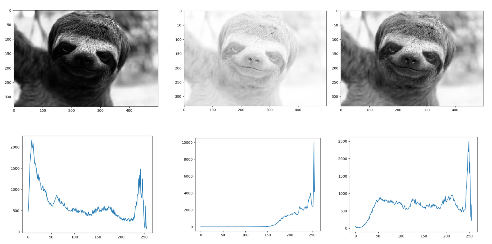

---

# Basic Image Operations
## Convolution
- Convolution is an operation used to apply filters to digital images.
- In imaging applications, filters represent a set of effects applied to images. 
- In image processing and computer vision, filters are defined as operations that allow certain frequencies to pass.
- We have low-pass, high-pass, band-block, and band-pass filters.
- Convolution filters are usually two-dimensional matrices with odd dimensions. 
- Filters are applied to each pixel and its neighborhood, which is determined by the filter size.
 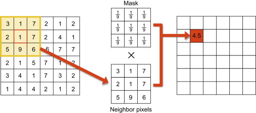
 
 
---

# Noise
- A digital image is a digital signal, and any signal is susceptible to noise.
- Noise consists of additional values that appear in a digital signal and carry no information, only distorting the original information. 
- Therefore, when processing a digital image, we must first remove noise.
---

# Noise
## Types of Noise
### Gaussian Noise

- Gaussian noise is also known as electronic noise because it originates in amplifiers or detectors. It arises from natural sources such as thermal vibration of atoms and the discrete nature of radiation from warm objects.

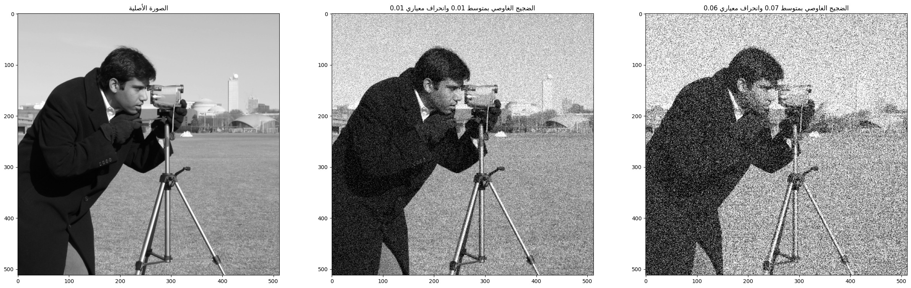
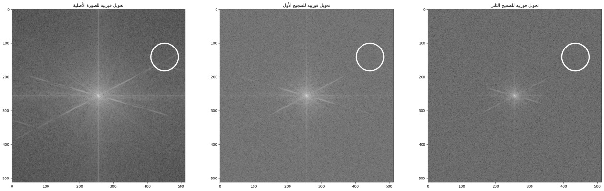

---

# Noise
## Types of Noise
### Salt & Pepper Noise

- Salt-and-pepper noise is known as data drop noise because it statistically drops original data values. It does not completely destroy the image, but changes the values of some pixels. It appears in data transmission where pixel values are replaced with corrupted values, either maximum or minimum. It sometimes appears in low-light conditions.

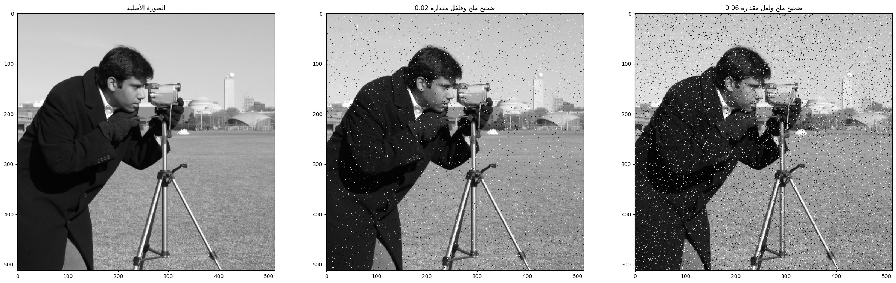
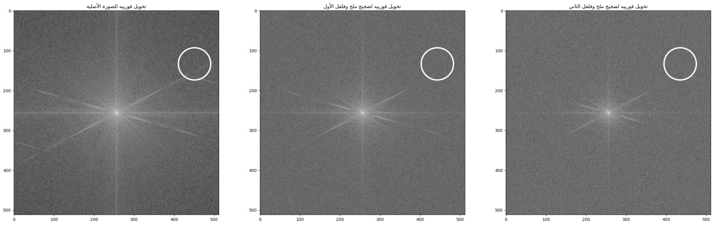

---

# Noise
## Types of Noise
### Salt & Pepper Noise

- Speckle noise is multiplicative noise. It appears in special imaging systems such as laser, radar, and ultrasound. It can look similar to Gaussian noise in images and is obtained using an equation 
$$
out=image+n*image
$$
- where n is Gaussian noise.

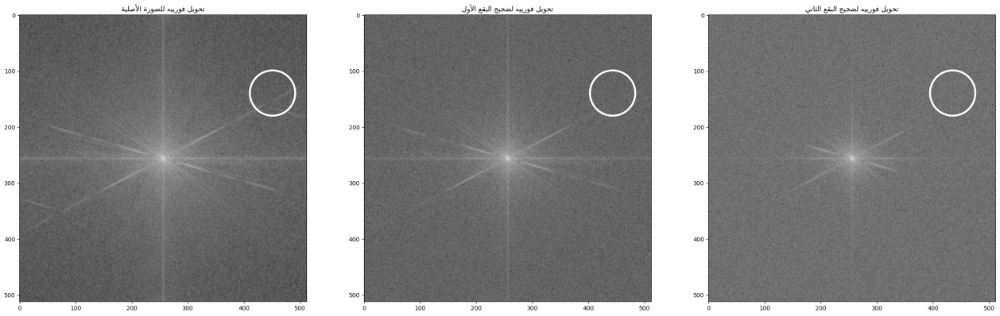

---

# Edge Detection

- What are edges in images? By edges, we do not mean the image boundaries, but rather sharp transitions between two colors.
- In digital image processing, edges represent high frequencies.
- Therefore, we use high-frequency filters to detect edges. These filters pass high frequencies in the image, resulting in edges only, without other details.

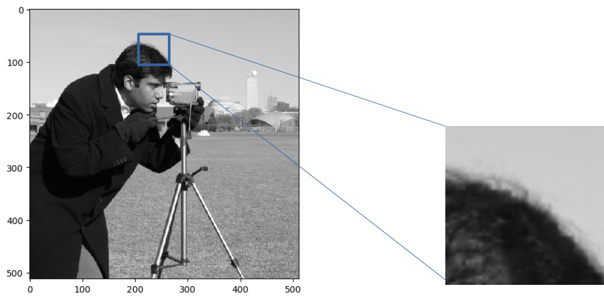

---

# Edge Detection
- Edge detection filters include Laplace, Prewitt, and Sobel. These three filters are linear filters, meaning the new pixel value depends on its neighborhood.
---

# Edge Detection

- Laplace edge detection uses a coefficient that follows a mathematical equation that can be modified.

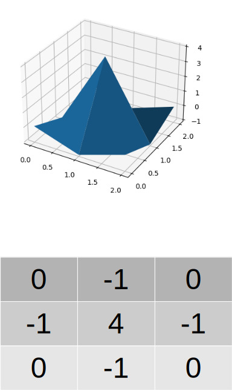

---

# Edge Detection

- Prewitt edge detection consists of two filters: one for horizontal edges and one for vertical edges.

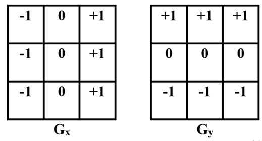

---

# Edge Detection

- Sobel edge detection also consists of two filters: one for horizontal edges and one for vertical edges.

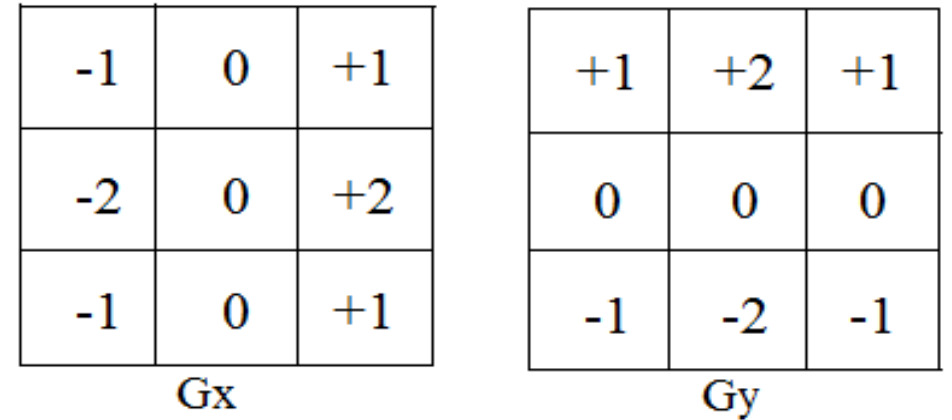

---

# Edge Detection
- The noise problem with edge detection.
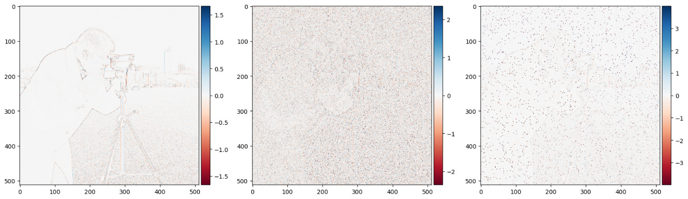
---

# Edge Detection
## Noise Removal
- Low-pass filters include the Gaussian filter and the median filter.
- Since noise is a sudden change in pixel value, edge filters detect it as an edge. 
- The best solution is to remove noise using low-pass filters and then apply edge filters.
---

# Edge Detection
## Noise Removal
### Gaussian Filters

- The Gaussian filter is used to remove Gaussian noise from digital images. 
- It is a low-pass filter that follows the Gaussian mathematical equation
$$
f(x,y)=A e^{-(\frac{(x-x_0)^2}{2\sigma^2_x}+\frac{(y-y_0)^2}{2\sigma^2_y})}
$$

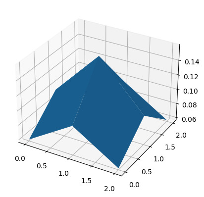

---

# Edge Detection
## Noise Removal
### Gaussian Filters
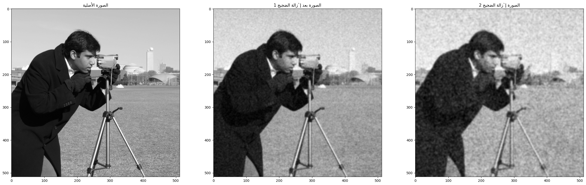

---

# Edge Detection
## Noise Removal
### Median Filter
- The Median filter is different from other filters (it is non-linear).
- It does not use convolution, but instead sorts the pixel values and their neighbors (8 neighbors) in ascending order and takes the middle value as the new pixel value. 
- It is used to remove salt-and-pepper noise.
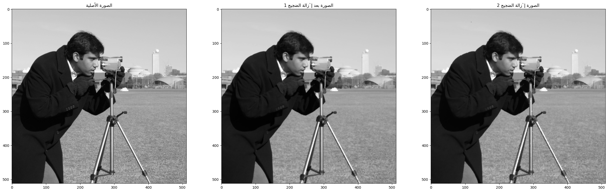
---

# Edge Detection

## Band Pass Filters
### DoG
- Difference of Gaussian (DoG): this filter applies two Gaussian filters with different strengths to the image and subtracts the results to obtain the band.
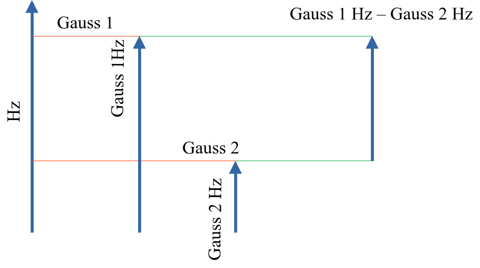
---

# Edge Detection

## Band Pass Filters
### DoG
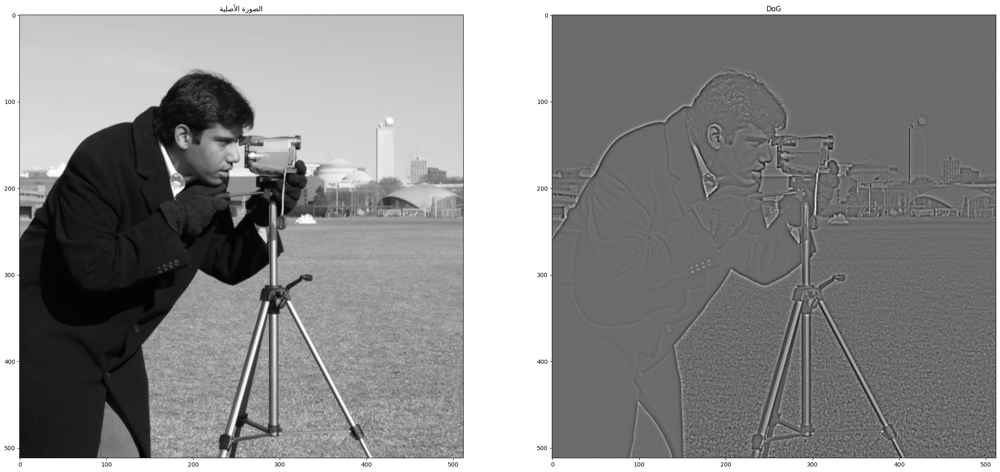
---

# Edge Detection

## Band Pass Filters
### LoG
- Laplacian of Gaussian (LoG) is a combined operator that removes noise and detects edges at the same time. First, a Gaussian filter is applied, then a Laplacian filter.
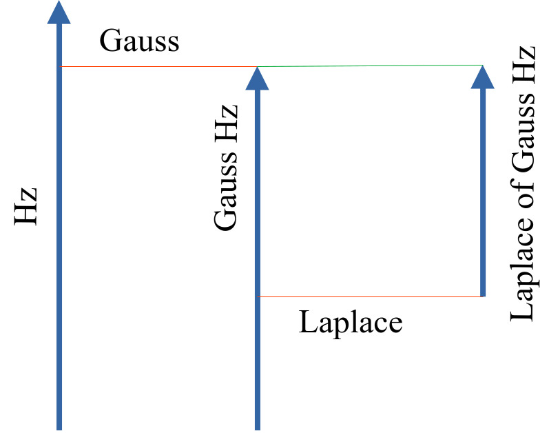
---

# Edge Detection

## Band Pass Filters
### LoG
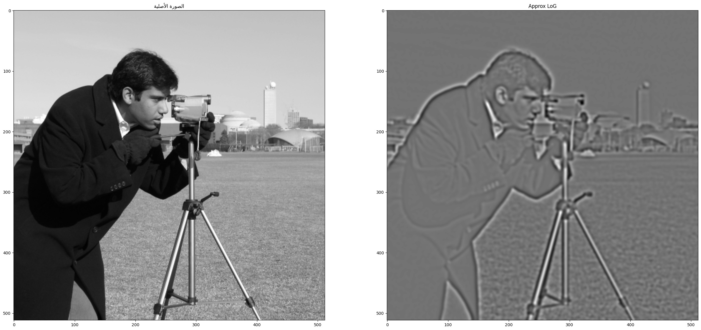
