# Computer Vision
## Lecture 2  
### Edge Detection

---

# What is Edge?
- As explained in the previous lecture, when we say edge we don't mean borders of the image
- We mean the location of sudden change between colors, that is the edge
- Edges correspond to high frequencies in images
- We can see it by understanding Fourier transformation
	- This is a transformation that converts information from temporal domain (the normal domain) to frequency domain
	- The first component (value) of the resulting transformation is the DC component containing most information in the signal
	- The rest of the components represent the frequencies in increasing order (further away from the DC component the higher the frequency)
---

# Fourier Transformation
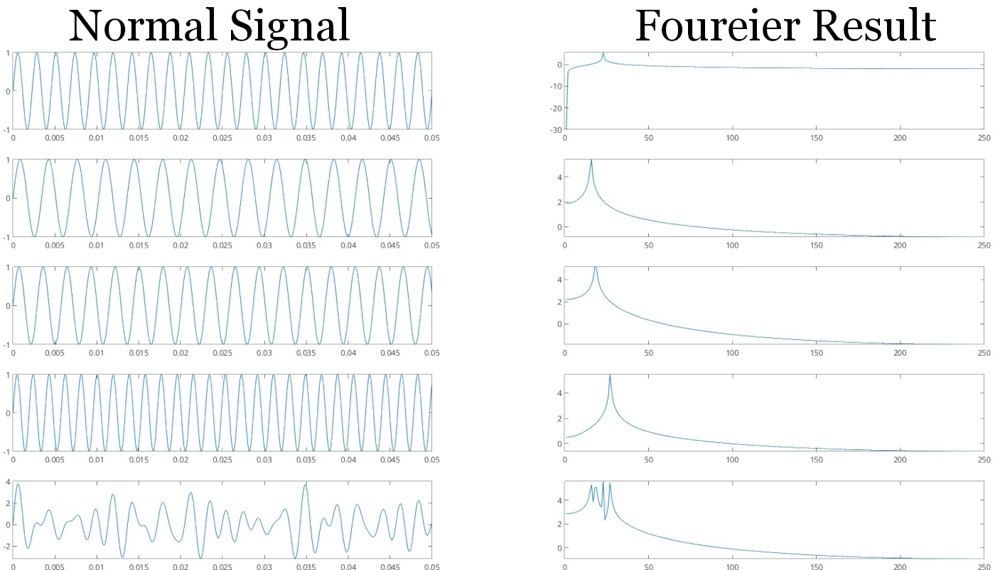

---

# Fourier Transformation
- Fourier Transformation is a mathematical transformation in which we convert a signal from the temporal domain to the frequency domain
- In the temporal domain we acquire the value of a signal
- In the frequency domain we acquire the frequency of signal
	- As shown in the previous slide the bottom signal and its Fourier result is a summation of all the above signals
	- As a result we understand the frequency components of a signal, not to mention we can remove a frequency from the signal by setting the corresponding value in Fourier result to 0

---

# Fourier Transformation
## Fast Fourier Transformation
- The story about fast Fourier transformation is based on strict deadlines, nuclear weapons, USSR and USA
- First thing first:
	- We are not dealing with Fourier transformation, we are dealing with discreet Fourier transformation
	- What is the different? simply put, the main operation in FT is integration, in DFT we approximate the integration with sum operation, and we work with measuring values not a function

FT
$$
X(f) = \int_{-\infty}^{\infty} x(t) e^{-j 2 \pi f t} \, dt
$$
Inverse FT
$$
x(t) = \int_{-\infty}^{\infty} X(f) e^{j 2 \pi f t} \, df
$$

DFT
$$
X(k) = \sum_{n=0}^{N-1} x(n) e^\frac{-j 2\pi kn}{N}
$$
Inverse DFT
$$
x(n) = \frac{1}{N} \sum_{k=0}^{N-1} X(k) e^\frac{j 2\pi kn}{N}
$$

---

# Fourier Transformation
## Fast Fourier Transformation
- We are dealing with images, a 2D signal, therefore we use 2D DFT:
$$
F(u, v) =
\sum_{x=0}^{M-1} \sum_{y=0}^{N-1}
f(x, y)\, e^{(-j 2\pi \left( \frac{ux}{M} + \frac{vy}{N} \right))}
$$
- While the inverse is:
$$
f(x, y) =
\frac{1}{MN}
\sum_{u=0}^{M-1} \sum_{v=0}^{N-1}
F(u, v)\, e^{(j 2\pi \left( \frac{ux}{M} + \frac{vy}{N} \right))}
$$
---

# Fourier Transformation
## Fast Fourier Transformation
- The problem with both FT and DFT is the calculation speed
- The story of calculating DFT as fast as possible is based in the treaties signed between USSR and USA to ban testing of new nuclear weapons
- We can test nuclear weapons on land, in space, in sea and underground.
- All of them are easily detectable but the underground is not
	- It creates a seismic events
	- The telltale of an underground explosion is seismic events recorded using various measurement tools 
	- The problem was how to uniquely identify legit seismic events (The result of an earthquake or a volcano) and the result of nuclear testing
	- It in the frequencies, which is where DFT is king
---

# Fourier Transformation
## Fast Fourier Transformation
- The problem was simple, calculations took too long to be done
- We needed to go faster.
- Unfortunately, the DFT algorithm was done after the signing of nuclear test ban treaty
	- Therefore, all but underground testing of nuclear weapons is banned
- The FFT is about divide and conquer
	- Basically it works but splitting the points into 2 smaller sets
	- We continue until we reach 2 values only, apply then return up until we calculate the entire point set
---

# Fourier Transformation
## FT & Edges

- There are 2 images, goofy and the degraded goofy, with FTs below each.
- Notice that both suffer from edge effects as evidenced by the strong vertical line through the center.
- The major effect to notice is that in the transform of the degraded goofy the high frequencies in the horizontal direction have been significantly attenuated.
- This is due to the fact that the degraded image was formed by smoothing only in the horizontal direction.

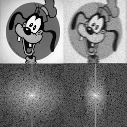

---

# Fourier Transformation
## FT & Edges

- Also, if you look carefully you can see that the degraded goofy has a slightly larger background noise level at high frequencies.
- Notice also that it is difficult to make much sense out of the low frequency information. This is typical of real life images.

---

# Fourier Transformation
- To summarize:
	- FT allows us to understand frequencies in signals
	- Images are 2D signals therefore they can by analyzed by 2D Fourier Transformation
	- This can be very helpful when extracting information about the image, including but limited to edge detection and noise cancellation
---

# Convolution and Correlation
- To very important operations in Digital Signal Processing and by extension Digital Image Processing
- Both of them calculate the amount of similarities between 2 different signals
- The higher the result the more similar the signals
- P.S.: In academic circles, when we are talking about Image Processing Convolution is the **same** as Correlation, but when talking about Signal Processing Convolution is **different** from Correlation
---

# Convolution and Correlation
# The Math Behind It
- When talking about these 2 concepts we need to have 2 signals:
	- A big signal, let's call it the source signal **S**
	- A small signal, let's call it the mask signal **M** (or **K**ernel)
	- What we want to do is checking the existence of M in **all possible locations inside** S
		- Where M exists (approx.) the value of S remains high, but when it doesn't the value is 0 or close to it
		- In mathematical notion, the mask signal goes from \[-a,+a\] in indecies

Convolution
$$
S(x,y) \ast M = \sum_{u=-a}^{u=a}\sum_{v=-b}^{v=b}M(u,v)S(x-u,y-v)
$$

Correlation
$$
S(x,y) \ast M = \sum_{u=-a}^{u=a}\sum_{v=-b}^{v=b}M(u,v)S(x+u,y+v)
$$

---

# Convolution and Correlation
# The Math Behind It
- Applying Correlation and Convolution on a signals
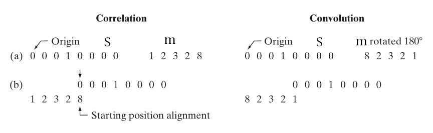
---

# Convolution and Correlation
- What is so important about these 2 operations?
- What if I told you applying filters to images depends on correlation! Interested, right?
- Simply put filters are simple signals, when correlating with an image (or any other signal for that matter) they allow values similar to them to stay, while ones different are removed
- We said that noise is high frequency, right? By applying low pass filter (e.g. Gauss) we allow values with neighborhoods reaching to 1 to stay, while ones reaching 0 to be removed
	- Remember, it is not set in stone, but low pass filters usually has a sum value of 1, while high pass have sum value of 0 (approx.)
- Meaning when the neighborhoods of similar values, it is full of low frequencies, while the neighborhoods of widely different values is full of high frequencies.
---

# Convolution and Correlation
## Applying Filters
- When A filter (kernel/mask) get applied to image, we apply on each pixel independently
- Each pixel has a neighborhood of pixels which are taken into consideration during the application process
- Let's say we want to apply the filter k on the image S at the selected pixel (the neighborhood is the red square)

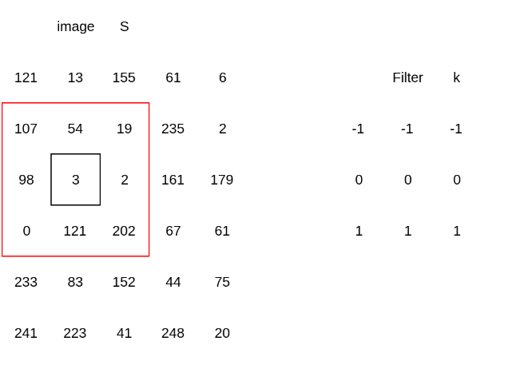

$$
new PixelValue= -1\times107+-1\times54+-1\times19+
\newline
0\times98+0\times3+0\times2+
\newline
1\times0+1\times121+202\times1
$$

---

# Convolution and Correlation
## Applying Filters

	
- What would happen if don't have a big enough neighborhood to apply a filter?
- How to deal with situation?
- The solution is simple we add values
- This done usually through padding
	- We usually add zeros to around the image
	- The amount of zeros added on each size amounts to the $\frac{size~of~kernel}{2}$
	- Now we have a bigger image
	- We apply the filter but on the entire new image
	- Only on a the original image

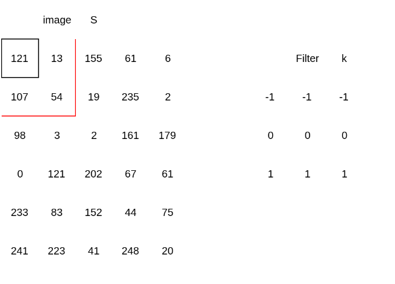

---

# Convolution and Correlation
## Applying Filters

	
- Now we apply the filter but only calculate at the original image
- The padded values provides the ability to calculate the filter response for edge pixels
- There are few other methods:
	- We can pad other values, but 0 is the most used
	- Reflection
	- Rotation
- But 0 padding is the most used

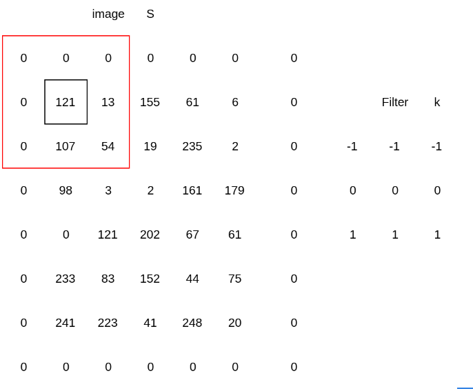

---

# Image Gradient (Derivative)
- Images are digital signals
- Digital signals are signals
- Signals are functions
- Functions have derivative
- Just like any other function, it has a derivative
- But wait a minute, we don't know the formula for the image, how can we derive the function?
- In case we don't have a formula, we simply subtract

| x                 | 0   | 1   | 2   | 3   | 4   | 5   | 6   | 7    | 8   | 9   |
| ----------------- | --- | --- | --- | --- | --- | --- | --- | ---- | --- | --- |
| f(x)              | 20  | 30  | 10  | 14  | 29  | 14  | 200 | 30   | 19  | 10  |
| f'(x)=f(x)-f(x-1) |     | 10  | -20 | 4   | 15  | -15 | 186 | -170 | 11  | -9  |

---

# Image Gradient (Derivative)
- If there are no big changes between neighboring pixels, the derivative is reaching to 0
- If there are big changes, the derivative will show in difference as bright spot
- In other words, when 2 neighboring pixels have a big difference in value, the change is obvious and shows
- This is the same as applying high pass filter
- We mentioned earlier that **high-frequency filters** help us extract **edges**.
- The main reason is that they help compute the **first and second derivatives** of images.
  In this case, we preserve the **large differences between image pixels**, and these differences **represent the edges**.
---

# Image Gradient (Derivative)
- Sobel, Prewitt and Scharr calculate the first derivative
- Laplace calculate the second derivative

Prewitt
$$
G_x =
\begin{bmatrix}
-1 & 0 & 1 \\
-1 & 0 & 1 \\
-1 & 0 & 1
\end{bmatrix}
\quad
\newline
G_y =
\begin{bmatrix}
 1 &  1 &  1 \\
 0 &  0 &  0 \\
-1 & -1 & -1
\end{bmatrix}
$$

Sobel
$$
G_x =
\begin{bmatrix}
-1 & 0 & 1 \\
-2 & 0 & 2 \\
-1 & 0 & 1
\end{bmatrix}
\quad
\newline
G_y =
\begin{bmatrix}
 1 &  2 &  1 \\
 0 &  0 &  0 \\
-1 & -2 & -1
\end{bmatrix}
$$

Scharr
$$
G_x =
\begin{bmatrix}
-3 & 0 & 3 \\
-10 & 0 & 10 \\
-3 & 0 & 3
\end{bmatrix}
\quad
\newline
G_y =
\begin{bmatrix}
 3 & 10 & 3 \\
 0 & 0 & 0 \\
-3 & -10 & -3
\end{bmatrix}
$$

---

# Image Gradient (Derivative)
## Still It Makes No Sense
- Still need a lot of explanation
- Let's take a deep dive using the first row fo $G_x$ of Prewitt: $[-1,0,+1]$
$$
R(x,y)=I(x-1,y)\times-1 + I(x,y)\times0+I(x+1,y)\times1
\newline
R(x,y)=I(x+1,y)-I(x-1,y)
$$
- The same can be said for $G_y$ 
- This is a modification of the standard derivative formula (first derivative)
---

# Image Gradient (Derivative)
## Still It Makes No Sense
- What about Laplace?
- Let's take the following Laplace 1D filter $[-1,2-1]$
$$
R(x,y)=I(x-1,y)\times-1+I(x,y)\times2+I(x+1,y)\times-1
\newline
= 2I(x,y)-I(x-1,y)-I(x+1,y)
\newline
	= (I(x,y)-I(x-1,y))-(I(x+1,y)-I(x,y))
$$
- Which is approximation of the 2nd derivative
---

# What Does This Mean
- Edge detection is a simple derivation of the image
- Filters are modification of the derivative formula to emphasize a certain features over others
- But wait a minute, Prewitt Sobel and Scharr have 2 filters, meaning 2 responses how to make them a 1 ?
	- It is true all of these filters produce 2 images for horizontal edges and vertical edges, in order to make cover all the edges we use super difficult, complex and unprocessable Pythagorean Theorem
$$
R(x,y)=\sqrt{(R_x(x,y))^2+(R_y(x,y))^2}
$$
---

# What Does This Mean
- You said we have a first derivative and a second derivative, what is the difference?
- The first derivative produces thicker edges while the second derivative is more sensative to micro details like thin edges and isolated points (noise)
---

# The results

The Image
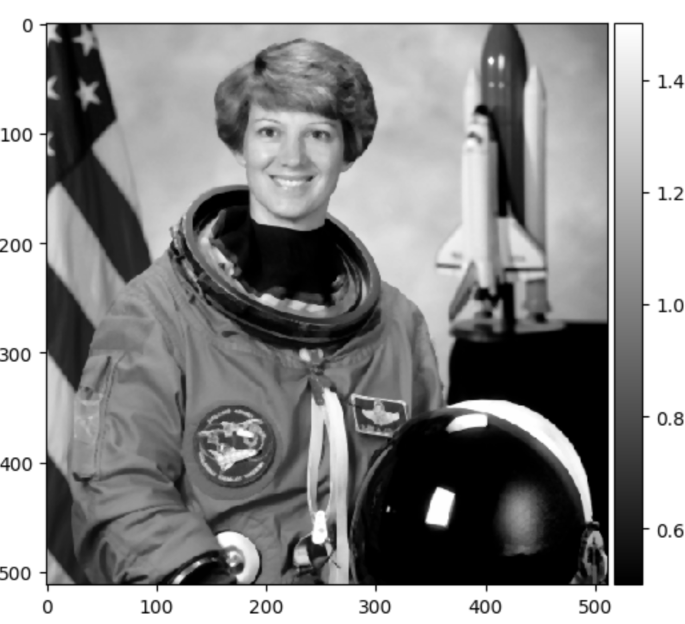

Laplace Response
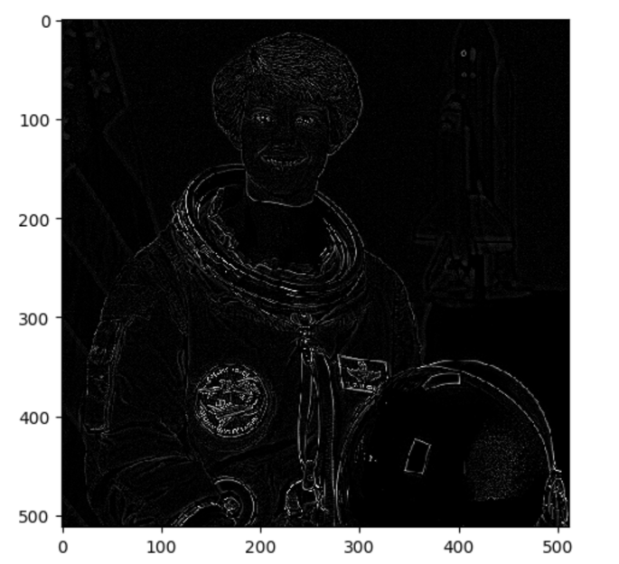

Prewitt Response
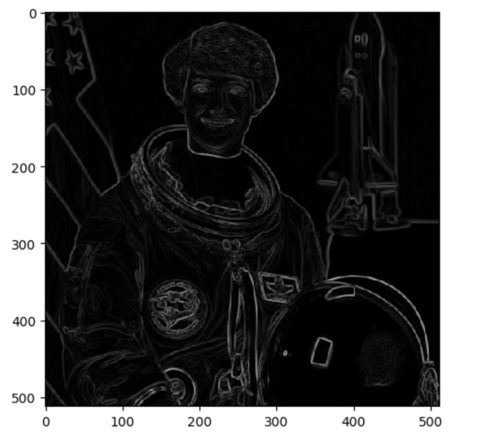

Sobel Response
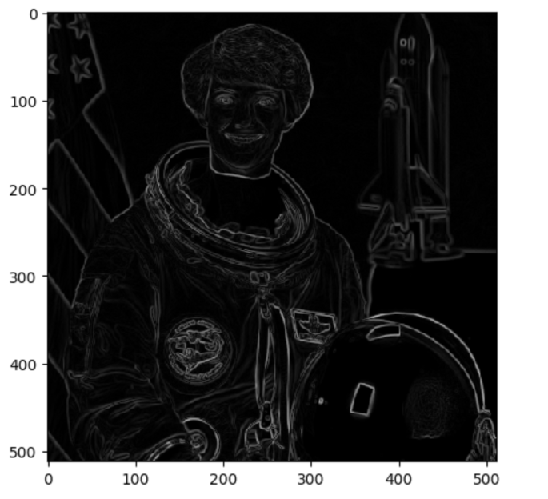

---

# The Next Step

- We need to isolate the detected edges, we simply threshold
- Using this we convert from gray scale to binary
- The process is simple:
	- We select a value (threshold)
	- Every thing bigger is white, the rest is black
- How can we choose the threshold?  
	- We can choose the threshold **manually**, **statistically**, or by using **various algorithms**.
	- Is it necessary to have a single threshold for the entire image?  
	- It is **not necessary** to have just one threshold for the image — we can use the concept of **Adaptive Thresholding** or **Multiple Thresholds** to generate a separate threshold for **each pixel** or for **groups of pixels**.
---

# Statistical Threshold

- Choosing the threshold **statistically**  
- can be done using **mathematical calculations** such as the **arithmetic mean**,  or by analyzing the **histogram** 
	- where the **largest cluster of pixel values** occurs  
	- Where the **mean value** within that region

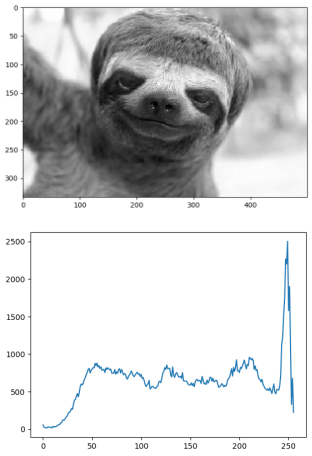

---

# Algorithmic Threshold
- Ready-made Algorithms
	- There are several algorithms for selecting the optimal threshold.  
	- The most famous of these is **Otsu's algorithm**.  
	- This algorithm works on the principle of minimizing the variance within the same class (intra-class variance), by maximizing the variance between classes (inter-class variance).  
	- It usually returns a single value representing a global threshold for the entire image.
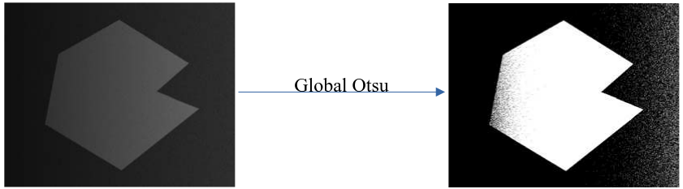
---

# Multiple/Adaptive Thresholds
- In this case, we can divide the image into several sections  
- Calculate the threshold for each section  
- Apply the resulting threshold to each section
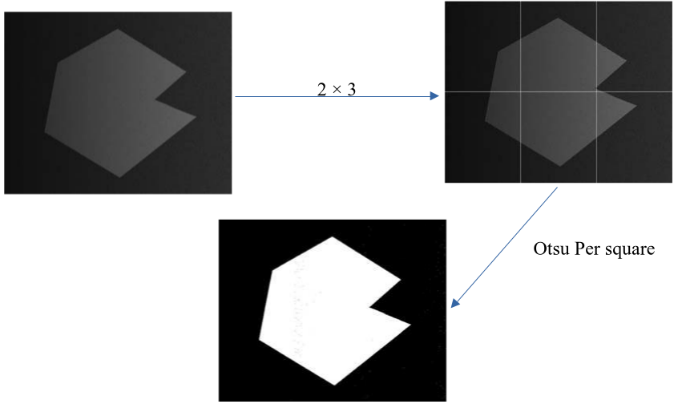
---

# Algorithmic Edge Detection
## Canny Edge Detection
- It is an edge detection algorithm developed in 1986.  
- It works according to the following steps:
	1. Denoise the image using a Gaussian filter.
	2. Detect horizontal and vertical edges using the Sobel operator. 
	3. Compute the overall response and Sobel direction (Intensity Gradient).
	4. Apply Non-Maximum Suppression.
	5. Apply Hysteresis Thresholding

---

# Algorithmic Edge Detection
## Canny Edge Detection
- Compute the overall response and Sobel direction (Intensity Gradient):  
	- We calculate the intensity value of the Sobel operator horizontally and vertically (i.e., the overall response).
$$
G = \sqrt{G_x^2+G_y^2}
$$
	- We calculate the direction using:
$$
	 \theta = arctan(\frac{G_x}{G_y}) 
$$
---

# Algorithmic Edge Detection
## Canny Edge Detection
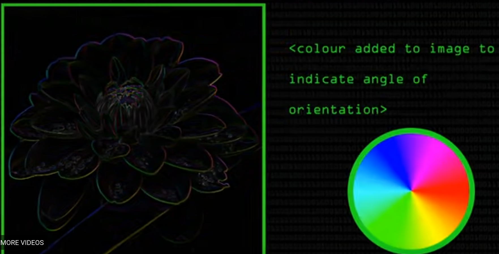

---

# Algorithmic Edge Detection
## Canny Edge Detection
- Apply Non-Maximum Suppression:  
	- Non-maximum suppression usually retains the value of a pixel if it is greater than its neighbors.
	- The standard NMS works as follows:
	$$
		E =IFF~ ~E >A,B,C,D,F,G,H,I => E~ ~else~0
	$$
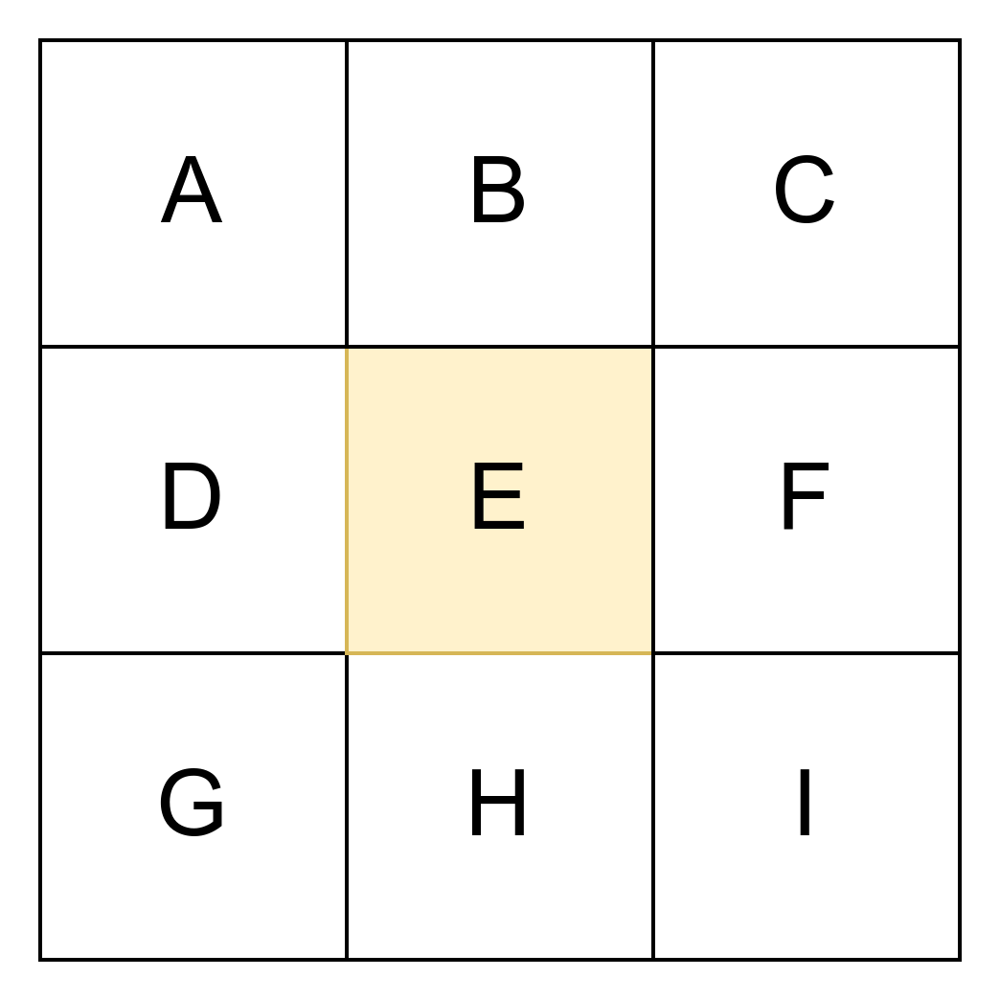

---

# Algorithmic Edge Detection
## Canny Edge Detection
- Apply Non-Maximum Suppression:
	- By incorporating the direction info we reduce the number of comparisons

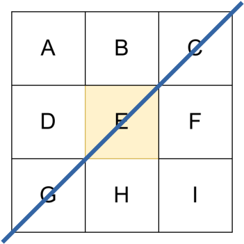

- We simply limit the comparison to the element corresponding with the direction
- In our example it is E,C,G only

---

# Algorithmic Edge Detection
## Canny Edge Detection

- Apply Hysteresis Thresholding:  
	- It relies on two values, **minVal** and **maxVal**.
	- Anything **above maxVal** is considered an edge.
	- Anything **below minVal** is **not an edge**.    
	- For values **between minVal and maxVal**, they are considered edges **only if they are connected to a strong edge** (i.e., a pixel above maxVal).
	- If a pixel in this range is **connected to a strong edge**, it is considered an edge.
Otherwise, it is **ignored**.

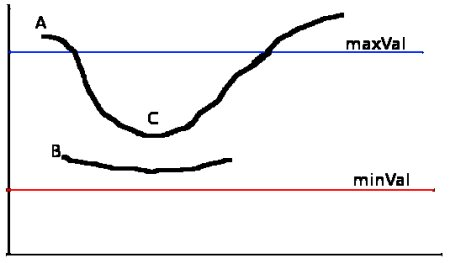

