# Computer Vision
## Lecture 3 
### Morphology, BLOBs & Texture Detection

---

# Morphology

- Sometimes when detecting edges we get cases where we have weak edges, extra edges, and incomplete edges
- As we see in the image on the side, the letters have incomplete edges
- Weak Edges happen because two objects are close to each other, in which situation, sometimes edge detection methods creates a link between the edges
- Extra edges are like spurs or spikes on the original objects

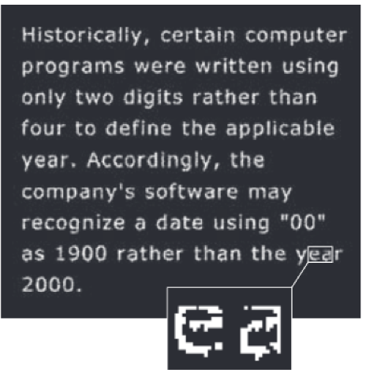

---

# Morphology
- We need a method to handle the inconsistencies with edges
- As result we use morphological operations (dilation, erosion, opening and closing)
- These operations are defined as set operations on images:
	- If we are working on binary images, we operate on $Z^2$, (x,y) the result is 0 (black) or 1 (white)
	- If we are working on gray scale images, we operate on $Z^3$, (x,y) the result is the gray scale value
- We use morphology with two types of sets of pixels: objects and structuring elements:
	- Objects are defined as sets of foreground pixels
	- Structuring elements can be specified in terms of both foreground and background pixels. In addition, structuring elements sometimes contain so-called “don’t care” elements, denoted by ×, signifying that the value of that particular element in the SE does not matter
---

# Morphology

- The upper line in the image represent the images
	- White pixel represents the background, while the blue ones are the foreground (object)
-  The lower line in the image represent the structure element
 	- White pixel represents the background, while the blue ones are the foreground (object), (no x here) while X represents the "don't care" pixels

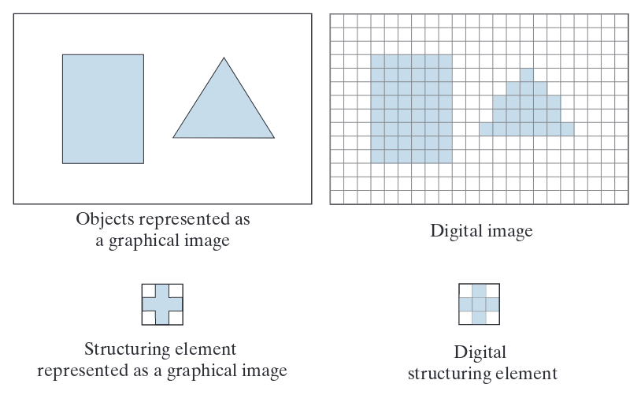

---

# Morphology

- The example image in the side is a simple morphology operation:
	- The Structuring Element B is all blue (All needed) pixels, meaning we accept the pixel in the center of the structuring element if and only if the all elements around contained foreground information
	- As a result we see the transformation of the object A is being slimmed down, pixels not completely surrounding other pixels

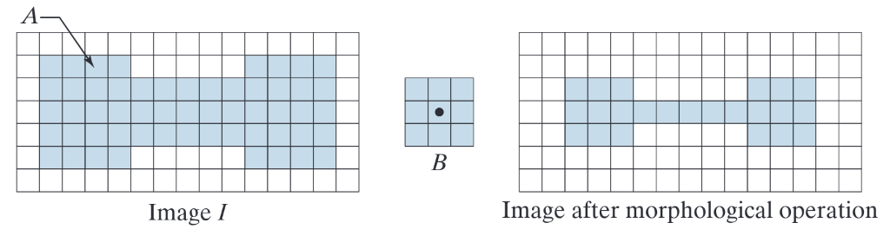

---

# Morphology
## Reflection
- Defined by the following equation
$\hat{B}=\{w | w=-b, for~b \in B\}$
- Meaning $\hat{B}(x,y)=B(-x,-y)$
## Translation
- Defined by the following equation
$(B)_z=\{c | c=b+z, for~b \in B\}$
- Meaning $(B)_z(x,y)=B(x+z_1,y+z_2)$
---

# Morphology

An Exmaple

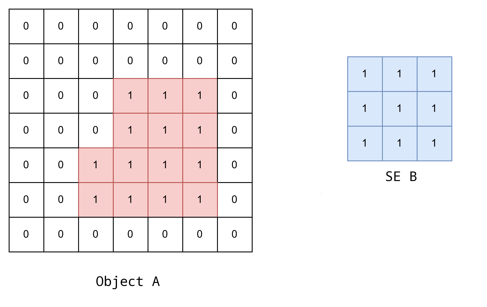
---

# Morphology

An Exmaple

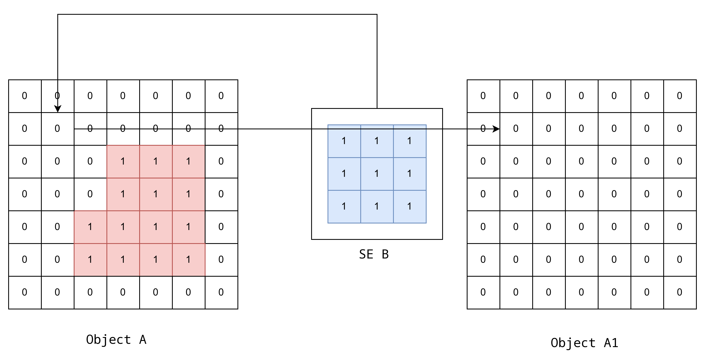
---

# Morphology

An Exmaple

---

# Morphology

An Exmaple

---

# Morphology

An Exmaple

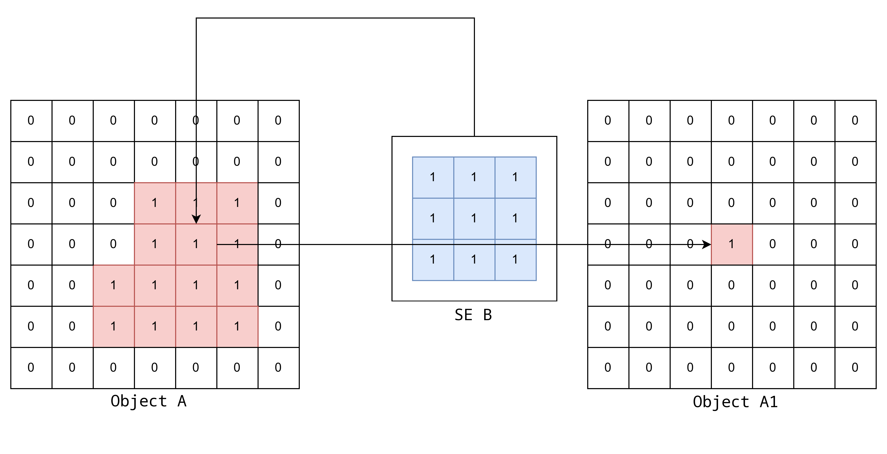
---

# Morphology

An Exmaple

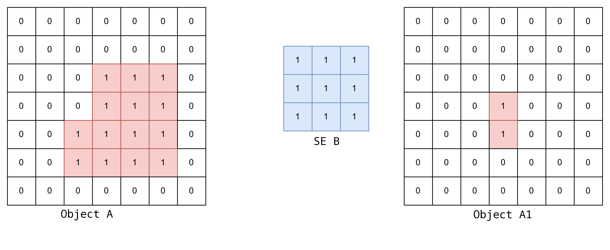
---

# Morphology

A test

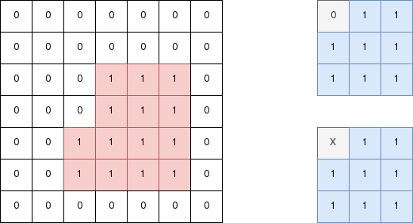
---

# Morphology

A test

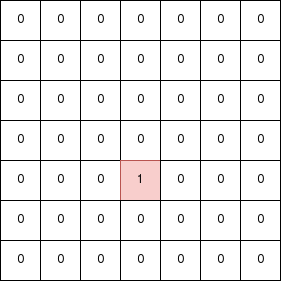

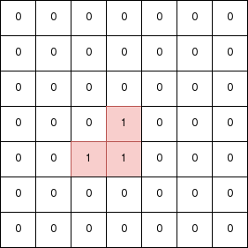

---

# Morphology
## Erosion
- Defined by
$A \ominus B~=~\{z | (B)_z~\subseteq~A~ \}$
	- A is the object, B is the structuring elements
- This equation indicates that the erosion of A by B is the set of all points z such that B, when shifted (translated) by z is entirely contained within A. 
- In other words, we generate four images from the object A
- In each one, we shift it up, down, right, and left, then we take the **intersection** of all these images.
- Erosion shrinks an object
---

# Morphology
## Erosion

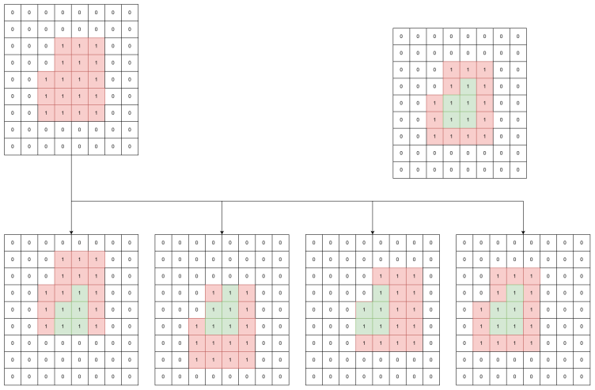
---

# Morphology
## Dilation

- Defined by
$A \oplus B~=~\{z | [(B)_z~\cap~A~]~\subseteq~A~ \}$
	- A is the object, B is the structuring elements
- This equation indicates that the dilation of A by B is the set of all shifts z such that the foreground elements of B, when shifted by z, overlap with at least one element of A. 
- In other words, we generate four images from the object A
- In each one, we shift it up, down, right, and left, then we take the **union** of all these images.
- Dilation grows the object
---

# Morphology
## Dilation

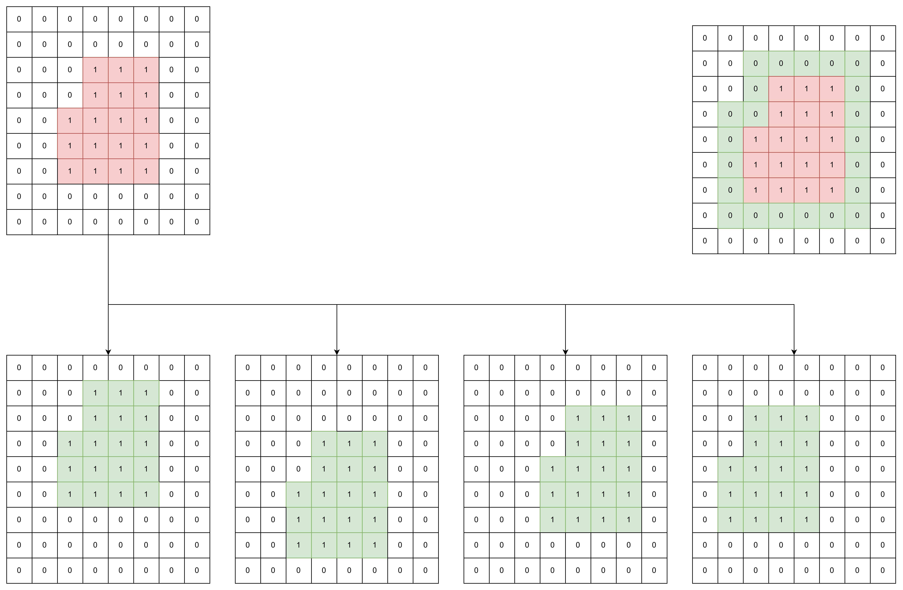
---

# Morphology
## Erosion & Dilation

- Erosion:
	It is useful for processing irregular or highly complex edges, helping to smooth or simplify them.
- Dilation: 
	It is useful for repairing breaks or gaps in edges, helping to connect or fill in discontinuities.

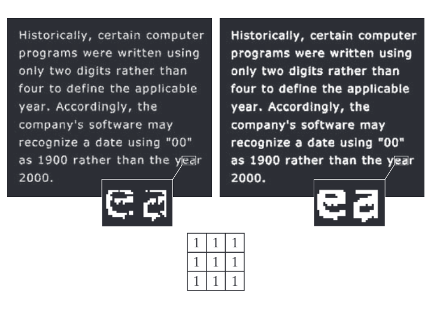

---

# Morphology
## Erosion & Dilation

- Because being set operations, there are relationships between erosion and dilation, taking into consideration reflection and complement 
$$
\overline{(A \ominus B)}=\overline{A} \oplus \overline{\hat{B}}
$$
$$
\overline{(A \oplus B)}=\overline{A} \ominus \overline{\hat{B}}
$$
---

# Morphology
## Opening

- Defined by the equation $A \circ B=(A \ominus B) \oplus B$
- Explaned by the equation $A \circ B=\cup\{(B)_z|(B)_z \subseteq A\}$
- geometric interpretation:
	- It consists of all parts of the object A that are large enough to fully contain the structuring element B inside them.
	- Practical use:
		- Opening is useful for **removing weak edges or small connections** that might link **two separate objects** in the image, effectively **separating them**.

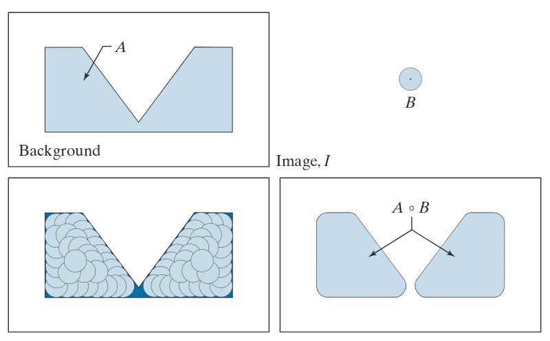

---

# Morphology
## Closing

- Defined by the equation $A \cdot B=(A \oplus B) \ominus B$
- Explaned by the equation $A \cdot B=\overline{[\cup\{(B)_z|(B)_z \cap A=\phi\}]}$
- geometric interpretation:
	- It consists of all parts of the object A that are encircled completely by the structuring element B.
	- Practical use:
		- Closing is useful for **closing** holes and **strengthen** weak edges.

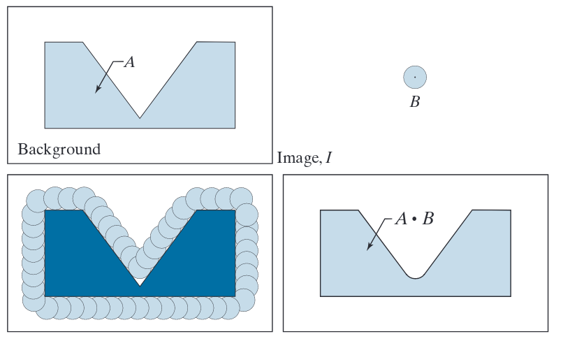

---

# Morphology
## Opening & Closing
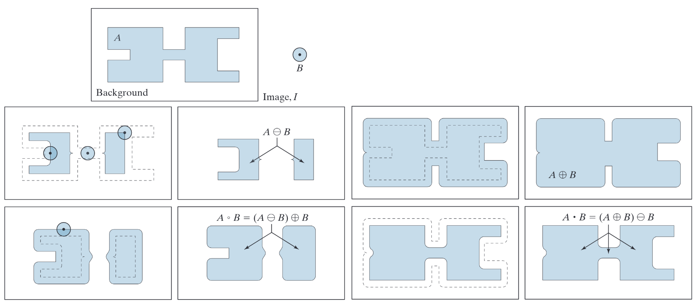
---

# BLOB
- Blob detection is a technique in computer vision used to identify regions in an image that differ in properties (such as brightness or color) compared to surrounding regions, often used to detect features like spots, corners, or objects
---

# BLOB
## Laplacian of Gaussian (LoG)
- Principle:
	- Blobs are regions where the image intensity has local extrema  
	- The Laplacian operator highlights areas of rapid intensity change.    
	- To reduce noise, the image is smoothed first with a Gaussian filter, giving the Laplacian of Gaussian.
- Steps:
	1. Smooth the image with a Gaussian of scale $\sigma$:   
		- $L(x,y;σ)=G(x,y;σ)∗I(x,y)$
		- $L(x, y; \sigma) = G(x, y; \sigma) * I(x, y)L(x,y;σ)=G(x,y;σ)∗I(x,y)$
	2.  Find local maxima and minima across space and scale. These correspond to blobs. 
---

# BLOB
## Laplacian of Gaussian (LoG)
- Pros: Accurate detection of blob size and location.
- Cons: Computationally expensive because the Laplacian has to be computed for multiple scales.
---

# BLOB
## Laplacian of Gaussian (LoG)
- The Mexian Hat Shap is the shap of LoG
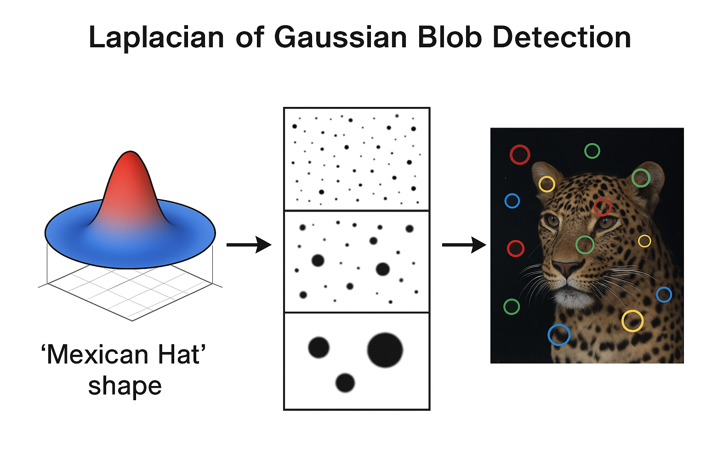
---
# BLOB
## Difference of Gaussian (DoG)
- Principle:
	- DoG approximates LoG but is faster to compute
	- The Laplacian operator highlights areas of rapid intensity change.    
	- To reduce noise, the image is smoothed first with a Gaussian filter, giving the Laplacian of Gaussian.
- Steps:
	1. Smooth the image at two scales $\sigma$ and $k \sigma$ where $k>1$.
	2.  Subtract the smoothed images to get DoG. 
	3. Detect local extrema in space and scale as blob locations.
---

# BLOB
## Difference of Gaussian (DoG)
- Pros:
	- Much faster than LoG.   
	- Used in SIFT feature detection.   
- Cons:
	- Approximation, slightly less accurate than exact LoG.
---

# BLOB
## Difference of Gaussian (DoG)

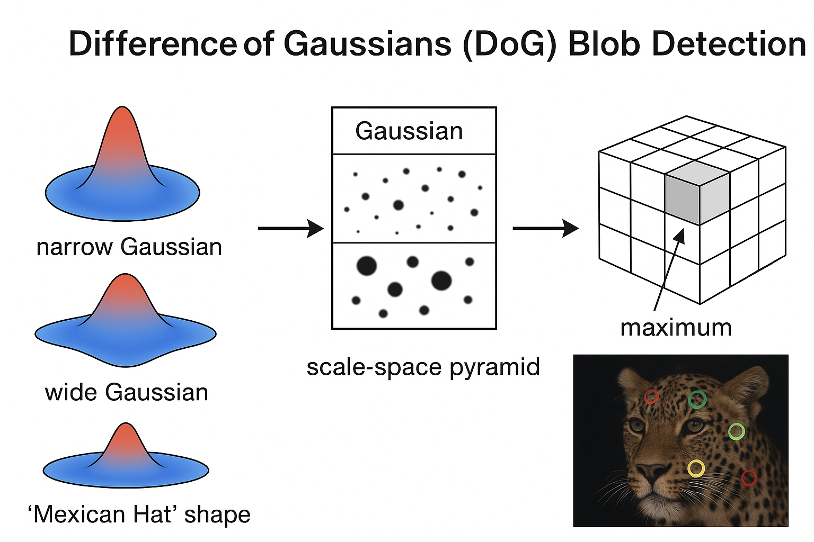

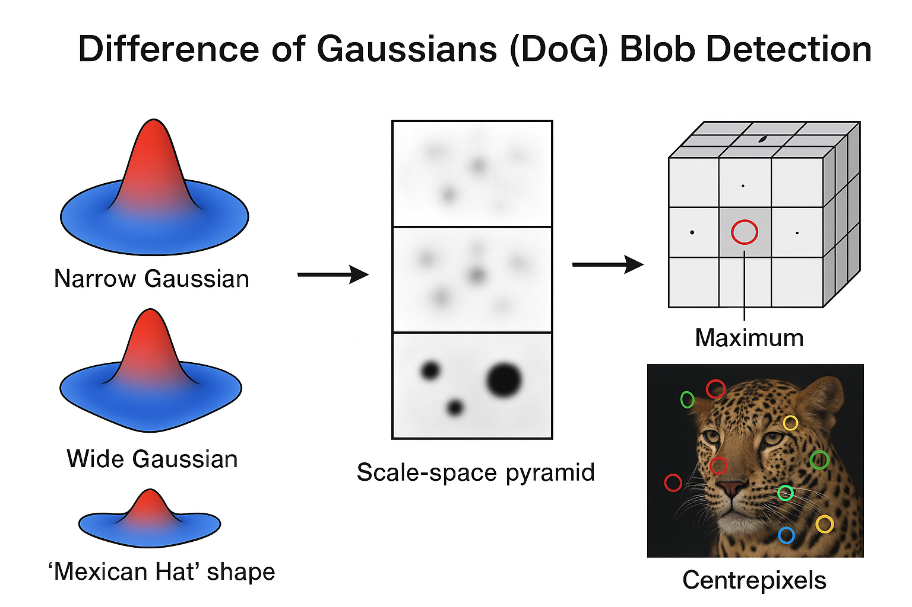

---

# BLOB
## Connected Component
- A connected component is a set of pixels in a binary image (or sometimes in a grayscale image after thresholding) that are connected to each other and share similar properties (like intensity or color).
- Essentially, it’s a “blob” or cluster of pixels that can be treated as a single object in the image.
- A connected component is a group of adjacent pixels that are all foreground pixels (usually 1s in a binary image).
- Pixels are considered connected based on a **connectivity criterion**:
	- 4-connectivity: Pixels are connected if they share an edge (up, down, left, right).
	- 8-connectivity: Pixels are connected if they share an edge or a corner (diagonal connections included).
- The method of work:
	- Scan the image and label each connected region with a unique identifier. 
	- All pixels with the same label belong to the same connected component.
---

# Texture Detection
- **Definition:** Texture is a fundamental element in **human visual perception** and is widely used in **computer vision systems**.
- It is defined as a measure of:
	- Roughness
	- Contrast    
	- Orientation       
	- Line similarity       
	- Regularity       
	- Coarseness        
- **Conceptually:** Texture represents the **grouping of similar patterns** in an image.   
- **Occurrence:** Natural scenes often contain **quasi-repetitive arrangements of pixel units**, which form textures.
---

# Texture Detection

- Texture analysis plays a major role in describing image content as it captures subtle variations in gray-level gradients that cannot be detected by high-pass filters
- **Key application:** One of the most important uses of texture detection is the detection of camouflaged objects in images.
- **Additional applications:**
	- Medical imaging
	- Detection of cracks in roads
	- Fingerprint analysis
	- And other fields requiring fine pattern recognition.
- Represent The Texture:
	- Gabor Filters
	- Gray Level Co-Occurrence Matrix
---

# Texture Detection
## Gabor Filters
- One of the simple methods for texture detection in digital images.
- A Gabor filter is defined as the product of a Gaussian filter and a sinusoidal (sine or cosine) wave.
- It is widely used because it can analyze both spatial and frequency information, making it effective for capturing texture, orientation, and spatial frequency in images.
- Defined by $G(x, y) = e^{-\frac{1}{2} \left( \frac{x_r^2}{\sigma_x^2}+\frac{y_r^2}{\sigma_y^2}\right)}\times e^{  i \left( 2 \pi \frac{x_r}{\lambda} + \psi \right)}$
- $\psi$ represents phase
- $\lambda$ represents wave length
- $x_r=x co \theta + y sin \theta$
- $y_r=-x sin \theta + y cos \theta$
---

# Texture Detection
## Gabor Filters
- When applying Gabor filter, we don't apply a single filter, apply a multiple filters
- In we don't supply all the parameters, we apply only multiple values of $\psi$ & $\lambda$ creating a bank of filters
- With the resulting images, we calculate the average and the standard deviation per resulting image
- The resulting pairs are called gabor response
- To compare responses we use Euclidean distance
---

# Texture Detection
## Gray Level Co-Occurrence Matrix

- Texture co-occurrence / Spatial Gray-Level Dependence

	- Used to provide information about the distribution of intensity levels in an image.    
	- Capable of numerically describing the image content.   
	- Defined as the distribution of co-occurring values at a certain displacement (offset).
	- It can also represent the distance and angular spatial relationship within a subregion of the image of a given size.
	- This method is based on counting the number of times a pixel value i occurs relative to its horizontal, vertical, or diagonal neighbor j
	- It forms a square matrix of size N×N, where N is the maximum pixel value in the image.   
	- Each entry in this matrix is calculated based on the frequency of occurrence of the pair (i,j) at a specified direction and distance.
---

# Texture Detection
## Gray Level Co-Occurrence Matrix

- Direction and distance in GLCM:
	- Direction is measured in angles (e.g., 0°, 45°, 90°, 135°).
	- Distance is measured in number of pixels between the pair.

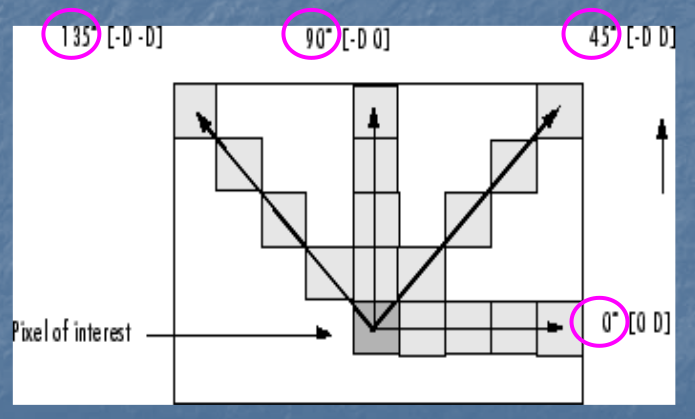

---

# Texture Detection
## Gray Level Co-Occurrence Matrix

- Example:
	- If we want to compute the co-occurrence of pixel values 6 and 7 at distance 2 and direction 0°, this means:
		- Count the number of times the pair (6,7) occurs in the image   
		- Such that the second pixel (7) is 2 pixels to the right of the first pixel (6) horizontally (0° direction).

---

# Texture Detection
## Gray Level Co-Occurrence Matrix
- A lot of information is obtained from GLCM
	- Contrast: Measures the amount of variation between a pixel and its neighbor. Higher contrast indicates greater differences. $\Sigma_{i,j} |i-j|^2 p(i,j)$
	- Homogeneity: Measures the closeness of the distribution of elements in the GLCM to the diagonal. Higher values indicate more uniformity. $\Sigma_{i,j}\frac{p(i,j)}{1+|i-j|}$   
	- Correlation: Measures the degree of linear relationship between a pixel and its neighbor Values range from -1 (negative correlation to 1 (positive correlation). $\Sigma_{i,j}\frac{(i-\mu_i)(j-\mu_j)p(i,j)}{\sigma_i\sigma_j}$  
	- Energy: The sum of squared elements of the GLCM. It reaches 1 for a perfectly uniform image and decreases as texture becomes more varied.$\Sigma_{i,j} p(i,j)^2$