# Computer Vision
## Lecture 4 
### Shape Descriptors & Template Matching
---

# Shape Description
- We have now managed to extract objects from digital images — how can we describe the shape of this object?  
- There are several methods:
	- Moments Descriptors 
	- Topological Descriptors
	- Fourier Descriptors   
---

# Shape Description 
## Moments Descriptors
- We can use several descriptors to describe a shape, such as (P is perimeter and A is area):
	- Compactness:
	    - The ratio of the object's area to the area of the surrounding circle.
	    - $compactness=\frac{p^2}{A}$
	    
    - Circularity: 
	    - The degree of similarity between the shape and a perfect circle.  
	    - $circularity=\frac{4\pi A}{P^2}$
---

# Topological Descriptors

- Topology is the study of properties of a figure that are unaffected by any deformation, provided that there is no tearing or joining of the figure
- The image on the side shows a region with two holes. 
	- a topological descriptor defined as the number of holes in the region will not be affected by a stretching or rotation transformation.
	- However, the number of holes can change if the region is torn or folded. Because stretching affects distance, topological properties do not depend on the notion of distance or any properties implicitly based on the concept of a distance measure.

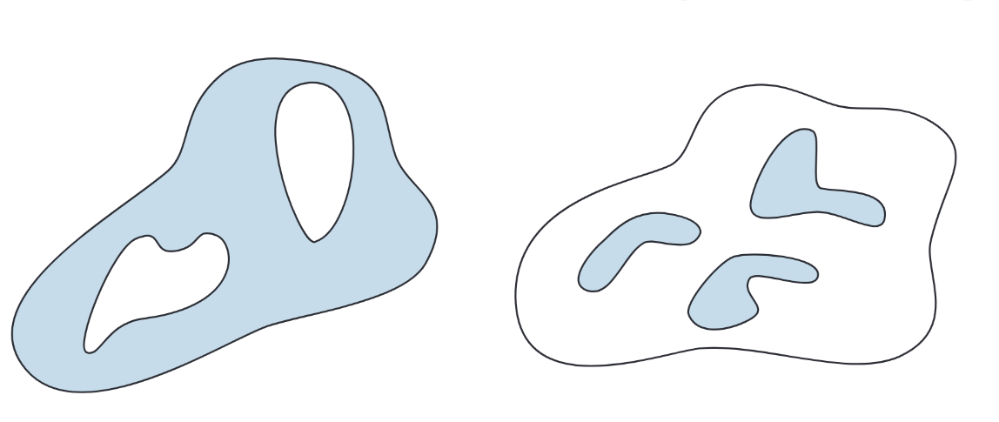

---

# Topological Descriptors

- Another topological property useful for region description is the number of connected components of an image or region (the second shape in the image)
- We can use Eular Number E to create a realationship between the number of holes and connected components inside the shape:
- $E=C-H$

---

# Topological Descriptors

- In the following picture:
	- The A letter has 1 connected component and 1 hole, E=0
	- The B letter has 1 connected component and 2 holes, E=-1

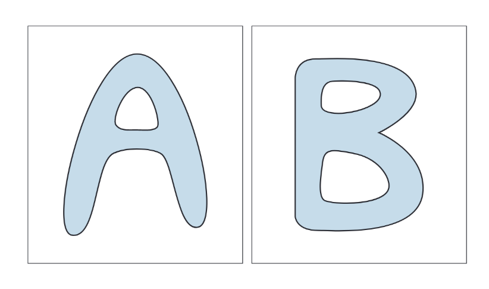

---

# Topological Descriptors
- Regions represented by straight-line segments (referred to as polygonal networks) have a particularly simple interpretation in terms of the Euler number
- Classifying interior regions of such a network into faces and holes is often important. Denoting the number of vertices by V, the number of edges by Q, and the number of faces by F gives the following relationship

$$
V-Q+F=C-H
$$
---

# Shape Description 
## Fourier Descriptors
- Fourier descriptors are a flexible and simple method for representing the two-dimensional shape of an object by applying the Fourier Transform to the boundary of that shape.
- The main idea is to represent a curve using a set of numbers that reflect the frequency content of the overall shape.  
- The method essentially relies on representing the curve and then applying the Fourier Transform to that representation.
---

# Shape Description 
## Fourier Descriptors
- The boundary pixels are represented — in the simplest possible form — using points (x, y).  
- Thus, the Fourier description of these boundaries is defined as providing a frequency representation corresponding to these points.
- The first component (DC component) represents the mean of the coordinates, hence expressing the center of the shape.   
- The second component represents the radius of the best-fit circle surrounding these points.  
---

# Shape Description 
## Fourier Descriptors

- By using a greater number of higher-order components, we achieve a more precise description of the shape since these components correspond to higher frequencies.  
- In general, only a limited number of low-frequency Fourier components are used because high-frequency components are easily affected by noise and provide less significant information about the overall shape.

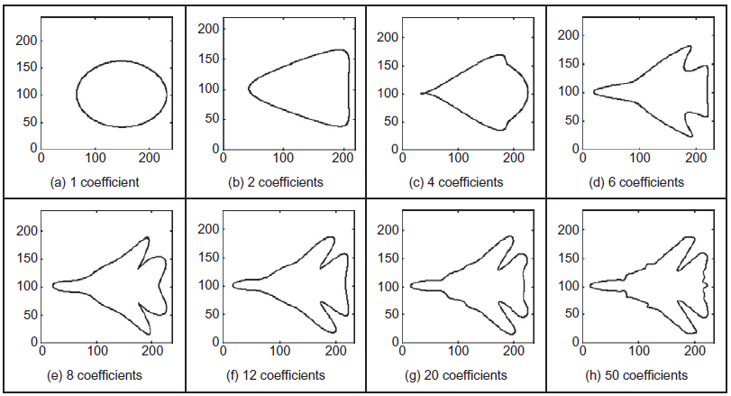

---

# Shape Description 
## Fourier Descriptors
- There are several mechanisms to use Fourier descriptors.  
- We will rely on the centroid-based method.

---

# Shape Description 
## Fourier Descriptors
### Centroid
- Computation Steps
	1. Compute the center of the object.
	2. Compute the Euclidean distance between the object’s center and each boundary point.
	3. Apply the Fourier Transform to the resulting vector.
	4. Normalize by dividing by the value of the first element of this vector (the DC component).
---

# Shape Description 
## Fourier Descriptors
### Centroid

- The Fourier descriptors obtained this way are invariant to rotation, translation, and scaling.
 

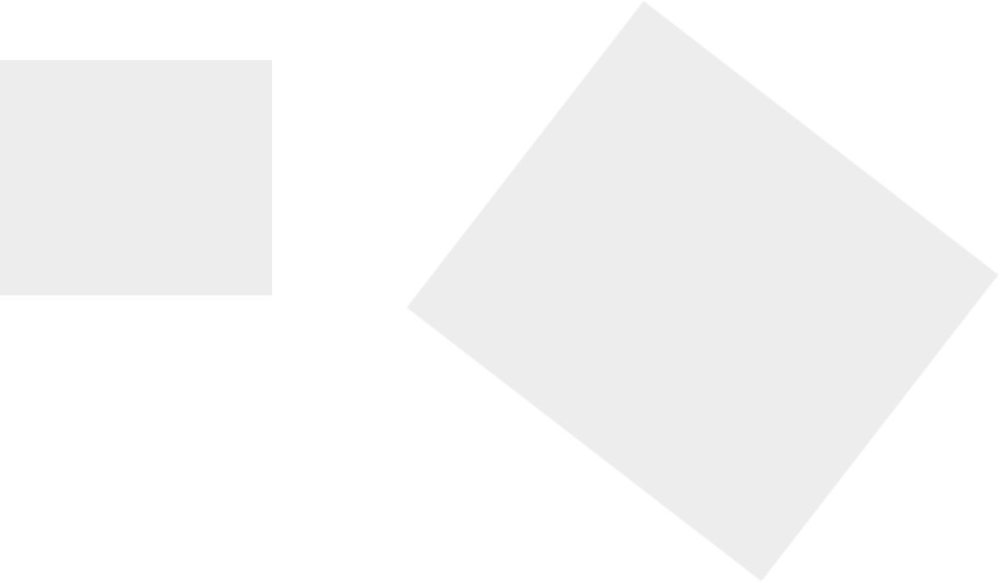

---

# Shape Description 
## Fourier Descriptors
### Centroid

- Rotation and translation invariance come from the fact that we calculate the distance between two points; this distance does not change when the object is shifted or rotated.  
- Since we apply the Fourier Transform to the differences, we obtain the same results regardless of the sample order.
 

---

# Shape Description 
## Fourier Descriptors
### Centroid

- Scale invariance is related to the DC component.  
- When an object is scaled by a constant factor, this value appears within the DC component of the Fourier Transform (which represents the shape’s center).  
- By normalizing the result through division by the DC component, we eliminate this scaling effect.

---

# Shape Description 
## Fourier Descriptors
### Centroid
- How to compare two shapes using Fourier descriptors: 
	- The process is quite complex and requires careful attention.  
	- We take the first _k_ components of the two shapes’ descriptors (preferably a power of 2) and compute the Euclidean distance between them.
	
$diff~=~\Sigma_k \sqrt{(x_{k,1}-x_{k,2})^2+(y_{k,1}-y_{k,2})^2}$
---

# Shape Description 
## Fourier Descriptors
### Centroid

- Assume we have two shapes, **S₁** and **S₂**,  
- and we take the first _k = 2_ components.

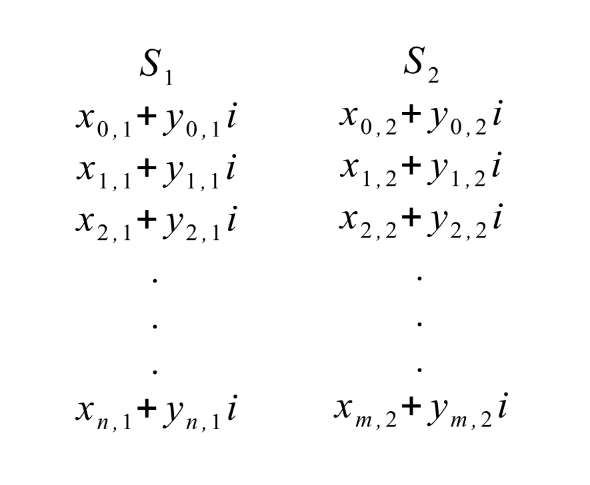

---

# Template Matching
- A high-level computer vision technique used to identify regions in an image that match a predefined template.  
- Template matching techniques are flexible and relatively easy to use, but their applicability depends on the available computational power — large and complex templates can take a long time to process.
---

# Template Matching 
## Requirements
- To perform template matching, we need:
	- A **reference image** of the object (template image)   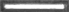
	- An **input image** to be searched 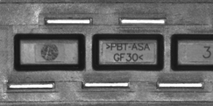
    - A **matching mechanism** (e.g., Naive, Correlation, Grayscale methods)  

---

# Template Matching 
## Sliding Window
- All the previously mentioned techniques rely on the **sliding window** concept.
- The **sliding window** is a technique that applies a certain algorithm across all pixels of the image, moving pixel by pixel to achieve the desired result.
- All the previously mentioned techniques rely on the sliding window concept — applying an algorithm on each pixel and moving one pixel at a time.
---

# Template Matching 
## Sliding Window 
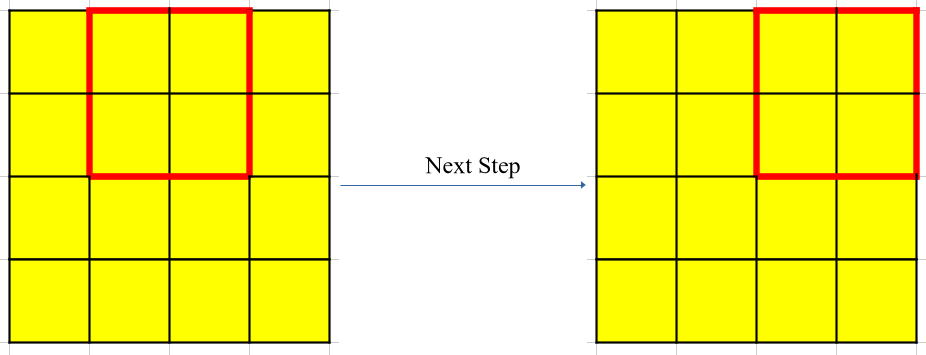
---

# Template Matching 
## Matching Mechanisms
### 1. Naive Method
- Subtract pixel values from each other.  
- Place the template (sliding window) on the image starting from the upper-left corner.
- Subtract values and compute the sum of differences.    
- Move the template rightward and repeat the computation.    
- Continue until the template has covered all pixels.    
- The locations with the smallest differences (below a threshold) indicate matches. 
---

# Template Matching 
## Matching Mechanisms
### 2. Correlation Method

- This method is similar to the naive one, but instead of subtraction, it studies the **correlation** between the template and the current region in the image.  
- The template is treated as a filter and applied to the image, producing an **output known as a correlation map**.  
- The higher the value, the better the match.

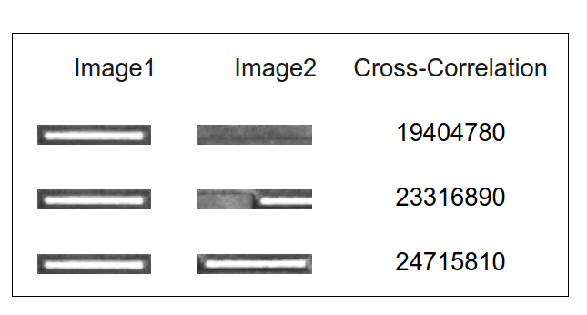

---

# Template Matching 
## Matching Mechanisms

### 2. Correlation Method: Example
- An example of a correlation map is shown, illustrating the region corresponding to the searched template.
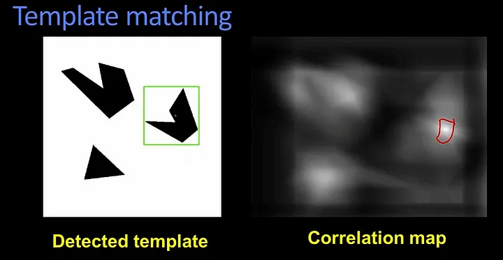
---

# Template Matching 
## Matching Mechanisms
### 2. Correlation Method: The Problem
- The main problem with this method is that it is **not normalized**, so we cannot determine the absolute best values, only the relatively best ones.  
- To solve this, we use **Normalized Correlation**.

---

# Template Matching
## Matching Mechanisms
### 2. Correlation Method: Normalized Correlation
- Correlation Formula: $C=\Sigma~~I(x,y) \times T(a,b)$
- **Normalized** Correlation Formula $Norm_C=\frac{1}{N \sigma_I\sigma_T}\Sigma~~(I(x,y)-\overline{I}) \times (T(a,b)-\overline{T})$
- The **normalized correlation** formula has the following characteristics:
	- Values between [-1, +1]  
	- Resistant to lighting variations   
---

# Template Matching 
## Matching Mechanisms
### 3. Grayscale Method
- What if the image contains the template but it is **rotated**?
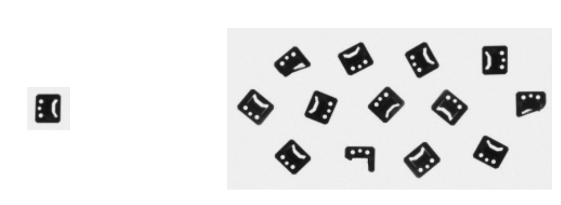
---

# Template Matching 
## Matching Mechanisms
### 3. Grayscale Method
- This method allows rotating the template at multiple angles and performing matching between each rotated version and the image to determine whether the template is present or not.  
- To reduce processing time, we apply this using an **image pyramid**.
---

# Template Matching 
## Matching Mechanisms
### 3. Grayscale Method
- We reduce the image and template to smaller sizes several times (e.g., twice, each time by half).
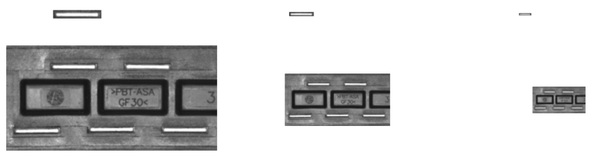 
---

# Template Matching 
## Matching Mechanisms
### 3. Grayscale Method
- Then, we generate rotated versions of the smallest-scale template and apply matching (using correlation or normalized correlation) between each rotated template and the image at that same level.
- For example, if we rotate the template at 20 different angles, and only 3 angles yield high matching scores,  
- we fix those angles and proceed to the next higher level.
---

# Template Matching 
## Matching Mechanisms
### 3. Grayscale Method
- We repeat the matching process at this level, rotating the template only according to the previously selected angles.  
- We then take the highest matching values, assume it corresponds to one specific angle 
- we apply rotation based on that angle and test the match at the next higher level, and so on,  until reaching the original image and template scale.
---

# Template Matching 
## Matching Mechanisms
### 3. Grayscale Method
- This technique allows most of the computations to be performed on smaller images.  
- As we move to larger ones, the computational cost decreases, improving performance.  
- There are other models as well, and we should not forget the significant role of **neural networks** in this field.
---

# Template Matching 
## Summary
- This technique is one of the simplest methods used for **object search and tracking in images**.  
- It can be used for **object tracking in videos**, especially when the object’s movement between consecutive frames is small.  
- It does **not require complex computations**, relying mainly on **correlation**.  
- It can also be used for **object identification** in digital images.  
- To make the process easier, it can be combined with **object detection algorithms**, reducing the search space from the entire image to specific regions.
---

# Histogram of Oriented Gradients
- Is a method to extract and describe objects in images using gradients
- Extremely used in detecting pedestrians in urban areas

---

# Histogram of Oriented Gradients
## Step 1: Preprocessing
- **Resize the Image:** Resize the input image to a fixed size. For the most common use case (pedestrian detection), the standard size is **64 pixels wide × 128 pixels high**.   
## Step 2: Compute Gradients
- Calculate the horizontal gradient ($G_x$) and vertical gradient ($G_y$) for each pixel. Simple 1-D filters like `[-1, 0, 1]` can be used. 
- **Formulas:**
    - $G_x(x,y)=I(x+1,y)−I(x−1,y)$
    - $Gy​(x,y)=I(x,y+1)−I(x,y−1)$
    
    where `I(x, y)` is the pixel intensity at location `(x, y)`.
---

# Histogram of Oriented Gradients
## Step 3: Compute Gradient Magnitude and Orientation

- For each pixel, compute the **gradient magnitude** and **orientation** from `G_x` and `G_y`.
    
- **Formulas:**   
    - Magnitude $\mu=\sqrt{G_x^2+G_y^2}$
	- Orientation $\theta=arctan
(G_y​,G_x​)$

---

# Histogram of Oriented Gradients
## Step 4: Create Cells and Histograms
- **Divide the image into cells:** Partition the image into small, connected regions called **cells**, typically **8x8 pixels** in size.   
- **Create a histogram for each cell:** For each cell, build a histogram with **9 bins**. Each bin represents an orientation range of 20 degrees (since 9 × 20° = 180°).
- **Voting method:** For each pixel in the cell, we determine which bin its gradient orientation `θ` falls into, and then add the pixel's gradient magnitude `μ` to that bin. This is called **magnitude-weighted voting**.
---

# Histogram of Oriented Gradients
## Step 5: Block Normalization
- This is the **most critical step in HOG** for achieving illumination and contrast invariance.    
- **Group cells into blocks:** Group adjacent cells into larger, overlapping regions called **blocks**. A typical block is **2x2 cells** (i.e., 16x16 pixels).    
- **Overlap:** These blocks move across the image with a **stride** (step size) of typically **1 cell** (8 pixels). This means blocks overlap by 50%, allowing each cell to appear in multiple blocks and creating more robust features.    
- **Normalization:** For each block, we concatenate the histograms of its four constituent cells (2x2 cells × 9 bins = 36 values). We then **normalize** this 36-dimensional vector. The most common method is L2 normalization:    
    $v→∥v∥_2^2​+\epsilon$
- where `ϵ` is a small constant to avoid division by zero.
---

# Histogram of Oriented Gradients
## Step 6: Form the Final Feature Vector

- We concatenate all the normalized block vectors together to form the **final HOG feature vector** for the entire input image.   
- **Example calculation for vector size:** For a 64x128 image, with 8x8 pixel cells, 2x2 cell blocks, and a block stride of 1 cell:   
    - Number of cells horizontally = 64/8 = 8 cells.
    - Number of cells vertically = 128/8 = 16 cells.        
    - Number of blocks horizontally = (8 - 2) + 1 = 7 blocks.        
    - Number of blocks vertically = (16 - 2) + 1 = 15 blocks.        

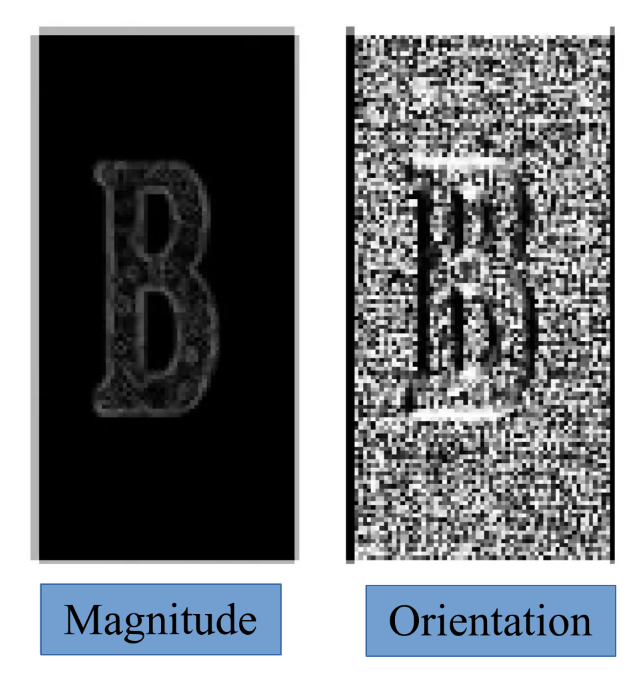

---

# Histogram of Oriented Gradients
## Step 6: Form the Final Feature Vector

- We concatenate all the normalized block vectors together to form the **final HOG feature vector** for the entire input image.   
- **Example calculation for vector size:** For a 64x128 image, with 8x8 pixel cells, 2x2 cell blocks, and a block stride of 1 cell:        
    - Total number of blocks = 7 × 15 = 105 blocks.
    - Final feature vector length = 105 blocks × 36 values/block = **3780 values**.

---

# Histogram of Oriented Gradients
## SVM 

- What is Support Vector Machine (SVM)
	- It is a classification technique using hyperplane to separate between data points

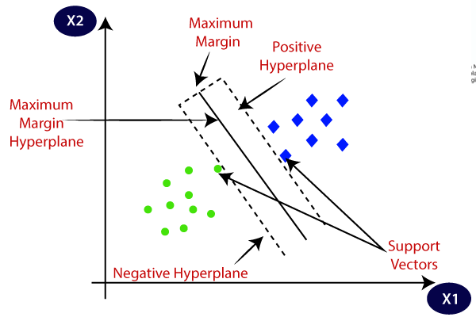

---

# Histogram of Oriented Gradients
## SVM 
### General Steps for Object Detection:
1. **Collect positive samples:** Gather images containing the object to detect (e.g., pedestrians), resize them to the standard size (e.g., 64x128), and extract HOG features from them. 
2. **Collect negative samples:** Gather images that do **not** contain the target object, and extract HOG features from them as well.    
3. **Train the model (SVM):** Use the HOG feature vectors from positives and negatives to train a Support Vector Machine (SVM) classifier. The SVM learns a hyperplane that best separates the positive and negative feature vectors.
---

# Histogram of Oriented Gradients
## SVM 
### General Steps for Object Detection:
4. **Implement sliding window detection:** To test a new image, slide a window of fixed size (e.g., 64x128) across the image at multiple scales. At each window position:
    - Resize the window region to the standard size.        
    - Extract HOG features from this window.
    - Apply the trained SVM classifier to get a score (whether the window contains the object) and a confidence value.
5. **Hard Negative Mining:** (Optional but effective step) Take windows that the current classifier incorrectly labeled as positive (from negative images) and add them to the negative training set, then retrain the classifier. This helps the classifier learn from its mistakes.
---

# Histogram of Oriented Gradients
## SVM 
### General Steps for Object Detection:
4. **Evaluate results:** Evaluate the final classifier's performance on an independent test set.    
5. **Non-Maximum Suppression (NMS):** After scanning the image, we get multiple overlapping bounding boxes detecting the same object. We use the NMS algorithm to keep only the most confident box and remove redundant duplicates.
