# Computer Vision
## Lecture 5  
### Segmentation & Visual Saliency
---

# Segmentation
- Active Contour
- Watershed
- GraphCut
- SLIC SuperPixel

---

# Active Contour

- It is a common type of segmentation algorithm in computer vision.
- It works on the principle of the "snake," where a snake exists on the image and continuously moves to enclose the objects in the image (regions with color variation) with the minimal possible path.
- It works on the principle of minimizing energy, i.e., it measures an energy value - similar to computing the difference between a pixel and its neighbors- and moves inward to make this difference as small as possible.

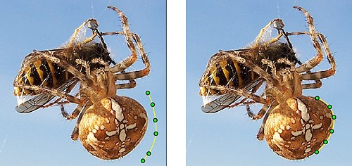

---

# Active Contour

- Sometimes, a binary image can be provided representing points on which
the algorithm should not operate, in order to reduce the required
processing time.

---

# Active Contour

- This algorithm aims to minimize the following equation over time.
$$
E_{total} = E_{image} + E_{contour}
$$
- The computational process mainly depends on differences between a pixel and its neighbors in the image.

- We take uniform samples from the contour boundary.
- We move each sample (point) within a window **W** so that the equation result becomes as small as possible.
- We then sum the values for all samples; if the result becomes smaller than a certain threshold, we stop.

---

### Active Contour

- We calculate the energy of contour
$$
E_{contour}=\alpha E_{elastic} + \beta E_{smooth}
$$
- where $\alpha$ and $\beta$ are values provided by the users.

---

# Active Contour 
## Curve Energy Calculation

$$
E_{contour} = \alpha\, E_{elastic} + \beta\, E_{smooth} 
$$
$$
E_{elastic} = \left\lVert \frac{dv}{ds} \right\rVert^2 \approx \left\lVert v_{i+1} - v_i \right\rVert^2 =\\ (x_{i+1}-x_i)^2 + (y_{i+1}-y_i)^2
$$
$$
E_{smooth} = \left\lVert \frac{d^2 v}{ds^2} \right\rVert^2 
$$
$$
E_{smooth} \approx \left\lVert v_{i+1} - 2v_i + v_{i-1} \right\rVert^2
$$
$$
E_{smooth} \approx (x_{i+1}-2x_i+x_{i-1})^2 + \\
(y_{i+1}-2y_i+y_{i-1})^2
$$

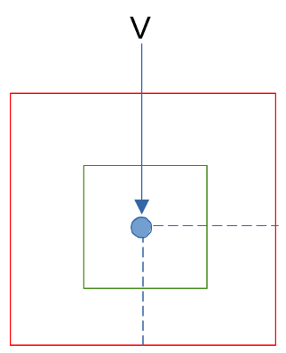

- **S** represents movements within the window surrounding the sample.
- **V**, **α**, and **β** are constants specified by the user.

---

# Active Contour
## Image Energy Calculation

- Image energy is based on computing the derivatives of illumination between neighboring pixels.
$$
E_{image}=\left\lVert \Delta I(x,y) \right\rVert^{2}
$$
- Total Energy
$$E_{total}=E_{image} + \alpha E_{elastic} + \beta E_{smooth}$$
- Image energy is called external energy and pulls the curves toward edges, while curve energy is called internal energy, and its components:
	- $E_{elastic}$ Force the curve to remain continuous and contracted
	- $E_{smooth}$ Force the curve to remain smooth

---

# Active Contour

- Active contours are useful for tracking objects in video frames.
- In the first row of images, the object can be tracked despite contour deformation between frames due to motion. 
- In the second row, the object can be tracked despite contour deformation caused by change of viewpoint.

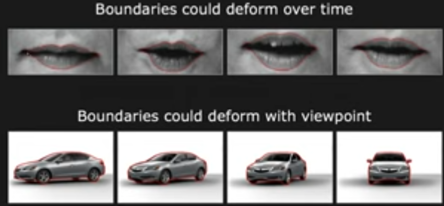

---

### Active Contour

- To speed up this algorithm, we often provide a simple **mask** to avoid operating on the entire image.
- Only the object's region is processed, reducing execution time.

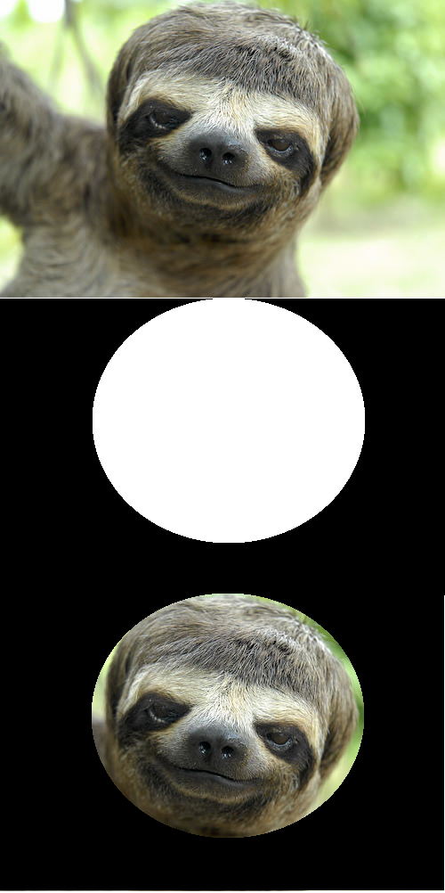

------------------------------------------------------------------------

# Watershed

- This algorithm treats the grayscale image as a topographic map.
- The higher the grayscale value, the higher the mountain peak.
- In this topographic representation, pixels are classified into three types:
	1. Points that represent **local minima**
	2. Points where, if a drop of water falls, it flows toward a local minimum
	3. Points from which water can flow toward more than one local minimum
- Points satisfying condition (2) represent the **catchment basin**.
- Points satisfying condition (3) represent the **watershed lines**.
- The algorithm aims to find these watershed lines.

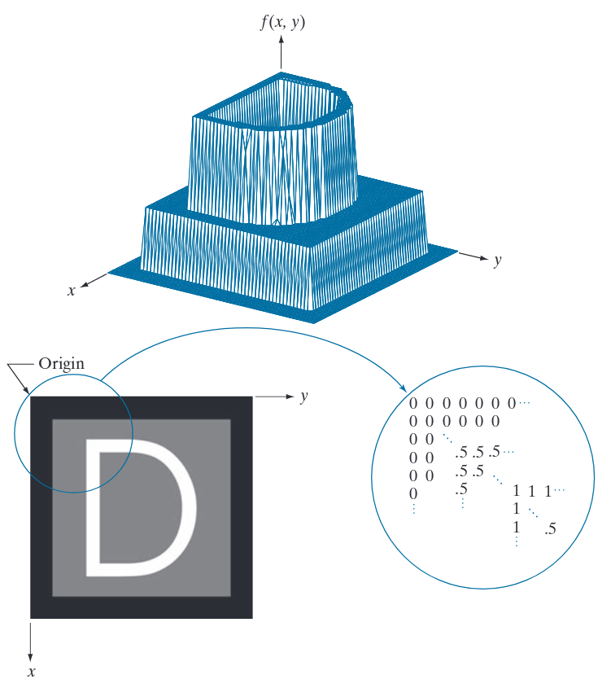

---

# Watershed

- Given the following images: the upper-left image is the original image, and the upper-right is the topography.

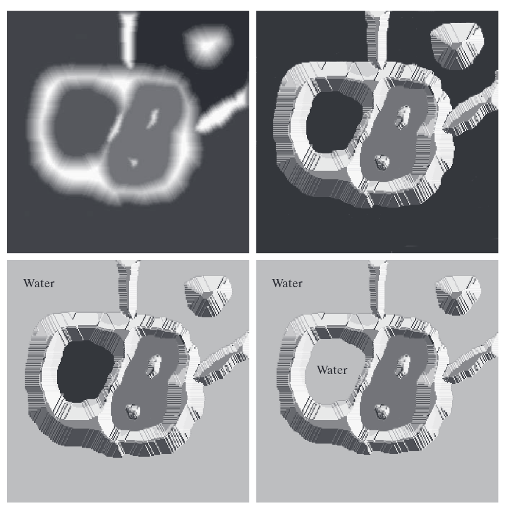

---

# Watershed

- We surround the image with dams - structures with a height equal to the maximum possible white level.
- We start filling the image with water.
- The background fills first, then the left basin.

---

# Watershed

- Then the right basin fills.
- We continue until reaching the upper-right image.
- Here the boundary between the right and left basins becomes one pixel wide (an edge -- condition 3).
- Here, we build a dam over this edge to prevent water from crossing.

---

# Watershed

- As filling continues, edges shrink to one-pixel thickness, and we build dams at each edge.
- Finally, we obtain the lower-right image.

---

# Watershed
- One of the most important applications of Watershed is extracting semi-regular objects from images.
- To speed up the algorithm, it is often applied to the **image derivative** rather than the image itself, because differences are more visible in the derivative.
- Most suitable is the second derivative as it produces thinner edges
---

# Graph Cut (GraphCuts)
- Graph Cut is an optimization technique widely used in **computer vision** to solve tasks such as:
	- Image segmentation   
	- Stereo matching    
	- Object/background separation
	- Energy minimization problems in general
- It transforms a vision problem into a **graph problem**, then finds the best solution by computing a **minimum cut** on that graph.

---

# Graph Cut (GraphCuts)
## What is a Graph Cut?

- A **graph cut** divides a graph into two disjoint sets by cutting edges.  
- Each cut has a **cost**, which is the sum of the weights of the edges that are cut.
- In computer vision, we construct a graph where:
	- **Nodes** = pixels (or superpixels)   
	- **Edges** = relationships between pixels    
	- **Weights** = cost (penalty) for cutting between pixels    
- We then find the **minimum cut** that best separates the graph into two sets:
	- **Source (S)** → often “foreground”
    - **Sink (T)** → often “background”  
- The algorithm finds the partition of nodes that minimizes the overall cost.
---

# Graph Cut (GraphCuts)
- GraphCut solves an energy minimization problem of the form:

$$
E = E_{data} + E_{smooth}​
$$

- Where:
	- **E_data**: cost of assigning pixel to foreground/background  
	- **E_smooth**: cost of assigning _neighboring pixels_ different labels (encourages smooth boundaries)   
- Graph Cut finds the labeling that minimizes **E**.
---

# Graph Cut (GraphCuts)
## How the Graph is Constructed

 

- We build a **directed graph** with:
	1. **Pixel nodes**
		- Each pixel = 1 node.
	2. Two extra nodes:
		- **Source (S)** → represents foreground    
		- **Sink (T)** → represents background

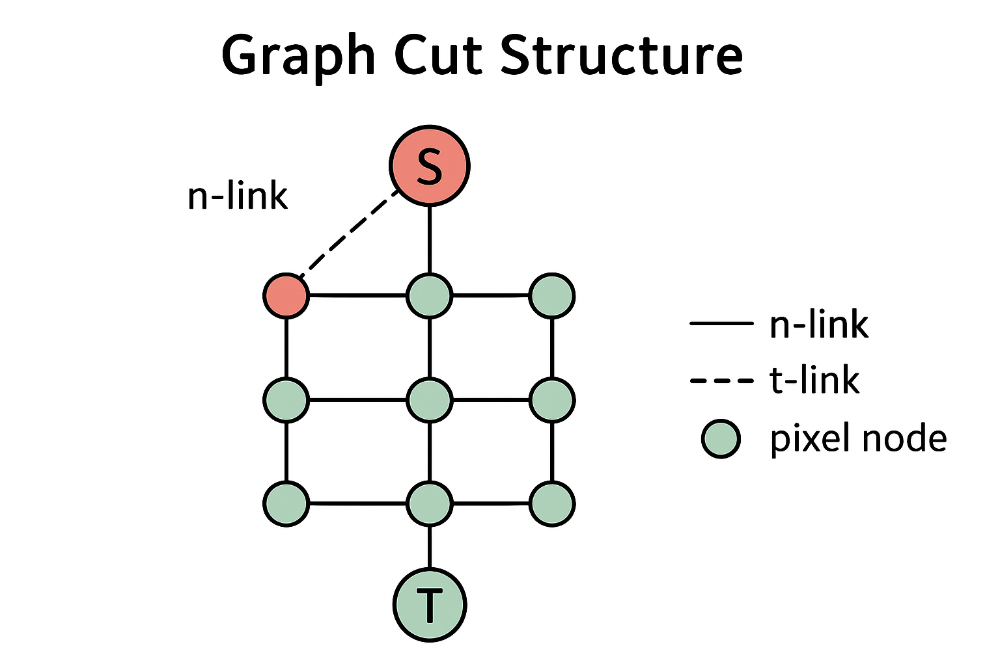

---

# Graph Cut (GraphCuts)
## How the Graph is Constructed

 

- Two types of edges: 
	1. **t-links (terminal links)**
		- Connect each pixel to S or T.  
		- Weights represent the data term:
			- Cost of assigning pixel to foreground (S)
			- Cost of assigning pixel to background (T)
	2. n-links (neighborhood links)
		- Edges between neighboring pixels.  
		- Weights represent the smoothness term:
			- High weight = don’t cut this edge (keeps region smooth)
			- Low weight = edge can be cut

---

# Graph Cut (GraphCuts)
- Once Graph is Built → Find the Minimum Cut
- We run a **max-flow / min-cut algorithm** (like Boykov–Kolmogorov).
- This gives:
	- A partition into two sets (Source side vs Sink side)  
	- A boundary where edges were cut → object boundary
- This is the final segmentation result.
---

# Graph Cut (GraphCuts)

- Example: Simple Foreground/Background Segmentation
	- Imagine each pixel has likelihood:
		- More red → belongs to object
		- More green → belongs to background  
	- We set:
		- t-links to source: high weight for red pixels
		- t-links to sink: high weight for green pixels
	- GraphCut finds a boundary where:
		- Object region = connected to **Source**
		- Background = connected to **Sink**
	- Smoothness term prevents noisy zig-zag boundaries.

---

# Graph Cut (GraphCuts)
## The Energy Function Used by GraphCut
- Typically:
$$
E(L)=\Sigma_i D_i (L_i)+\Sigma_{i,j}V_{i,j}(L_i,L_j)
$$
- Where:
	- $L_i​$: label (0 = background, 1 = foreground)
	- **Data term** $D_i$​: cost of assigning pixel i a label    
	- **Smoothness term** $V_{i,j}$​: penalty for neighboring labels being different

---

# Graph Cut (GraphCuts)
## Why ?
- Global optimization  
- Fast on large images  
- Robust to noise  
- Handles complex energy functions  
- Works with user scribbles (GrabCut)
## Uses
- Used in:
	- Medical imaging  
	- Photo editors (Photoshop uses it!)
	- Stereo vision
	- Object extraction
---

# SLIC SuperPixel Algorithm

- This algorithm belongs to the family of segmentation algorithms that
detect **superpixels**.
- A superpixel is considered the true shape of the pixel that should have been obtained during imaging.
- It is one of the most used superpixel algorithms due to its speed and result quality.
---

# SLIC SuperPixel Algorithm
- This algorithm divides the image into squares representing initial
- superpixels by drawing a grid of size **S × S**, $S=\sqrt{\frac{N}{K}}$ where:
	- **N** is the total number of pixels
	- **K** is the desired number of superpixels
- The initial superpixel centers are chosen as the smallest gradient value within a 3×3 neighborhood inside each square.
---

# SLIC SuperPixel Algorithm
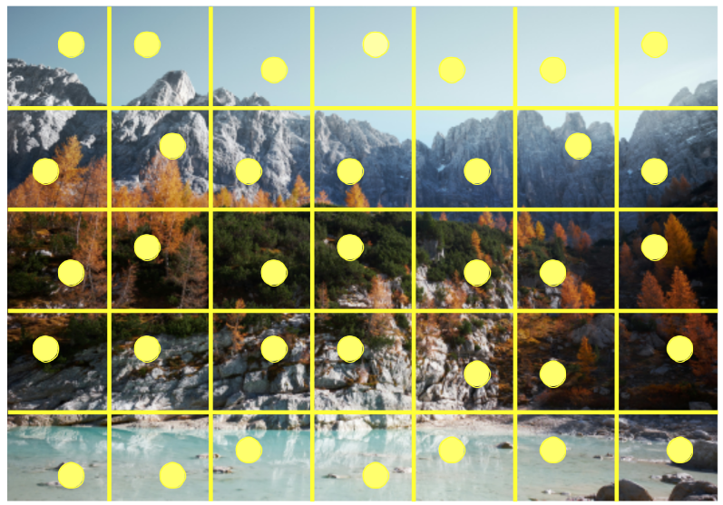
---

# SLIC SuperPixel Algorithm
- We apply **k-means** to each center independently using a neighborhood of size **2S × 2S**.
- We stop when the error becomes smaller than a specified threshold.
---

# SLIC SuperPixel Algorithm
- We apply k-means inside the square
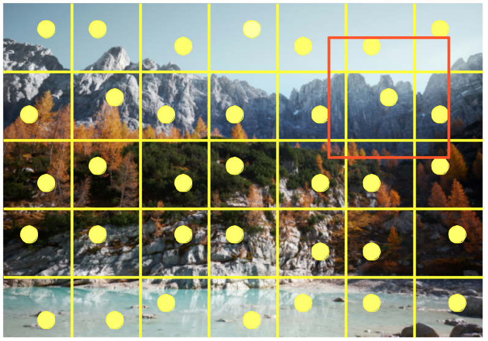

---

# SLIC SuperPixel Algorithm
## Distance Metric in SLIC
- The SLIC distance depends on color and spatial differences:
	- **d_c**: Euclidean color distance
	- **d_s**: Euclidean spatial distance
- A large **c** value prioritizes spatial distance over color distance, causing superpixels to become square-like at high values.
$$
d=\sqrt{d_c^2+\frac{d_s^2}{s}c^2}
$$
---

# SLIC SuperPixel Algorithm
## Example
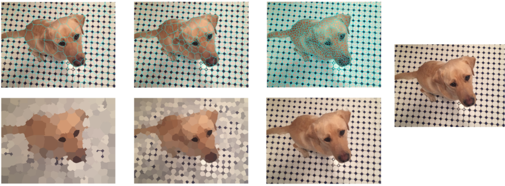
---

# SLIC SuperPixel Algorithm
## Purpose of SLIC
- We often need to apply very complex mathematical operations to images.
- If applied to each pixel, execution time becomes extremely long.
- Superpixels reduce the number of processed units---from millions (e.g., 4,000,000 pixels) to only a few hundred.
---

# Visual Saliency
## Concept of Visual Saliency

- The human eye provides a large amount of information to the brain, more than the brain can fully process.
- Thus, the brain gives priority to visually important content.
---

# Visual Saliency
- The regions the brain processes are those that are **distinct or salient**.
- These regions differ in color or illumination, or may include fast movement (e.g., seeing a cockroach suddenly run past you very fast).
- Saliency expresses how distinct a region, person, or pixel is compared to its surroundings.
- To model saliency, **saliency maps** were introduced---ordered topographic maps representing scene saliency.
- Despite precise definitions in neuroscience and psychology, computer vision lacks a strictly defined saliency concept.
- Saliency maps can be used to predict eye fixation points---i.e., where a human is likely to look.
---

# Visual Saliency
- Some models aim to detect salient objects or regions.
- Saliency in computer vision is part of the broader field:
	- **Computational Models for Visual Attention**, which describes mechanisms for computing attention and includes theoretical studies of brain and behavioral patterns.
	- A salient object is defined as an intrinsic property of the image---information within it---that can be clearly and explicitly perceived and understood by humans.
---

# Visual Saliency
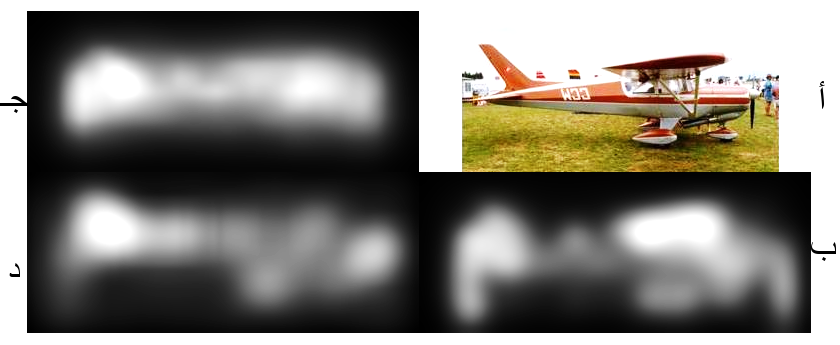
---

# Visual Saliency
- The whiter a pixel is, the more important it is The blacker it is, the less important it is.
- A saliency map represents visual saliency in a scene---values in the map represent clarity and perceptual importance of regions.
- Saliency maps have large applications such as:
	- Predicting where humans will look
	- Directing cameras toward important regions
	- Predicting eye movement
	- Prioritizing important regions for transmission, generation, or compression
- Object detection, recognition, and tracking
- Segmentation
---

# Visual Saliency
- Saliency can be determined using:
	- **Internal information only** (contrast and edges) 
	- **External information** from other images.
---

# Salient Objects
## Saliency Maps

- Algorithms vary, but the simplest is **Frequency-Tuned Saliency Detection (FT)**.
---

# Salient Objects
# FT-Based Saliency Maps
- Saliency detection relies on global and local contrast: 
	- Local contrast: difference between a pixel and its neighbors
	- Global contrast: difference between a pixel and the image's mean color

---

# Salient Objects
## FT Algorithm
- The FT algorithm relies on global contrast.
- It operates by:
	1. Applying a Gaussian filter
	2. Converting RGB to LAB color space
	3. Computing the average of L, A, and B channels
	4. Computing the Euclidean distance between each pixel and the average
	5. Threshold to obtain a binary image 
$$
T=\frac{2}{w \times h}\Sigma_i^w \Sigma_j^h I(x_i,y_j) 
$$

---

# GMR Algorithm (Graph-Based Manifold Ranking)
## Concept
- treat saliency as a **ranking problem on a graph** of image superpixels:
	- given a set of query nodes (background seeds or foreground seeds), rank every node by its relevance to those queries using **manifold ranking**.
	- They propose a two-stage pipeline:
		1. Rank using boundary priors (four sides individually → combine) to get an initial saliency map that suppresses background
		2. Binarize that map to select foreground queries and re-rank for the final saliency

---

# GMR Algorithm
## How GMR Works
### Preprocess

- Compute SLIC superpixels on `I`, producing `N` superpixels. Record for each superpixel `i`:
	- Mean color vector $c_i$​ in CIE-LAB.    
	- Pixel indices to map back to full resolution.
- They default `N=200`

---

# GMR Algorithm
## How GMR Works

### Step 1

1. Create a graph G=(V,E)G=(V,E)G=(V,E) with `N` nodes (one per superpixel).   
2. For each node i, connect:
    - its spatial neighbors (adjacent superpixels)        
    - expand to `k` nearest neighbors by adjacency (k-regular extension described in paper), i.e., connect nodes that share boundaries with neighbors to capture local grouping        
    - **close-loop constraint**: connect every boundary superpixel with every other boundary superpixel on the same image side.

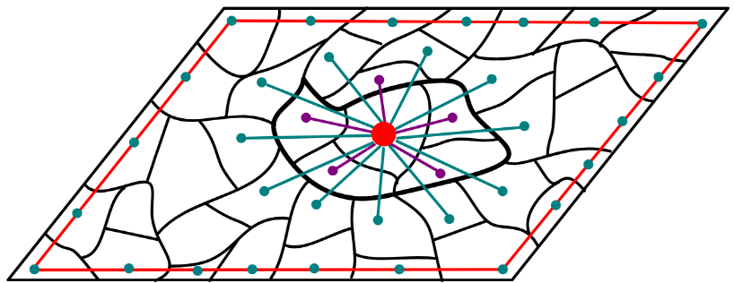

---

# GMR Algorithm
## How GMR Works
### Step 1
3. Compute affinity matrix W (sparse), elementwise:
$$
w_{i,j}=exp(-\frac{||c_i-c_j||^2}{\sigma^2})
$$
	- Only for connected pairs (others = 0). Use $\sigma^2=0.1$ as default.
4. Compute degree matrix $D = \mathrm{diag}$  where $d_{ii}=\sum_j w_{ij}$
---

# GMR Algorithm
## How GMR Works
### Step 2 — Precompute ranking operator
1. Set $\alpha = 1/(1+\mu)$, they suggest $\alpha = 0.99$.   
2. Form matrix $M = D - \alpha W$.    
3. Compute (or prepare to solve systems with) $A = M^{-1}$.
4. Set diagonal elements of `A` to zero when used to compute ranking (to avoid self-relevance bias). (They compute inverse first then set diagonal of `A` to 0 for ranking)

---

# GMR Algorithm
## How GMR Works
### Step 3 — Ranking with boundary (background) queries
- For each side $S \in \{top,bottom,left,right\}$
	1. Create indicator vector $y_S$ of length N: $y_S[i] = 1$ if superpixel i is on that image side (the paper uses nodes on that side as background queries), else 0.
	2. - Compute ranking vector $f_S = A y_S$.
    3. Normalize `f_S` to $[0,1]$.
	4. Convert to a saliency map for that side:
 $$
	S-S(i)=1-f_s(i)
$$
---

# GMR Algorithm
## How GMR Works
### Step 3 — Ranking with boundary (background) queries

- Combine the four side maps element-wise by multiplication (the SC rule):
$$
S_{bg}=S_{top}S_{bottom}S_{left}S_{right}
$$
---

# GMR Algorithm
## How GMR Works
### Step 3 — Ranking with foreground queries
1. Binarize $S_{bq}$ to pick foreground seeds    
2. Form indicator  $y_f g[i] = 1$ for selected foreground superpixels, else 0.    
3. Compute ranking $f_{fg} = A y_{fg}$.
    
4. Normalize $f_{fg}$ to $[0,1]$. This is the **final** per-superpixel saliency:
    $$
    S_{final}(i) = f_{fg}(i)
    $$