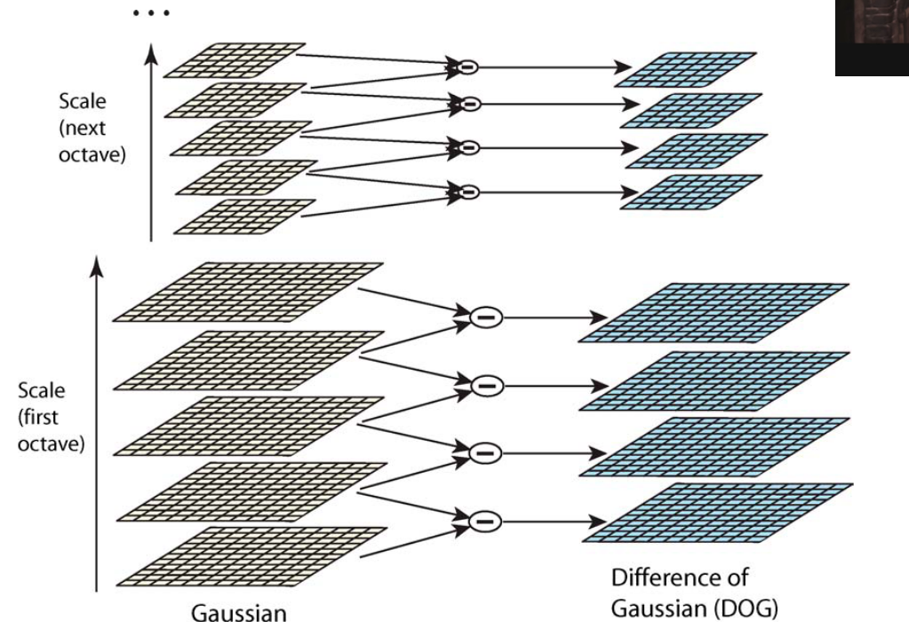
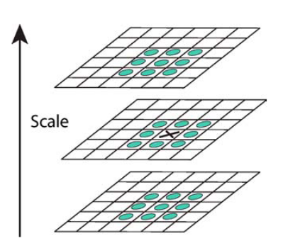
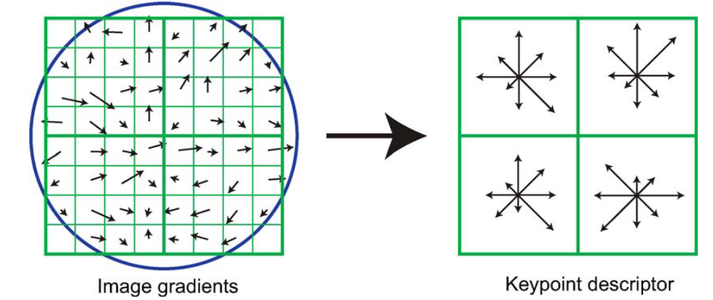
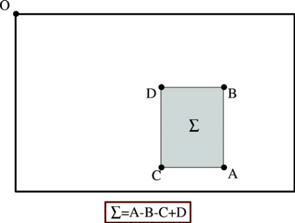
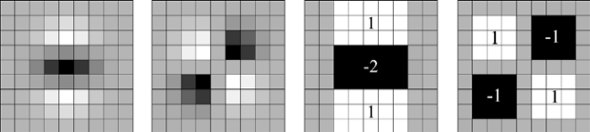
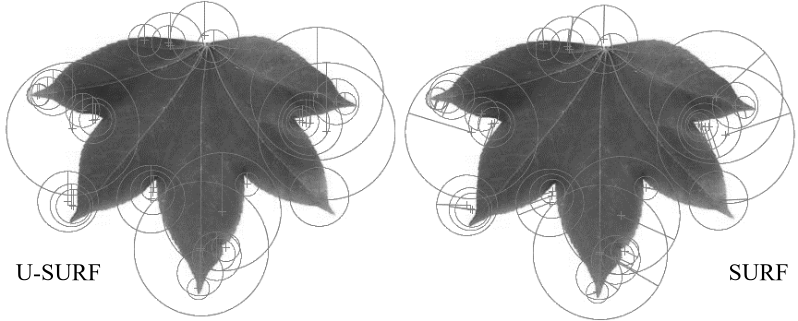
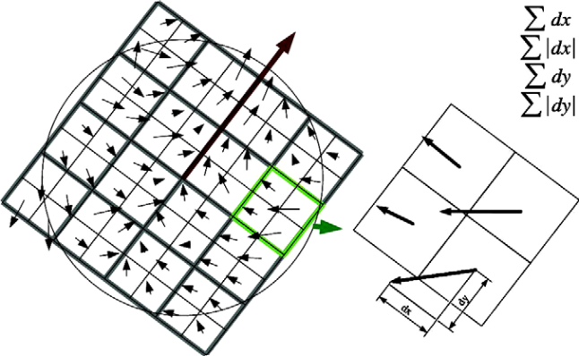
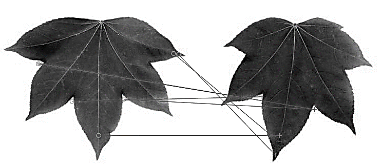

# Computer Vision
## Lecture 6  
### Keypoint Detection in Images
---

# Introduction
## What are keypoints?
- Not all points are equal. Some points, due to their position and values, contain rich information about the image.
- These points often appear near edges.
- Keypoint detection performs:
	- Locating important points in the image
	- Describing each point and its neighborhood using an easy‑to‑compare descriptor
	- Using these descriptors to compare points across two images to measure similarity
---

# Introduction
## What are important points?
- A set of keypoints (example illustration)

---

# Applications
- Content‑based image retrieval:
	- Images are indexed by building a database of each image and its keypoints.
	- When searching for an image, keypoints are extracted from the query image and compared to the database.
	- The matching image is identified.
	- It is also possible to search for an image using only a part of it.
- Keypoints can help classify images (Bag of Visual Words algorithm).
- They are also used for object detection.
- Tracking
	- Used extensively in video.
	- Allows tracking a specific point across consecutive frames.
	- Useful for visual effects.
---

# Keypoint Concept
- Among the most popular keypoint descriptors:
	- SIFT
	- SURF
	- KAZE
	- ORB
---

# SIFT
- Scale‑Invariant Feature Transform
- One of the earliest techniques for describing image information using keypoints.
- Developed in 2004.
- Highly accurate and robust to rotation, scale changes, and sometimes perspective.
- However, it is slow in extraction.
- Proprietary technology, when used outside of research, you're required to pay royalties
---

# SIFT 
## Detection Stages
- SIFT detection consists of 4 stages:
	1. Scale‑space extrema detection  
	2. Keypoint localization  
	3. Orientation assignment  
	4. Keypoint descriptor  

- A Difference of Gaussian (DoG) function is used to find stable keypoints in scale and orientation.
$$
DoG(x,y,\sigma) = G(x,y,k\sigma) * I(x,y) - G(x,y,\sigma) * I(x,y)
$$
---

# SIFT 
## Scale‑space extrema detection
- A key aspect of SIFT is that it produces a large number of features densely covering the image across many scales and positions.
- To find scale‑invariant keypoints, stacked Gaussian filters are used.
- Stable points across scales are selected.
- Scale‑space is built using continuous Gaussian blurring.
- Given an image \(I\) and Gaussian kernel \(G\), convolution produces:
$$
L(x,y,\sigma) = G(x,y,\sigma) * I(x,y)
$$
- The DoG filter approximates the Laplacian of Gaussian (LoG):
$$
	DoG(x,y,\sigma) = L(x,y,k\sigma) - L(x,y,\sigma)
$$
- This is computationally cheaper than LoG.
---

# SIFT 
## Building Gaussian Pyramid

- At each scale, σ is multiplied by k to produce multiple Gaussian levels.

---

# SIFT
## Extrema Selection

- Each candidate point is compared with 26 neighbors (8 in current scale + 9 in scale above + 9 in scale below).
- Selected only if it is a local maximum or minimum → becomes a keypoint candidate.

---

# SIFT
## Keypoint Localization
- Once a keypoint candidate has been found by comparing a pixel to its neighbors, the next step is to perform a detailed fit to the nearby data for location, scale, and ratio of principal curvatures. This information allows points to be rejected that have low contrast.
- This is done with 3 stages:
	1. Refining the Keypoint Location (Sub-pixel Accuracy)
	2. Eliminating Low-Contrast Points
	3. Eliminating Edge Responses
---

# SIFT
## Keypoint Localization
### 1. Refining the Keypoint Location (Sub-pixel Accuracy)
- The initially found extrema are at integer pixel positions, but the true extremum may be between pixels.
- SIFT fits a **3D quadratic function** (Taylor expansion) to the local DoG values around the keypoint:
$$
D(x)=D+\frac{\delta D^T}{\delta x}+ \frac{1}{2}x^T\frac{\delta^2D}{\delta x^2}x
$$

- where  
$$
 \mathbf{x}=(x,y,\sigma)
$$
- x is offsets in position and scale.
---

# SIFT
## Keypoint Localization
### 1. Refining the Keypoint Location (Sub-pixel Accuracy)
- Solving:
$$\hat{\mathbf{x}} = -\left( \frac{\partial^2 D}{\partial \mathbf{x}^2} \right)^{-1} \left( \frac{\partial D}{\partial \mathbf{x}} \right)
$$
- gives the **sub-pixel** (and sub-scale) offset.
	- If $\hat{\mathbf{x}}$ is larger than 0.5 in any dimension, the keypoint is shifted to a nearby position and recomputed.
---

# SIFT
## Keypoint Localization
### 2. Eliminating Low-Contrast Points
- If the value of the DoG function at the refined location is low:
$∣D(\hat{\mathbf{x}})∣<threshold (typically~0.03)$
- the keypoint is removed.
---

# SIFT
## Keypoint Localization
### 3. Eliminating Edge Responses
- DoG produces strong responses along edges—these are not good stable keypoints.
- SIFT examines the **Hessian matrix** at the keypoint:
$$
H = \begin{bmatrix} D_{xx} & D_{xy} \\ D_{xy} & D_{yy} \end{bmatrix}
$$
- Eigenvalues of H tell whether the structure is:
	- blob-like (good keypoint)  
	- edge-like (reject)   
---

# SIFT
## Keypoint Localization
### 3. Eliminating Edge Responses
- Instead of computing eigenvalues directly, SIFT uses the ratio:
$$
\frac{(\text{Tr}(H))^2}{\det(H)} < \frac{(r+1)^2}{r}
$$
- where r is the allowed edge ratio (typically 10).
- If this inequality fails, the keypoint lies on an edge → **discarded**.
- Hessian Matrix:
	- A **Hessian matrix** is a square matrix of **second-order partial derivatives** of a multivariable function.
	- It tells you how the function curves in different directions and is widely used in optimization, machine learning, and differential geometry.
---

# SIFT
## Orientation Assignment
- To achieve rotation invariance, an orientation is assigned to each keypoint using gradient magnitudes and directions.

$$
m(x,y) = \sqrt{(L(x+1,y)-L(x-1,y))^2 + (L(x,y+1)-L(x,y-1))^2}
$$
- And the direction
$$
\theta(x,y) = 	tan^{-1}\frac{L(x,y+1)-L(x,y-1)}{L(x+1,y)-L(x-1,y)}
$$
---

# SIFT 
## Descriptor

- A descriptor is created by sampling gradients around the keypoint, weighted by a Gaussian window.
- These samples are grouped using a directional histogram on 4x4 sub-regions
- These are accumulated into 4×4 sub‑regions with 8 orientation bins → 128‑dimensional vector.

---

# SIFT 
## Descriptor Normalization
- The descriptor consists of a vector that contains the values of all entries in the orientation histogram, corresponding to the lengths of the arrows.  
- The vector is normalized to reduce the effects of lighting changes by scaling it to unit length.  
- Any change in image contrast that multiplies every pixel value by a constant will also multiply the gradients by the same constant, so this contrast change will be canceled out by normalizing the vectors.  
- A change in brightness, where a constant is added to every pixel in the image, will not affect the gradient values, since they are computed from pixel differences.
---

# SIFT 
## Matching
- Descriptors are compared using Euclidean distance.
- For many points, nearest‑neighbor matching is used.
---

# SURF
- Speeded Up Robust Features
- Faster alternative to SIFT.
- Uses integral images and Hessian determinant approximation for faster keypoint extraction.
- DoG (SIFT) → replaced by Hessian‑based detector.
---

# SURF 
## Integral Images
- Integral image: each pixel equals the sum of all previous pixels. 
$$
I_\Sigma(x,y) = \sum_{i \le x, j \le y} I(i,j)
$$
- Converts summing over a rectangular region from O(n) to O(1):
	- Any rectangle sum can be computed with four corner values.

---

# SURF
## Keypoint Detection
- Uses Hessian matrix approximation:
$$
H(x,\sigma) = 
\begin{bmatrix}
L_{xx}(x,\sigma) & L_{xy}(x,\sigma) \\
L_{xy}(x,\sigma) & L_{yy}(x,\sigma)
\end{bmatrix}
$$
- Keypoints are detected using determinant:
$$
\det(H) = L_{xx}L_{yy} - (L_{xy})^2
$$
- Where $L_{xx}(x,\sigma)$ is the result of applying the second gaussian derivative $\frac{\delta^2}{\delta x^2}g(\sigma)$ and similarly for $L_{xy}(x,\sigma)$ and $L_{yy}(x,\sigma)$
---

# SURF 
## Filter Approximation
- Second‑order Gaussian derivatives are expensive for being based on floating point arithmetic.
- SURF approximates them with square‑shaped filters to exploit integral images.

---

# SURF
## Approximate Determinant
- Approximate determinant:
$$
\det(H_{approx}) = D_{xx}D_{yy} - (0.9D_{xy})^2
$$
- $\sigma$ controls filter size: 9×9, 15×15, 21×21, 27×27, etc. where the lowest value is $\sigma=1.2$
## Non‑maximum Suppression
- 3×3×3 neighborhood suppression across scales selects strongest responses.
- Similar to SIFT scale‑space maxima.
---

# SURF
## Descriptor Extraction
**1. Orientation Assignment**
- To achieve rotation invariance, we need to determine a direction we can use to reproduce the point, Haar wavelet responses in x and y directions are computed in a circular region of radius 6s.
- Responses are weighted using a Gaussian kernel.
- After computing the wavelet values at the keypoint center, they are normalized using a Gaussian weight of value $\sigma=2.5$.  
- The wavelet values are represented as vectors, where the horizontal value is projected onto the x-axis and the vertical value onto the y-axis.
- Gaussian normalization works slightly differently from traditional normalization:
	- In traditional normalization, all values are scaled by the same factor.
-  In Gaussian normalization, the divisor changes and increases as we move further from the center of the image (the divisor follows a Gaussian relationship).

---
  
# SURF
## Descriptor Extraction

**1. Orientation Assignment**
- To compute the orientation, a sliding window of size $\frac{\pi}{3}$ is used, where the horizontal and vertical values within the window are summed.  
- This produces a new vector, and the keypoint’s orientation is taken as the direction of the longest vector.
---

# SURF
## Descriptor Extraction
### Upright SURF (U‑SURF)
- A simplified form without orientation calculation.
- Faster and effective when camera rotation is limited.

---

# SURF
## Descriptor Extraction
**2. Descriptor Construction**

- A 20s×20s square region is built around the keypoint and rotated to match orientation.
- It is divided into 4×4 subregions each contains 5×5 samples.
- We calculate the sum of Haar wavelets on the X and Y axes as well as absolute sum on both axes
- $v=(\Sigma d_x,\Sigma d_y,\Sigma |d_x|,\Sigma |d_y|)$

---

# Haar Wavelets
- Haar wavelets are square‑shaped basis functions.
- They approximate both spatial and frequency representations.
---

# SURF
## Similarity Test
- Similarity is measured using Euclidean distance.
- Matching between two images uses nearest‑neighbor matching.

``