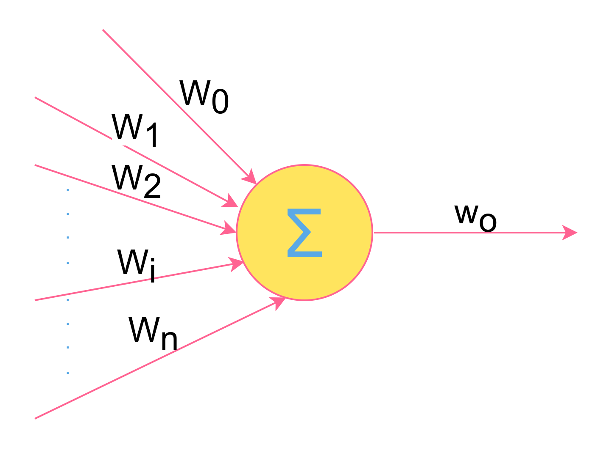
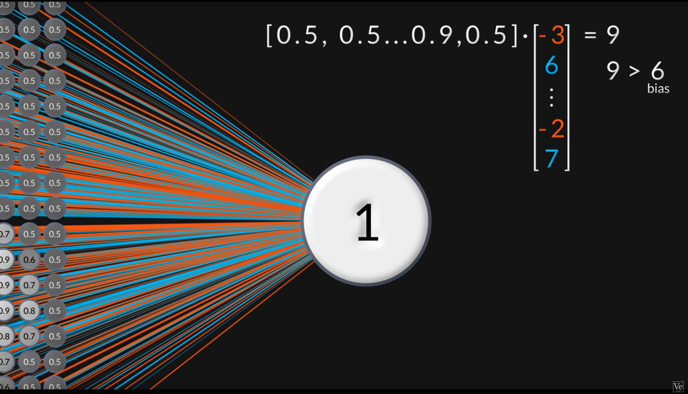
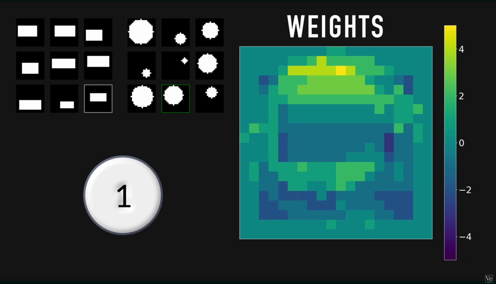
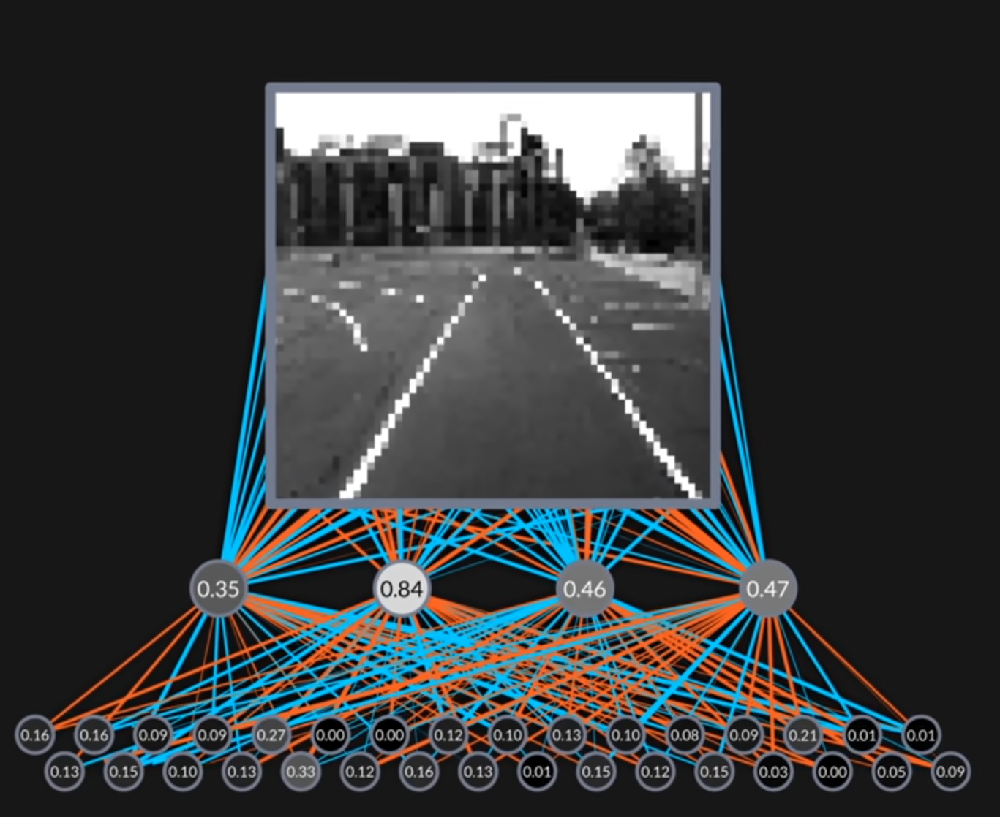
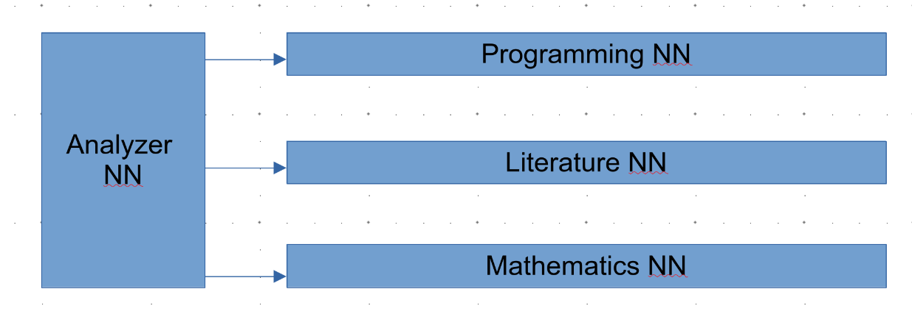
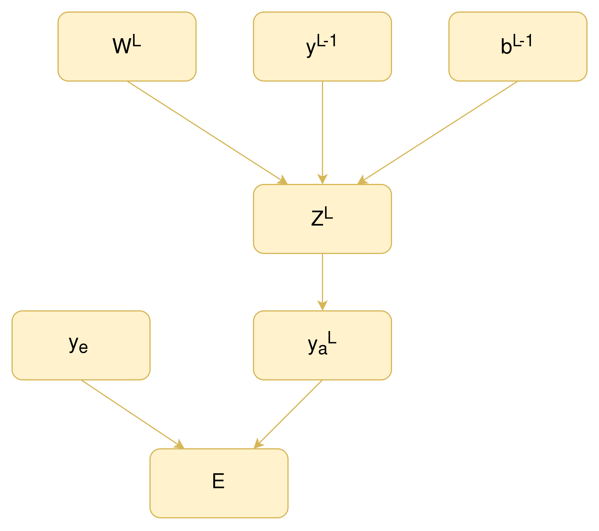
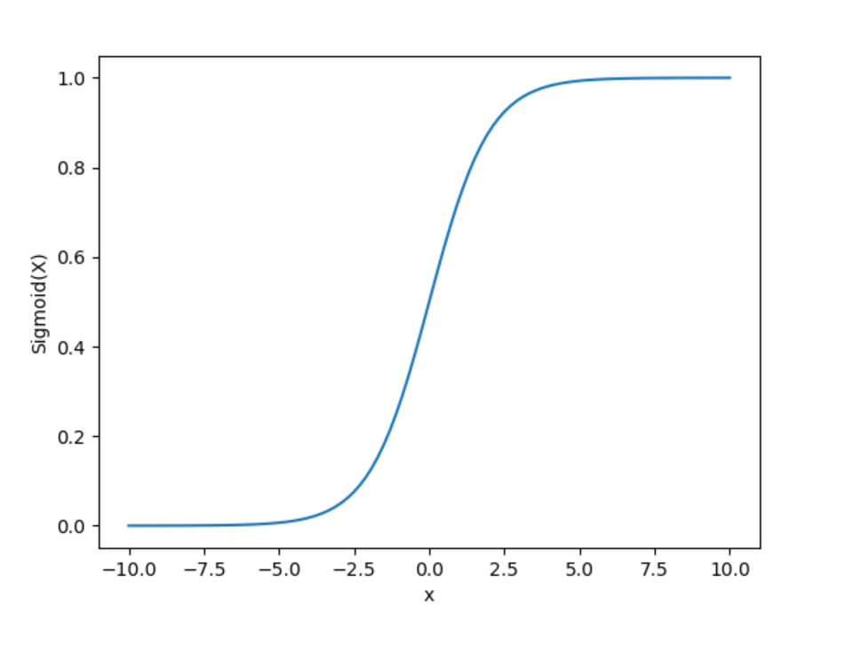
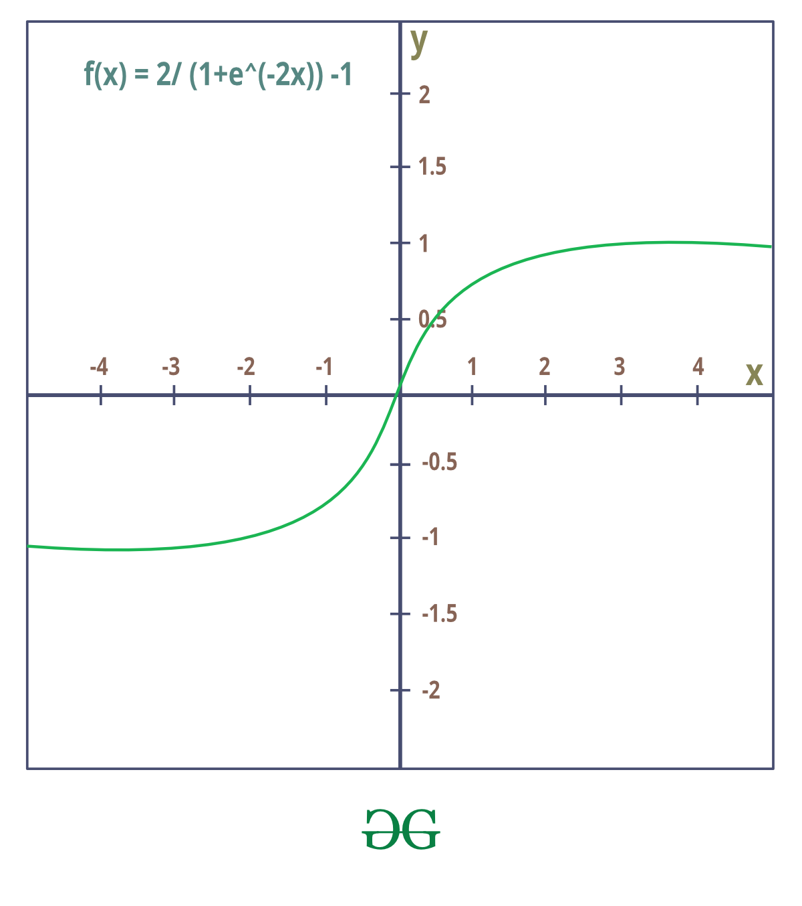

# Computer Vision
## Lecture 7  
### Introduction To Neural Networks
---

# Historical Overview
- The human brain consists of a **large number of highly connected elements** (about $10^4$ connections per element) called **neurons**.   
- These neurons have **three main components**: **Dendrites**, the **Cell Body**, and the **Axon**:
	- **Dendrites** are tree-like receptive networks of nerve fibers that carry nerve signals to the cell body.
	- The **Cell Body** effectively gathers these incoming signals when they exceed a certain **threshold**.
	- The **Axon** is a single long fiber that transmits the signal from the cell body to other neurons.
	- The point of contact between one cell's axon and another cell's dendrites is called the **Synapse**.
- As a result of studying how biological neural networks work, a theory emerged that all biological neural functions, including **memory**, are stored in the neurons and in the connections between them.
---

# Historical Overview

- The **neuron** is defined as the information processing unit in the neural network.
- The basic neural model consists of the following fundamental elements:
	- A set of Synapsis, or connecting links, each characterized by its own weight or strength.
- A collector to aggregate the input signals, such that the total is the result of the product of the previous neurons with the weight of the connection between these neurons and the current neuron.
- An activation function to limit the neuron's output.
- A Bias (threshold), which affects the increase or decrease of the activation function's input.
- Despite the mathematical and computational basis of neural networks starting from the late nineteenth and early twentieth centuries,
- The current concept of neural networks did not develop until the 1940s as a result of the research of Warren McCulloch and Walter Pitts.
- These two researchers showed that neural networks are capable of executing any mathematical or logical operation.
---

# Historical Overview
- In 1958, the scientist Rosenblatt developed a practical application of neural networks by building the first Single Layer Perceptron and its associated rules.
- He developed a network that takes as input an image of 20×20 photosensitive cells (pixels by current concepts) and works to classify whether this image is a rectangle or a circle.
- The **artificial neuron (Rosenblatt's neuron)** consists of the following structure:
	

	
	$W_o = f \left( \sum_{i=0}^{n} V_i W_i + b \right)$ 
	

- $V_i$​: Input value
- $W_i$​: Weight of this value
- $b$: Threshold, Bias, or Offset
- $f$: Activation function
--- 

# Historical Overview
## Rosenblatt Neuron

- Each of the previous cells connects to a single output cell.
- If the value is greater than the bias, the output is considered 1 (circle), otherwise 0 (square/rectangle).

---

# Historical Overview
## Rosenblatt Neuron

---

# Historical Overview
## Rosenblatt Neuron
- This network is trained on a set of images of circles and rectangles.
- If the network correctly recognizes the image, the weights are not modified.
- If the expected output value should be 1 but it is 0, the input image is added to the neuron weights.
- If the expected output value should be 0 but it is 1, the input image is subtracted from the neuron weights.
- These steps are repeated until the Convergence stage is reached.
---

# Historical Overview
## Rosenblatt Neuron

---

# Historical Overview
## Rosenblatt Neuron
- This very simple neural network model is unable to handle complex problems.
- Rosenblatt was aware of this, as this example treats the problem as a Classification problem and thus suffers from the same classification issues.
---

# Historical Overview
## Multi Layer Perceptrons
- During the sixties and seventies, research in the field of neural networks was observed to decline.
- However, in the eighties, new concepts emerged that revived activity in this field, namely Multi Layer Perceptrons.
- Multi Layer Perceptrons:
	- These are neural networks that have two or more layers of elements (Input + Hidden Layer + Output).
	- The hidden or internal layers have the ability to discover patterns in the data.
	- One application of this network is autonomous driving.
	- With the development of these networks, a new learning algorithm called Back Propagation was developed, as the previous learning method was ineffective with this type of network.
	- In the human brain, there are neural areas that contain more than one layer to perform different tasks.
---

# Historical Overview
## Multi Layer Perceptrons

- The introduction to this type of networks took place in 1980s with an autonomous car driving nerual network made up of:
	- An input layer ($64 \times 64$ image)
	- A 4 neurons hidden layer
	- An output layer of 32 neurons representing the steering angle
	- This network was named **Alvin** and allowed the car to drive at a speed not exceeding **1 km/h** due to the speed of the hardware available in those days.
	- A human driver drove the car to store the various training values for the network to learn from

---

# Historical Overview
## The Age of Dataset
- Despite the progress in this field, the fundamental problem was that the results of these networks were not good.
- Researcher Fei-Fei Li was able to identify the reason for the problem: the lack of a sufficient amount of data for training.
- She worked on building the ImageNet collection of images.
- ImageNet: Researcher Fei-Fei Li built the largest collection of labeled images.
	- 1,281,167 training images.
	- 50,000 validation images.
	- 100,000 test images.
	- Distributed across 1000 categories (car, airplane, etc.).
--- 

# Historical Overview
## The Age of Dataset
- An annual competition was held, involving universities and companies.
- This competition involves these entities developing neural networks that classify the images in the collection and calculate the error rate.
- The lower the error, the better.
- In 2012, the AlexNet network entered the arena.
	- This network was characterized by a low error rate and high accuracy.
	- It consisted of 8 layers and about 500,000 neurons.
	- The problem lies in which CPU is capable of executing these calculations within a reasonable time.
	- A single image required about 700,000,000 calculations.
---

# Historical Overview
## The Age of Dataset
- This network was the first to rely on executing the neuron calculations on the GPU (Graphics Processing Unit) rather than the CPU.
- The reason is simple: the process of applying filters to digital images using Convolution is a parallel process, as execution on one pixel does not affect its neighbors.
- Therefore, this process can be highly parallelized.
- Research on neural networks exploded after solving the performance problem.
- Advanced models emerged, such as Convolutional Neural Networks (CNN).
- Networks with memory, such as RNN and LSTM.
- In addition to the emergence of Deep Learning and its branches, primarily Generative Adversarial Networks (GANs) and Diffusion Networks.
- Finally, Transformers and large language models.
---

# Historical Overview
## The Age of Dataset

 

- DeepSeek R1:
    - A modern model characterized by low financial cost.
	- Most modern models are a single huge network.
	- DeepSeek R1, however, relies on the Mixture of Experts concept.
	- In this model, several networks are created, each specializing in a specific field.
	- The question is directed to the appropriate network.

 

---

# Historical Overview
## The Age of Dataset
- DeepSeek R1:
	- The cost of training GPT-4o is more than 100 million dollars.
	- The cost of training R1 is 6 million dollars.
	- This figure is not precise.
	- Several new programming techniques were developed by avoiding the CUDA layer.
	- This allowed for accelerated performance.
	- The cost of preparation and experimentation for the new structure adds to the cost of R1.
	- However, these costs are usually distributed across new models developed based on the same technologies.
--- 

# Historical Overview
## The Age of Dataset
- Why do you say we live in the age of the dataset?
- Because of transfer learning
- This concept is very simple, instead of building a new neural network from the grounds up - a tedious and expensive endeavor - let's just use an existing one
- But we need to tweak it to match our needs, how to do so you ask? we re-train
- In transfer learning we tune hyper parameters (like number of epochs, activation function,...etc) while retraining an existing model on a new dataset, in the same domain as the original dataset in which the model was trained
	- For example we need to create a model to check  X-Ray images if any image contains cancer cells, we choose an existing model like YOLO v11 (trained on ImageNet) and retrain it on the new X-Ray images to understand the new assignment
- Using the concept of transfer learning a lot of model have been developed based on existing models but more specialized
---

# Historical Overview
## The Age of Dataset
### Microsoft Tay
<ul>
<li>It was a bot published by Microsoft on the Twitter platform on March 23, 2016.</li>
<li v-click="1">It was equivalent to a teenager in terms of mental capacity.</li>
<li  v-click="2">It was an experiment aimed at studying the interaction between human users and AI systems.</li> 
<li  v-click="3">Microsoft was forced to cancel the experiment after only 16 hours.</li><li  v-click="4">The "nice people" (humans) did not fall short; by the end of this experiment, Tay had become:</li>
<ul class="pl-8" v-click="4">
<li>Misogynistic</li>
<li>Nazi</li>
<li>Racially biased</li>
<li>Its greeting was an insult</li>
<li>In short, they taught it every bad thing</li>
</ul>
</ul>
---

# The Problems with NN
- We can summarize the problems with NN with 3 categories
	- Datasets
	- Energy & RAM
---

# The Problems with NN
## Datasets
- As demonstrated by the catastrophe of Microsoft Tay, in order to achieve good results we need good data
- That is why we refer to Neural Networks as Garbage In - Garbage Out
- This means that the results depend on the quality of the input
	- good input yields good results.
- In the recent times, great efforts have been made to develop **large-sized datasets** suitable for neural networks (the larger the network size, the more data it needs for training).
- These datasets are characterized by being labeled and prepared for training and testing.
---

# The Problems with NN
## Energy & RAM
- We are now suffering from the problem of memory and energy.
- Modern neural network models like GPT-4 are characterized by their large size.
- This size requires a large storage space, especially within the graphics card.
- These cards also require electricity.
- The electricity bill became so high that Microsoft decided to lease and maintain the first generation unit at a nuclear power plant and operate it for 20 years because it is financially cheaper.
---

# The Problems with NN
## Energy & RAM
- The solution lies in Analog Computers
- Before digital computers appeared, we had analog computers that worked on the principle of gears or measuring electrical voltage.
- One of their basic problems is the difficulty of repetition/reproducibility.
- Any slight change in the gear or electrical voltage will cause significant changes in subsequent calculations.
- Despite this, they are characterized by:
	- Low power consumption 
	- Speed in calculations
	- Storing a large amount of data in a small space (higher storage density than digital)
- Several companies are working on developing analog computer systems specifically for Artificial Intelligence that address the problem of repetition/reproducibility.
---

# Back Propagation
- This is the algorithm used to train neural networks
- Some neural networks might require a modification of the algorithm due to its structure, but still the same.
- In this algorithm we study what weight is affects the output in order to change it
- Slow down what?
- I forgot to mention the following:
	- In order  to use neural networks we need to train them
	- Training is simple, we provide the following:
		- Input data
		- The expected (real) output
		- The actual (result) output after processing the input data in the network
	- We then compare the expected output with actual one
		- If match, or within a margin of error, then all is well
		- If not, we need to analyze the weights in the network to identify the guilty parties and change their value
---

# Back Propagation
- The back propagation algorithm is responsible for finding those guilty parties, but it doesn't change them, that is a job for the optimizer
- In order to understand back propagation, we need to understand the following:
	- The loss function: is the function responsible for comparing the expected output to the real
	- The activation function: has the job to limit the output of a neuron in limited range to prevent any explosions in values
---

# Back Propagation
## Loss Functions
- There are several loss functions, depends on the type of the output and the problem:
	- MSE
	- MAE
	- BCE
	- CE
---

# Back Propagation
## Loss Functions

- **MSE**
	- Mean Square Error
	- Uses the following formula: 
		- $E=\frac{1}{N}\Sigma_i (y^e_i-y^a_i)^2$
		- $y^e_i$ is the expected output for input i
		- $y^a_i$ is the actual output for input i
	- Used to detect errors in continuous output
- **MAE**
	- Mean Absolute Error
	- Uses the following Formula: 
	- $E=\frac{1}{N}\Sigma_i|y^e_i-y^a_i|$
	- Used to detect errors in continuous output
	- Faster than MSE

- **BCE**
	- Binary Cross Entropy
	- Uses the following formula: 
		- $E=\frac{-1}{N}\Sigma_i^N (y_i log(p_i)+(1-y_i)log(1-p_i))^2$
	- Used to detect when the output is yes/no based on probablities
- **CE**
	- Cross Entropy
	- Uses the following Formula: 
		- $E=\frac{-1}{N}\Sigma_i^N\Sigma_j^Cy_{i,j}log(y_{i,j})$
	- Used to detect errors in classification

---

# Back Propagation
## Let's Dive
- We will be using MAE as a loss function for ease of calculations

- Our main purpose is to study the effect of $w^L$ on the output $E$
- In other words, we need to see if changing $w^L$ changes $E$
- So we derive

---

# Back Propagation
## Let's Dive

$$
E=\frac{1}{2}(y^e_i-y^a_i)^2
\\
\frac{\delta E}{\delta w^L}
$$

The problem is simple, E as a function doesn't relate directly to wL, it relates to yaL, as a result we will use the chain of a derivatives

$$
\frac{\delta E}{\delta w^L}=\frac{\delta E}{\delta y_a^L}
$$

Still yaL is not related directly to wL, it is related directly to ZL

---

# Back Propagation
## Let's Dive

$$
E=\frac{1}{2}(y^e_i-y^a_i)^2
\\
\frac{\delta E}{\delta w^L}=\frac{\delta E}{\delta y_a^L}\frac{\delta y_a^L}{\delta Z^L}
$$

Finally ZL is related directly to wL

$$
Z^L=a^{L-1}w^L+b^L
\\
\frac{\delta Z^L}{\delta w^L}=a^{L-1}
$$

$$
y_a^L=f(Z^L), ~f~ is ~ activation ~ function
\\
\frac{\delta y_a^L}{\delta Z^L}=f'(Z^L)
$$

---

# Back Propagation
## Let's Dive

$$
E=\frac{1}{2}(y^e_i-y^a_i)^2
\\
\frac{\delta E}{\delta w^L}=\frac{\delta E}{\delta y_a^L}\frac{\delta y_a^L}{\delta Z^L}\frac{\delta Z^L}{\delta w^L}
\\
\\
\frac{\delta E}{\delta y_a^L}=y^e_i-y^a_i
\\
\\
\frac{\delta y_a^L}{\delta Z^L}=f'(Z^L)
\\
\\
\frac{\delta Z^L}{\delta w^L}=a^{L-1}
\\
$$

---

# Back Propagation
## Let's Dive

$$
E=\frac{1}{2}(y^e_i-y^a_i)^2
\\
\frac{\delta E}{\delta w^L}=\frac{\delta E}{\delta y_a^L}\frac{\delta y_a^L}{\delta Z^L}\frac{\delta Z^L}{\delta w^L}
\\
\\
\frac{\delta E}{\delta w^L}=(y^e_i-y^a_i)f'(Z^L)a^{L-1}
$$

---

# Activation Functions

- Sigmoid
	- Values range between 0 and 1
	- Used with classification problems
 $$
 f(x)=\frac{1}{1+e^x}
 $$
 

 

 

- Tanh
	- Values between -1 & +1
	- Used in hidden layers
$$
f(x)=\frac{2}{1+e^{-2x}}-1
$$

- ReLU
	- Value range between 0 and infinity
	- Used with images a lot
$$
f(x)=max(0,x)
$$

---

# Optimzers
- They are the algorithms used to actually change the values, back propagation decides which weight to change while optimizer decides how to change that weight
- Most used optimzers:
	- Adam
	- SGD (Stochastic Gradient Decent)
---

# How to Train Your Network
- The following methods are used to train the neural network:
	- Supervised: we provide the question and the answer and ask the network to solve it to reach the same answer
	- Unsupervised: We simply through the kid in the water, let him/her figure out how to swim
	- Semi-Supervised: a mixture between supervised and unsupervised
	- Re-enforcement: Simply we give points(or treats) for correct answers (like taking an exam, for each correct answer you get part of the total points)