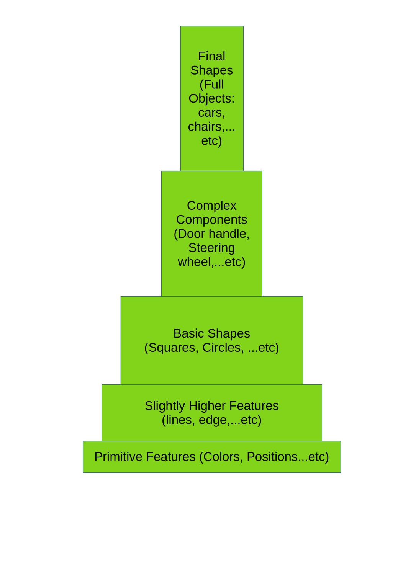
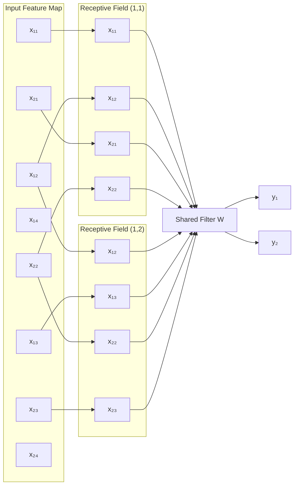
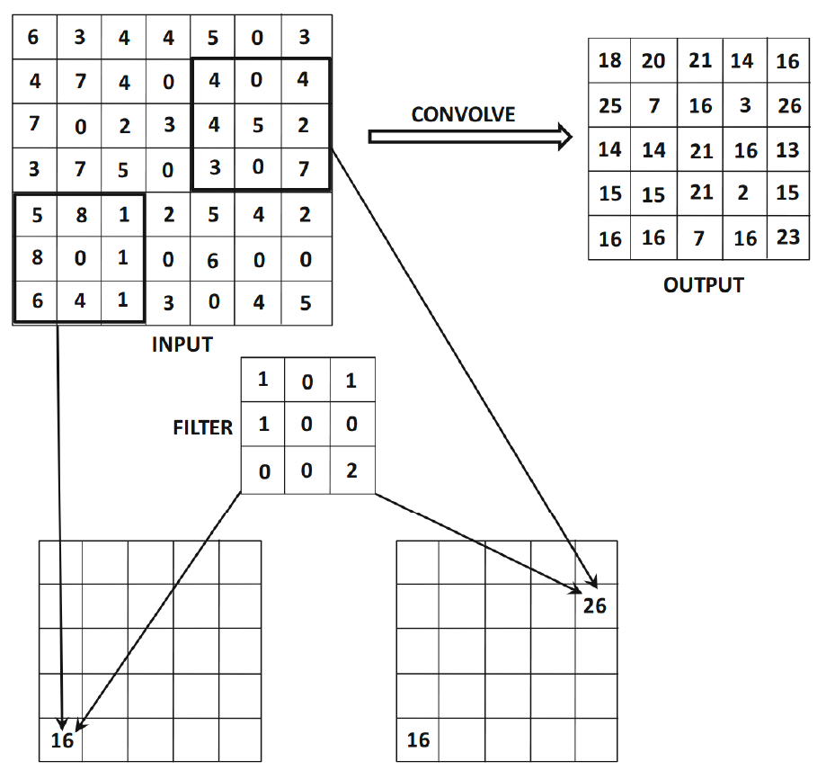
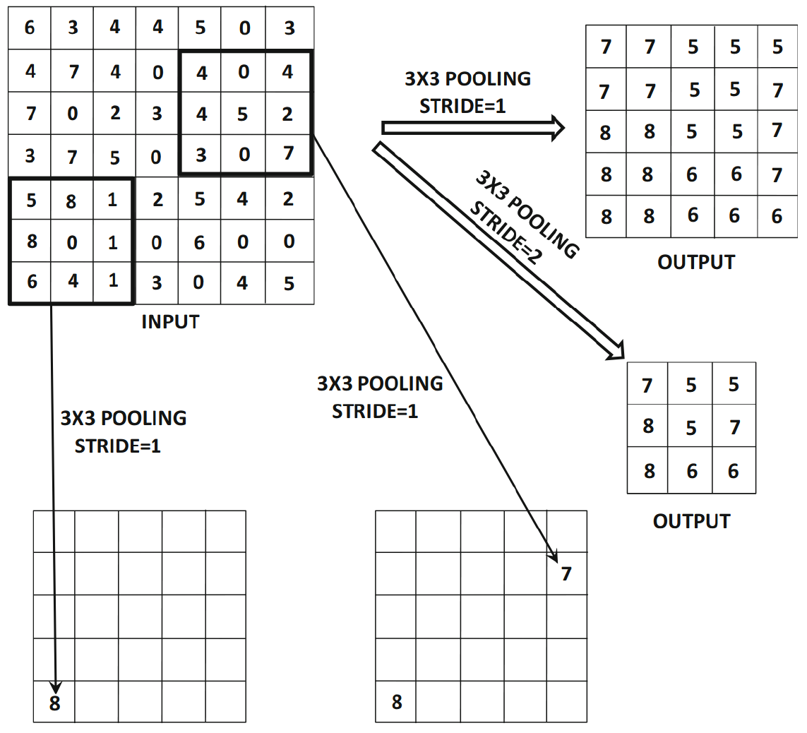
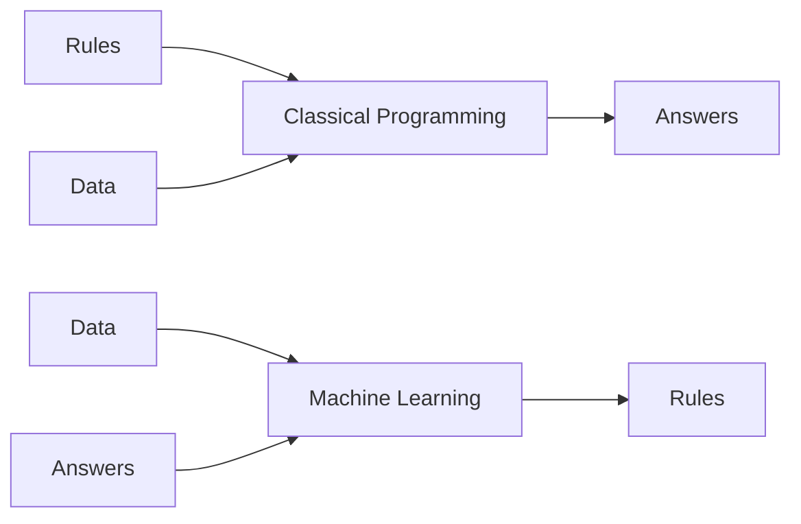
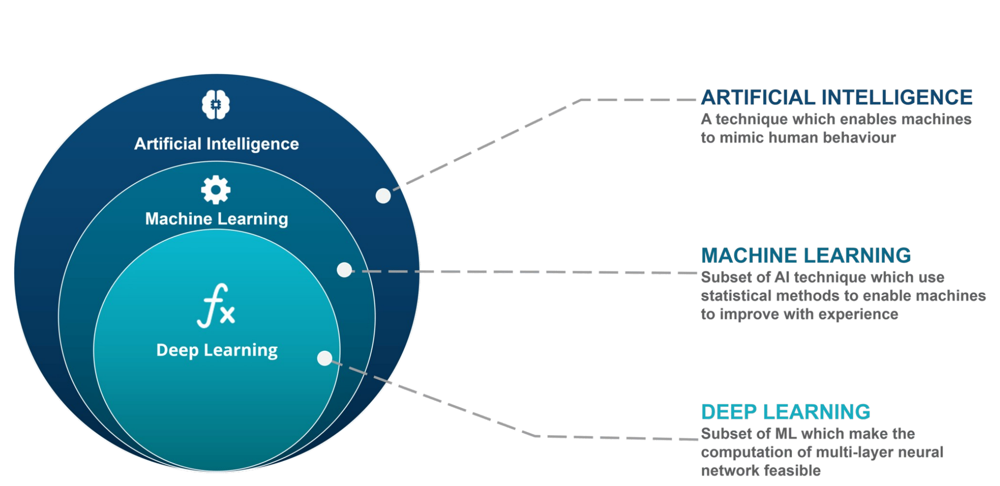
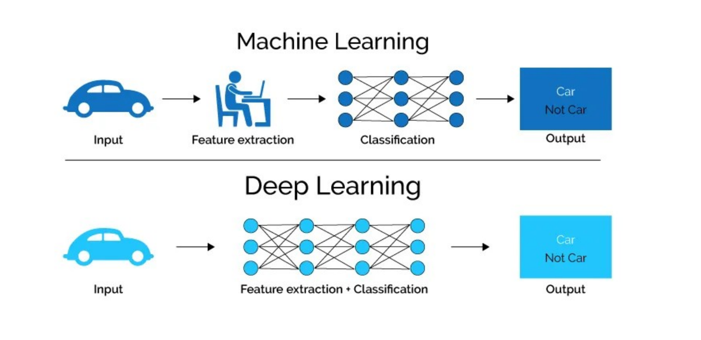
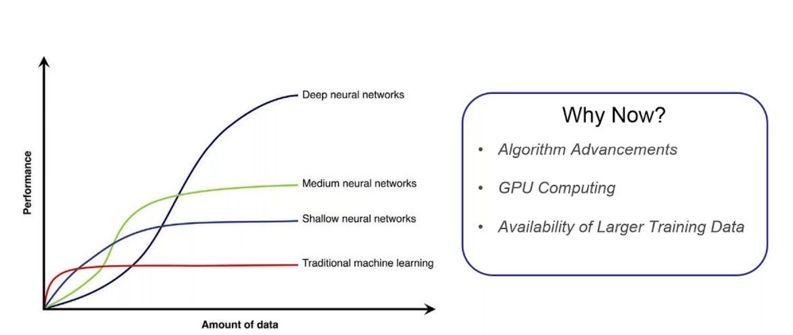
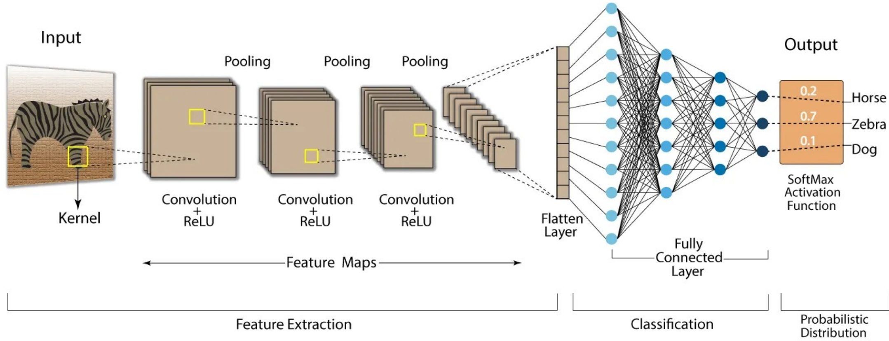

# Computer Vision
## Lecture 7  
### Convolutional Neural Networks
---

# Convolutional Neural Networks (CNN)
- CNNs (Convolutional Neural Networks) are networks that have the ability to perform the convolution operation on a given input.  
- They were initially developed to handle textual sequences, but they have proven highly effective in image processing within neural networks, and are also used in time-series processing.
- The early motivation for convolutional neural networks was derived from experiments on the visual cortex of cats.  
	- The visual cortex contains small regions of cells sensitive to specific regions of the visual field.
	- If certain regions of the visual field are active, those cells are activated.  
	- Activated cells depend on the shape and orientation of objects in the visual field.
	- Some cells are sensitive to vertical edges, while others are sensitive to horizontal edges.
---

# Convolutional Neural Networks (CNN)
## Hierarchical Representation
<div grid="~ cols-2 gap-1">
<div>

- Cells are connected using a multi-layer structure.  
- This led to the hypothesis that mammals use these layers to build image components at different abstraction levels.
- This principle resembles **hierarchical feature extraction**.  
- CNNs encode primitive shapes in early layers and more complex shapes in later layers.
</div>
<div>

</div>
</div>
---

# Convolutional Neural Networks (CNN)
## Hierarchical Representation
<div grid="~ cols-2 gap-1">
<div>

- CNNs encode primitive shapes in early layers and more complex shapes in later layers.
	- Basic information (pixel locations and color values)
	- Slightly Higher Features shapes (lines, edges)
	- Basic Shapes (Squares, Circles, Rectangle)
	- Complex Components
	- Final shapes
</div>
<div>

</div>
</div>
---

# CNN Architecture
## Local Connectivity

<div grid="~ cols-2 gap-1">
<div>

- In CNNs, successive layers are used, but neurons in the current layer are **not** necessarily connected to all neurons in the previous layer.
- Each feature value is connected only to a **local spatial region** in the previous layer, with shared features across the entire image.
- This is known as **domain-related organization**, where neuron relationships depend on the problem domain, not just weights.
</div>
<div>
<div style="width: 55%">

</div>
</div>
</div>
---

# Spatial Structure
- Neurons in each layer are arranged in a structured grid.  
- These spatial relationships are preserved between layers because each feature depends on a local region of the previous layer.
- Each CNN layer is a **3D structure**:
	- Height
	- Width
	- Depth (number of feature maps / channels)
## CNN vs FNN
- A CNN operates similarly to a traditional feed forward neural network (FNN), except that:
	- Operations are spatially organized
	- Connections are sparse
	- Many weights are null 
---


# CNN Layer Types
- CNNs consist of the following layer types:
	- Convolutional
	- Pooling
	- Fully Connected
- They rely heavily on the **ReLU activation function**.
## Input Representation
- Assume the input is an RGB image of size: $32 \times 32 \times 3$
- The initial convolutional layer contains the same spatial dimensions and depth.
- In general, the size of layer $i$ is defined as: $H_i \times W_i \times D_i$
- In convolutional layers, the image length and width are usually equal: $H_i=W_i$
---

# Convolutional Layer 
## Filters (Kernels)
- In convolutional layers, weights are organized into **3D filters (kernels)**.
	- Filter depth equals image depth
	- Filter height and width are smaller than image dimensions
$$
\text{Filter size} = f_h \times f_w \times D_i
$$
	- Applying convolution produces a new image passed to the next layer.
	- The output size is:
$$
H_{out} = H_{in} - f_h + 1
$$
$$
W_{out} = W_{in} - f_w + 1
$$

	- The image shrinks because filters cannot be applied to all pixels.
---

# Convolutional Layer 
## Filters (Kernels)
### Zero Padding
- If don't want to shrink images, we apply zero Padding
- The number of removed pixels depends on the filter size.
- For a $5 \times 5$ filter:
	- 4 pixels are removed from each side
- Pixels with value 0 are added to each side:

$$
p = \frac{f - 1}{2}
$$
---

# Convolutional Layer
## Depth
- The depth $D$ of the next layer depends on the **number of filters**.
	- 1 filter → depth = 1 x times the number of channels 
	- 10 filters → depth = 10 x times the number of channels 
- As the network deepens:
	- Spatial dimensions decrease
	- Depth increases
---

# Convolutional Layer
# Filters

---

# Convolutional Layer
## Stride
- The previous example assumes stride $S = 1$.
- **Stride** is the number of pixels skipped during convolution.
- For stride $S$:
$$
1,S_q+1,2S_1+1,...
$$
---

# Convolutional Layer
## Pooling Layer

- Pooling is used to:
	- Regularize the network
	- Prevent parameter explosion
- Types of pooling:
	- **Max Pooling**: The maximum value in the neighborhood
	- **Average Pooling**: The average value in the neighborhood
------

# Convolutional Layer
## Pooling Layer – Example
<div grid="~ gap-1 cols-2">
<div>

- Max pooling with a $3 \times 3$ window.
- The output size is computed like convolution, but:
	- **Depth remains unchanged**
</div>
<div>

</div>
</div>
---

# Fully Connected Layer
- Every feature in the final spatial layer is connected to every neuron in the first fully connected layer.
- This layer behaves exactly like a traditional FNN.
- Most CNN parameters are located in fully connected layers.
- These layers perform the **final decision-making**.
---

# Layer Arrangement in CNN

- Typical arrangement:
```
CRCRP  CRCRP  CRCRP  CRCRCRP  F
```

- Where:
	- C: Convolution
	- R: ReLU
	- P: Pooling
	- F: Fully Connected
---

# Training CNNs
- Training relies on the **back propagation algorithm**.
- Specific modifications are applied depending on the type of layer being trained.
---

# Deep Learning
- Deep Learning is a subset of Machine Learning that uses mathematical functions to map the input to the output.
- These functions can extract non-redundant information or patterns from the data, which enables them to form a relationship between the input and the output.
- This is known as learning, and the process of learning is called training.
<div style="width: 50%">

</div>
---

# Deep Learning
- Modern deep learning models use artificial neural networks or simply neural networks to extract information.
- These neural networks are made up of a simple mathematical function that can be stacked on top of each other and arranged in the form of layers, giving them a sense of depth, hence the term Deep Learning.
- Deep learning can also be thought of as an approach to Artificial Intelligence, a smart combination of hardware and software to solve tasks requiring human intelligence.
---

# Deep Learning

---

# Deep learning
- Deep Learning was first theorized in the 1980s, but
- it has only become useful recently because:
	-  It requires large amounts of labeled data
	- It requires significant computational power (high performing GPUs)
---

# Deep Learning
## Deep Learning vs Machine Learning
-  Deep Learning can essentially do everything that machine learning does, but not the other way around.
- For instance, machine learning is useful when the dataset is small and well-curated, which means that the data is carefully preprocessed.
- Data preprocessing requires human intervention. It also means that when the dataset is large and complex, machine learning algorithms will fail to extract information, and it will underfit.
- Generally, machine learning is alternatively termed shallow learning because it is very effective for smaller datasets. Deep learning, on the other hand, is extremely powerful when the dataset is large.
- It can learn any complex patterns from the data and can draw accurate conclusions on its own. In fact, deep learning is so powerful that it can even process unstructured data - data that is not adequately arranged like text corpus, social media activity, etc.
- Furthermore, it can also generate new data samples and find anomalies that machine learning algorithms and human eyes can miss.
---

# Deep Learning
## Deep Learning vs Machine Learning

---

# Deep Learning
## Deep Learning vs Machine Learning
- On the downside, deep learning is computationally expensive compared to machine learning, which also means that it requires a lot of time to process.
- Deep Learning and Machine Learning are both capable of different types of learning: Supervised Learning, Unsupervised Learning, and Reinforcement Learning.
- But their usefulness is usually determined by the size and complexity of the data.
---

# Deep Learning
## Deep Learning vs Machine Learning

---

# Deep Learning
## Understanding Deep Learning
- Let's take CNN as an example

---

# Deep Learning
## Understanding Deep Learning
- By analyzing the structure of CNN we realize it is a great implementation of deep learning
- The CRP layers are used to extract features, we understand the general idea of the extracted features each layer, but we don't know for a fact what are the exact features it has extracted
- We don't tell it what features to extract, it just decides the most suitable features to extract based on the required result
- Then we provide the extracted features to FNN (MLP) traditional multilayered network which takes the final decision in the classification steps
---

# Deep Learning
## Limitation
- Data availability
	- Deep learning models require a lot of data to learn the representation, structure, distribution, and pattern of the data.
	-  If there isn't enough varied data available, then the model will not learn well and will lack generalization (it won't perform well on unseen data).
	-  The model can only generalize well if it is trained on large amounts of data.
- The complexity of the model
	- Designing a deep learning model is often a trial and error process.
	-  A simple model is most likely to underfit, i.e. not able to extract information from the training set, and a very complex model is most likely to overfit, i.e., not able to generalize well on the test dataset.
	-  Deep learning models will perform well when their complexity is appropriate to the complexity of the data.
---

# Deep Learning
## Limitation
- Lacks global generalization
	- A simple neural network can have thousands to tens of thousands of parameters.
	- The idea of global generalization is that all the parameters in the model should cohesively update themselves to reduce the generalization error or test error as much as possible. However, because of the complexity of the model, it is very difficult to achieve zero generalization error on the test set.
	- Hence, the deep learning model will always lack global generalization which can at times yield wrong results.
- Incapable of Multitasking
	- Deep neural networks are incapable of multitasking.
	- These models can only perform targeted tasks, i.e., process data on which they are trained. For instance, a model trained on classifying cats and dogs will not classify men and women.
	- Furthermore, applications that require reasoning or general intelligence are completely beyond what the current generation’s deep learning techniques can do, even with large sets of data.
---

# Deep Learning
## Limitation
- Hardware dependence
	- As mentioned before, deep learning models are computationally expensive.
	- These models are so complex that a normal CPU will not be able to withstand the computational complexity.
	- However, multicore high-performing graphics processing units (GPUs) and tensor processing units (TPUs) are required to effectively train these models in a shorter time.
	- Although these processors save time, they are expensive and use large amounts of energy.
---

# Transfer Learning
- Deep learning is expensive and requires a lot of data and hardware
- If there is only a way to use knowledge in more general way
- As a result of the complexity of network architectures and the high cost of training, we resort to **transfer learning**.
	- In this technique, we use a deep learning network such as:
		- VGG
		- ResNet
		- U-2-Net
	- These large networks are **pretrained on the ImageNet dataset**.
	- They are considered to be trained on a **general dataset**, from which they have acquired a great deal of “experience”.
	- We transfer this experience to be applied to a **specific domain**, that is, a “specialization”.
	- In other words, we rely on a **pretrained model** and retrain it on a **specialized dataset**, allowing us to exploit its “experience” in a specific or sub-domain of the model’s main field.
---

# Transfer Learning
- We are working on retraining these networks on our own image dataset (for example, medical images or vehicle license plate images).  
- We are tuning the **hyperparameters** of these networks to specialize their performance for this specific domain.  
- Hyperparameters are the parameters that control the training process,   which reduces both training and execution time.
- Some of the hyperparameters include:
	- Learning rate
	- Data split ratio for training and testing
	- Activation function in the neural network
	- Number of hidden layers
	- Number of epochs
	- Dropout rate
	- Filter/kernel size, or Pooling size