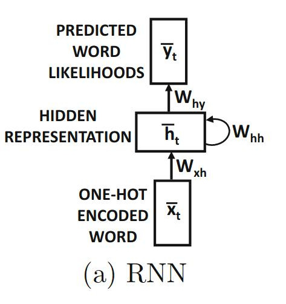
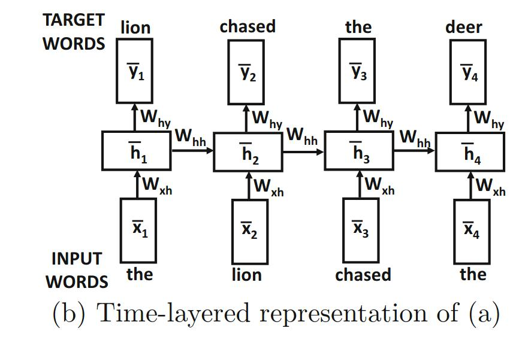
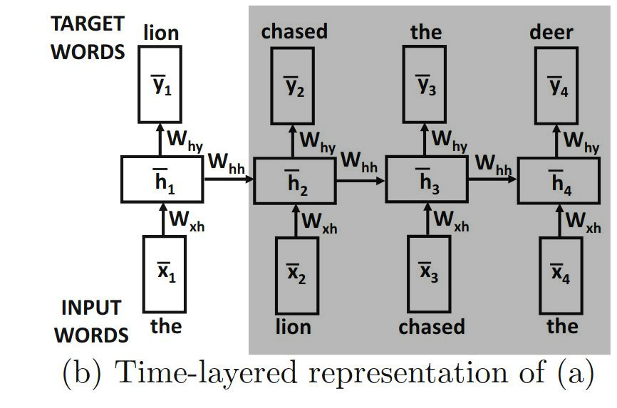
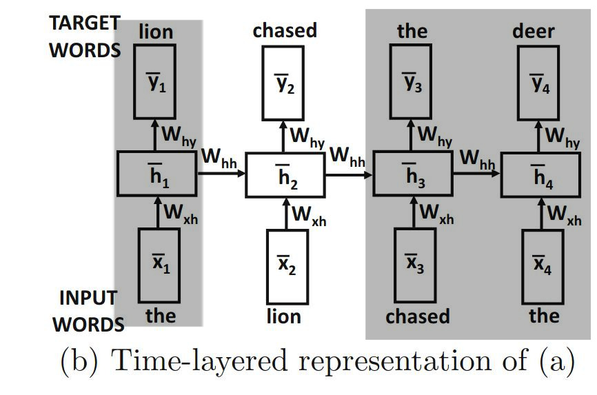
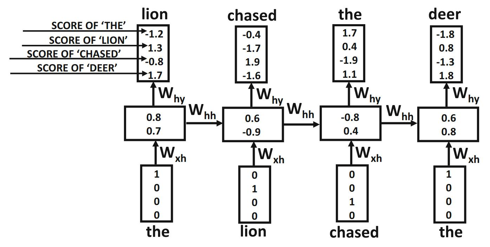
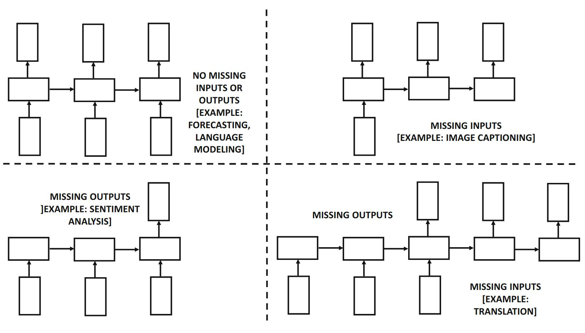
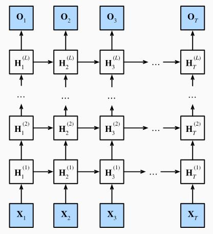
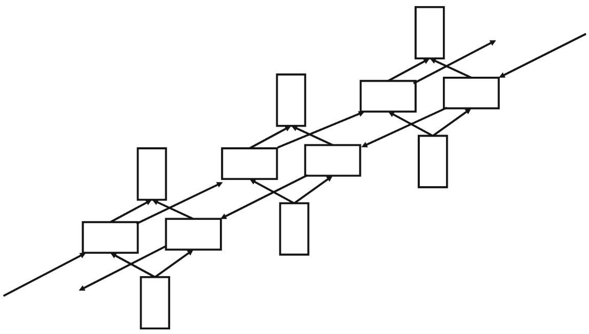
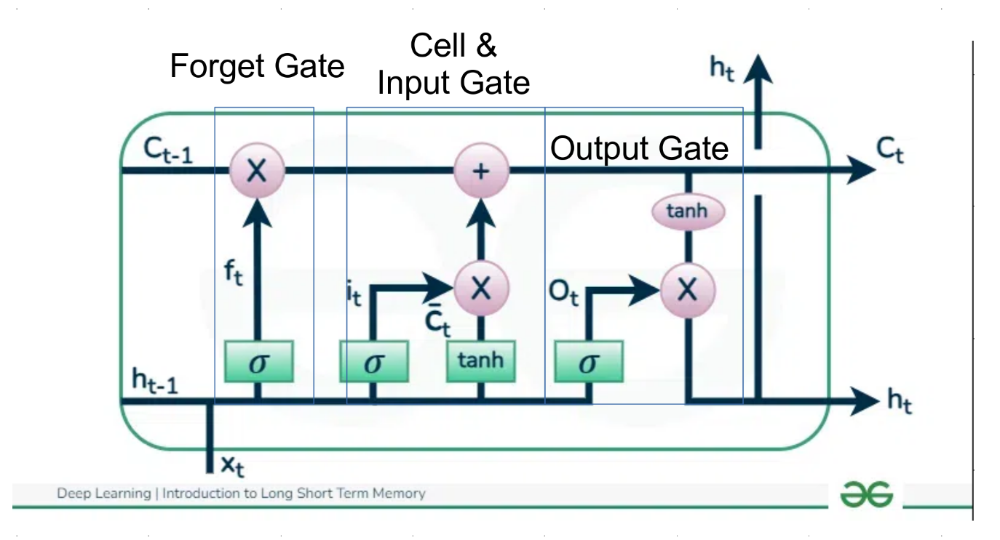
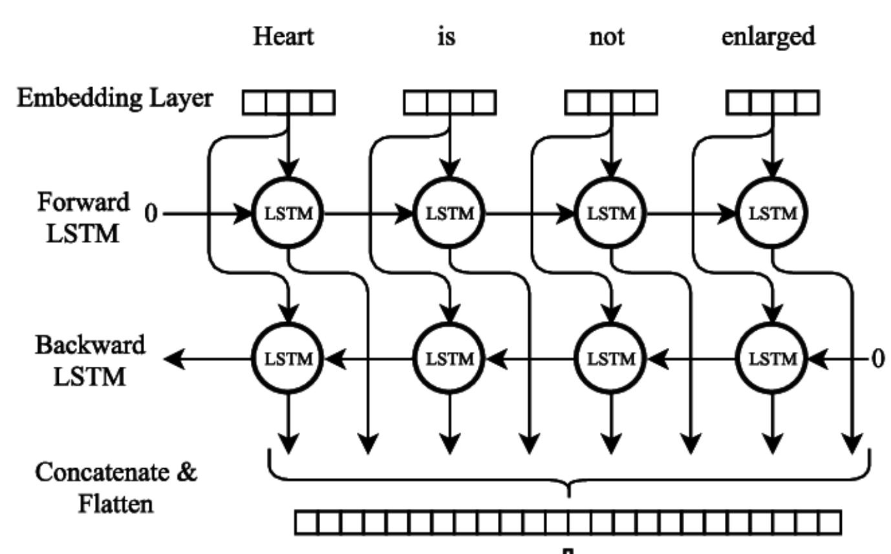

# Computer Vision
## Lecture 9
### Recurrent Neural Networks and Long Short Term Memory Networks
---

# The Problem of Previous Networks
- Previous networks (MLP, SLP) are characterized by their speed and simplicity of structure, as data flows in only one forward direction. Therefore, they are known as Feedforward Neural Networks (FNN).  
- As for CNN, it is still a FNN network but it has the ability to create its own set of features
- This representation is suitable when dataset values are independent, meaning that the output of processing image 1 does not affect image 2.

---

# The Problem of Previous Networks
- However, this is not suitable for many applications.
	- **Word Prediction:**
	
		- When we want to type a sentence on a mobile phone, we notice that the device suggests words we might need, known as Auto-Predict, which speeds up typing.  
		- To predict the next word, we need to know the previous words to determine context.
	- **Time Series Processing:**
	
		- Time series are data that change over time, such as daily passenger rates in a garage, the stock market, or weather changes. 
		- Previous values strongly influence subsequent values and give an impression of the expected future state.
---

# The Problem of Previous Networks
- However, this is not suitable for many applications.
	- **Video Processing:**
	
		- These networks can process each frame (image) individually
		
		- But processing a video by using information in the current frame and the previous frame is not applicable in this situation.

---

# The Problem of Previous Networks
- Consider the following two sentences:
	- Barcelona defeated Real Madrid 4–0 in their first match of the 2024–2025 season  
	- Real Madrid defeated Barcelona 4–0 in their first match of the 2024–2025 season  
- They have different meanings, but traditional representations (TF, IDF, TF-IDF) treat them as identical.
- What if the input sentence is longer or shorter?  
- What if it is a full paragraph?  
- Do we change the number of input neurons every time and retrain? (Not logical)
---

# The Solution
- We must unify the input size while considering previous inputs.  
- We need a **memory**.
	- The network must be able to remember previous data to be able to process the new information
- This leads to:
	- Recurrent Neural Networks (RNN)
	- Long Short-Term Memory (LSTM)
---

# RNN
- RNNs are especially effective in text processing.
- Example sentence:
	- `The lion chased the deer`
	- Using this simple sentence we will explain the logic of RNN

---

# RNN
## Architecture

- A RNN consists of an input layer, output layer, and at least one hidden layer.
- What distinguishes it is that the hidden layer output feeds the next time step through the weight $w_{hh}$

---

# RNN 

- Goal: predict the next word based on the current word and sentence context.
- This will grant us the ability to correctly understand RNN

---

# RNN
## Example
### Step 1

- Input word: **the**  
- Predicted next word: **lion**
- Hidden state $h_1$ is passed to the next time step.

---

# RNN 
## Example
### Step 2

- Input word: **lion**  
- Expected next word: **chased**
- This process continues sequentially.

---

# RNN
## Language Models

- This structure represents a **language model**.
- Language models predict the next word by processing the history of previous words.
- Encoded word sequences are fed in order across time steps.  
	- It's all about feeding the network one word at a time
- The output is a probability vector for the next word.
- Different probability distributions appear at each step.
	- Example:
		- Step 1: **Deer** has highest probability (1.7)
		- Step 2: **Chased** has highest probability

---

# RNN
## Language Models
## Special Tokens

Two special tokens are added:
- `<start>` : beginning of sequence
- `<end>` : end of sequence

---

# RNN 
## Mathematics
- Definitions:
	- $x_t$: input at time \( t \)
	- $h_t$: hidden state
	- $y_t$: output (prediction of \( t+1 \))
	- $x_t$ and $y_t$ have dimension $d$ (vocabulary size).  
	- $h_t$ has dimension $p$ which represents the complexity of the representation vector.
		- Representation vectors is  a method to represent data while preserving contextual meaning:
$$
\text{The lion chased the deer} \neq \text{The deer chased the lion}
$$
---

# RNN 
## Mathematics
- we define function $h_t=f(h_{t-1},x_t)$
- This function is defined using the weight matrices **w** and activation functions (like any neural network), and the same weights are used at every time step.
- Although the hidden layer evolves over time, the weights and the core function remain fixed across all time steps (that is, the connection with the previous step does not affect the weights once they are fixed at the end of training, but it does affect the output of the next step by entering into the intermediate computations).
- We use a separate function to compute the output of each step $y_t=g(h_t)$

---

# RNN 
## Mathematics
- We define the input matrix to the hidden layer $w_{xh}$ as having dimensions $p \times d$.  
- We define the hidden-layer transition matrix $w_{hh}$ as having dimensions $p \times p$.  
- We define the hidden-layer output matrix $w_{hy}$ that feeds into the output layer as having dimensions $d \times p$.
- Thus, the previously defined functions take the following form.
$$
h_t=tanh(w_{xh}x_y+w_{hh}h_{t-1})
\\
y_t=w_{hy}h_t
$$
- Output Activation:  A **softmax** activation is applied to interpret outputs as probabilities.  
- Variable-length sequences are supported.
---

# RNN 
## Input / Output Variants

- An RNN does not require input or output at every time step.

---

# RNN
## Memory

- The hidden state $h_t$ represents the model’s memory.  
- Increasing hidden layers allows storing more information.

---

# RNN
## Training
- Training uses **Backpropagation Through Time (BPTT)**.
- Gradients from previous time steps are incorporated into learning.
---

# RNN
## Loss Function
- We use Softmax is used as an activation function.  
	- Assuming we have the output $[y^1_t,y^2_t,y^3_t,...,y^d_t]$
	- We get the result $[p^1_t,p^2_t,p^3_t,...,p^4_t]=softmax([y^1_t,y^2_t,y^3_t,...,y^d_t])$
- Loss is calculated at each time step. $L=-\Sigma_{t=1}^T log(p_t^{j_t})$
- The index corresponds to the expected value at time \( t \).

---

# RNN
# Bidirectional RNN
- One drawback of RNNs is that the state at a given time step has access only to the previous inputs up to a certain point in the sentence, and it has no knowledge of future states.
	- In some applications, such as word sense disambiguation, performance improves significantly when information from both past and future states is available simultaneously.
	- For example, the specific meaning of a polysemous word like **“right”** in the phrase **“right choice”** (correct choice) cannot be inferred until the word **“choice”** is processed.
	- It can be difficult to determine the correct meaning of a word without processing the positions that follows it.
- Traditional RNNs are not able to achieve this goal, at least to some extent, because any predictions made by an intermediate state that occur before such informative positions and are likely to lack sufficient contextual information.
---

# RNN
# Bidirectional RNN
- Bidirectional RNNs are well suited for applications in which the prediction process is not limited to a traditional historical window.
- **Classical Historical Window:**  
	- Only past values are analyzed in order to predict subsequent values.
- **Bidirectional Historical Window:**  
	- In this case, both past values and possible future values are analyzed to predict the expected value.
- Although language modeling is causal, prediction accuracy improves using surrounding context.
---

# RNN
# Bidirectional RNN

---

# RNN
## Problems
### Vanishing and Exploding Gradients
- Occurs due to long temporal dependencies.
	- Small learning rate → slow learning (changes don't propagate enough in the network, it vanishes)  
	- Large learning rate → unstable updates (small changes causes massive changes in weight, it explodes)
- Solutions:
	- Clipping
		- **Value clipping:** if \( g > v \), then \( g = v \)
		- **Normalization:** rescale gradients to \([0,1]\)
---

# LSTM
## Motivation
- One of the problems of RNNs is memory retention in long text sequences.
- For example, in the following sentence:  
_"Selecting the left branch at the fork was a mistake, and I should have understood that it made better sense to choose the right one"_
	- The word **“right”** refers to a direction, and the word **“one”** refers to **“branch”**.
- However, due to the length of the sentence, the network may forget this, as it might struggle to correctly interpret it by the end of the sentence, much of the relevant information may have already been distorted through the successive transformations.
---

# LSTM
- To address this problem, the solution is to modify the recurrence equation of the hidden layer using **LSTM** (Long Short-Term Memory).
- LSTM operations are designed to allow precise control over the information stored in this long short-term memory.
- LSTM introduces the concept of a **memory cell** to tackle the storage limitations of RNNs.
- LSTMs are capable of learning long-term dependencies in sequential data, making them highly suitable for tasks such as language translation, speech recognition, and time series prediction.
---

# LSTM
## Gates
- LSTM has three gates:
	- Input gate: Controls the information entering the network
	- Forget gate: Controls the information that should be forgotten by the network
	- Output gate: Controls the output of the network
- This allows LSTM networks to **retain or selectively forget information** as it flows through the network, enabling them to learn long-term dependencies.
- LSTM maintains a **hidden state** (the hidden layer data), which serves as the network's short-term memory. The hidden state is updated based on the current input, the previous hidden state, and the current state of the memory cell.
---

# LSTM 
## Structure

---

# LSTM 
## Structure
## Forget Gate
- Controls what information is removed.
	- Non-useful information gets removed from the memory
$$
f_t=\sigma(w_f.[h_{t-1},x_t]+b_f)
$$

- where:
	- $\sigma$ is the sigmoid function
	- $w_f$ are the weights for the forget gate
	- $h_{t-1}$ the previous output of the hidden layer
	- $C_{t-1}$ the previous state of the cell
	- $b_f$ the bias
	- $[h_{t-1},x_t]$ is array concatination

- Output
	- 0 → forget
	- 1 → remember

---

# LSTM 
## Structure
# Input Gate
- Determines what new information is stored.
$$
i_t=\sigma(w_i[h_{t-1},x_t]+b_i)
\\
\tilde C=tanh(w_c[h_{t-1},x_t]+b_c)
\\
C_t=f_t \odot C_{t-1}+i_t \odot \tilde C
$$

- Where
	- $i_t$ the importance of the new value
	- $\tilde C$ possible new value
	- $C_t$ the actual new value
	- $w_i$ the input weights
	- $w_c$ the cell state weights

- Where
	- $\odot$ element wise multiplication

---

# LSTM 
## Structure
# Output Gate

- Determines the output of the cell.
$$
O_t=\sigma(w_o[h_{t-1},x_t]+b_o)
\\
h_t=O_t \odot tanh(C_t)
$$
- where
	- $w_o$ the output weights
	- $O_t$ the output of the networks
	- $h_t$ the information sent to the hidden state
---

# LSTM
# BiLSTM

- BiLSTM consists of two LSTMs:
	- One processes from start to end
	- One processes from end to start
- This provides richer contextual understanding.

---

# Now What?
- Now we simply use CNN (without the MLP layer, just the convolutional layers) to feed data to either a RNN or LSTM
- CNN does have a fixed output size, as a result we can have a RNN or LSTM with multiple inputs (not just one) and pass `visual words` to these networks
- As a result we get to have the effectiveness of CNN feature extraction capabilities from complex structure like an image and the memory capability of RNN/LSTM allowing us to process videos.
- Another way is to use VLM (Visual Language Models) which are based on a similar concept used by LLMs (Large Language Models: GPT-O4, Gemini, Claude Sonet,..etc)  but for images.
	- This solves a major issue in RNN/LSTM: the serial execution
	- LLMs have the ability to perform parallel execution (process the entire paragraph/text) at once
	- This achieved by using word embedding and attention instead of memory
